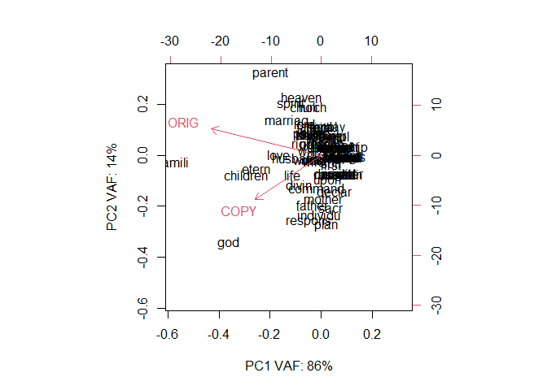
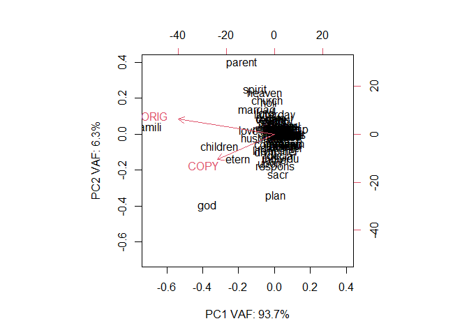
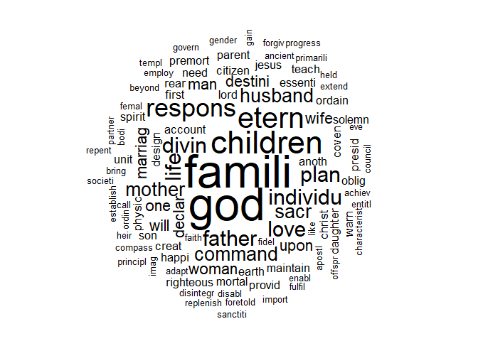

```r
# CHANGE PATH HERE:

mypath = "D:\\_nj_\\-github-\\Resources\\2022-07-15\\Proclamation Plagiarism\\";

# YOU need to install these packages for this to work.
library(SentimentAnalysis);
```

```
## Warning: package 'SentimentAnalysis' was built under R version 4.1.3
```

```
## 
## Attaching package: 'SentimentAnalysis'
```

```
## The following object is masked from 'package:base':
## 
##     write
```

```r
library(wordcloud2);
```

```
## Warning: package 'wordcloud2' was built under R version 4.1.3
```

```r
library(wordcloud);
```

```
## Warning: package 'wordcloud' was built under R version 4.1.3
```

```
## Loading required package: RColorBrewer
```

```
## Warning: package 'RColorBrewer' was built under R version 4.1.3
```

```r
library(tm);
```

```
## Warning: package 'tm' was built under R version 4.1.3
```

```
## Loading required package: NLP
```

```r
library(textclean);
```

```
## Warning: package 'textclean' was built under R version 4.1.3
```

```r
library(slam);
```

```
## Warning: package 'slam' was built under R version 4.1.2
```

# Inputs

## Reed H. Bradford as ORIG


```r
# https://rsc.byu.edu/latter-day-saint-essentials/teachings-about-family
myFile = paste0(mypath,"ORIG.txt");
ORIG = readChar(myFile, file.info(myFile)$size);
```


## Mormon Proclamation as COPY


```r
# https://www.churchofjesuschrist.org/study/scriptures/the-family-a-proclamation-to-the-world/the-family-a-proclamation-to-the-world?lang=eng
myFile = paste0(mypath,"COPY.txt");
COPY = readChar(myFile, file.info(myFile)$size);
```


# COMPARISONS

## Sentiment

Is the message negative or positive?


```r
# https://cran.r-project.org/web/packages/SentimentAnalysis/vignettes/SentimentAnalysis.html

sentiment = analyzeSentiment( c(ORIG,COPY) );
rownames(sentiment) = c("ORIG", "COPY");
sentiment;
```

```
##      WordCount SentimentGI NegativityGI PositivityGI SentimentHE NegativityHE
## ORIG       594   0.2710438   0.04882155    0.3198653 0.008417508  0.001683502
## COPY       331   0.2688822   0.04833837    0.3172205 0.009063444  0.003021148
##      PositivityHE  SentimentLM NegativityLM PositivityLM RatioUncertaintyLM
## ORIG   0.01010101 -0.003367003   0.02020202   0.01683502        0.001683502
## COPY   0.01208459  0.000000000   0.03021148   0.03021148        0.006042296
##      SentimentQDAP NegativityQDAP PositivityQDAP
## ORIG     0.2356902     0.03367003      0.2693603
## COPY     0.1661631     0.05740181      0.2235650
```

## PREP using tm


```r
# https://riptutorial.com/r/example/31050/create-a-term-frequency-matrix
# docs = Corpus(VectorSource( c(ORIG,COPY) ));


prepString = function(vec, stemMe=FALSE)
{
docs = Corpus(VectorSource( vec ));

docs = tm_map(docs, replace_non_ascii);

# function from textclean to remove curly quotes ” and ’
docs = tm_map(docs, replace_curly_quote);
# function from textclean to replace "it's" to "it is"
docs = tm_map(docs, replace_contraction);


docs = tm_map(docs,removeNumbers);
docs = tm_map(docs,removePunctuation);
docs = tm_map(docs,stripWhitespace);
docs = tm_map(docs, PlainTextDocument);

docs = tm_map(docs,content_transformer(tolower));
docs = tm_map(docs,removeWords, stopwords("english"));


if(stemMe)
{
docs <- tm_map(docs, stemDocument, language="english");
}


# inspect(docs);

docs;
}
```


```r
doc.ORIG = prepString(c(ORIG));
```

```
## Warning in tm_map.SimpleCorpus(docs, replace_non_ascii): transformation drops
## documents
```

```
## Warning in tm_map.SimpleCorpus(docs, replace_curly_quote): transformation drops
## documents
```

```
## Warning in tm_map.SimpleCorpus(docs, replace_contraction): transformation drops
## documents
```

```
## Warning in tm_map.SimpleCorpus(docs, removeNumbers): transformation drops
## documents
```

```
## Warning in tm_map.SimpleCorpus(docs, removePunctuation): transformation drops
## documents
```

```
## Warning in tm_map.SimpleCorpus(docs, stripWhitespace): transformation drops
## documents
```

```
## Warning in tm_map.SimpleCorpus(docs, PlainTextDocument): transformation drops
## documents
```

```
## Warning in tm_map.SimpleCorpus(docs, content_transformer(tolower)):
## transformation drops documents
```

```
## Warning in tm_map.SimpleCorpus(docs, removeWords, stopwords("english")):
## transformation drops documents
```

```r
doc.COPY= prepString(c(COPY));
```

```
## Warning in tm_map.SimpleCorpus(docs, replace_non_ascii): transformation drops
## documents
```

```
## Warning in tm_map.SimpleCorpus(docs, replace_curly_quote): transformation drops
## documents
```

```
## Warning in tm_map.SimpleCorpus(docs, replace_contraction): transformation drops
## documents
```

```
## Warning in tm_map.SimpleCorpus(docs, removeNumbers): transformation drops
## documents
```

```
## Warning in tm_map.SimpleCorpus(docs, removePunctuation): transformation drops
## documents
```

```
## Warning in tm_map.SimpleCorpus(docs, stripWhitespace): transformation drops
## documents
```

```
## Warning in tm_map.SimpleCorpus(docs, PlainTextDocument): transformation drops
## documents
```

```
## Warning in tm_map.SimpleCorpus(docs, content_transformer(tolower)):
## transformation drops documents
```

```
## Warning in tm_map.SimpleCorpus(docs, removeWords, stopwords("english")):
## transformation drops documents
```

```r
doc.BOTH = prepString(c(ORIG,COPY));
```

```
## Warning in tm_map.SimpleCorpus(docs, replace_non_ascii): transformation drops
## documents
```

```
## Warning in tm_map.SimpleCorpus(docs, replace_curly_quote): transformation drops
## documents
```

```
## Warning in tm_map.SimpleCorpus(docs, replace_contraction): transformation drops
## documents
```

```
## Warning in tm_map.SimpleCorpus(docs, removeNumbers): transformation drops
## documents
```

```
## Warning in tm_map.SimpleCorpus(docs, removePunctuation): transformation drops
## documents
```

```
## Warning in tm_map.SimpleCorpus(docs, stripWhitespace): transformation drops
## documents
```

```
## Warning in tm_map.SimpleCorpus(docs, PlainTextDocument): transformation drops
## documents
```


## WordCloud "RAW"

```r
buildFreq = function(docs)
{
dtm     = TermDocumentMatrix(docs);
words   = sort(rowSums(as.matrix(dtm)),decreasing=TRUE);
words.f = data.frame(word = names(words),freq=words);

words.f;
}

# ORIG.freq = termFreq(inspect(docs[1])$content); # ORIG
# COPY.freq = termFreq(inspect(docs[1])$content); # COPY
```

### ORIG

```r
ORIG.freq = buildFreq(doc.ORIG);
set.seed(1234);
wordcloud2(ORIG.freq);
```

```{=html}
<div id="htmlwidget-1b4ff99564eb6e8884a5" style="width:672px;height:480px;" class="wordcloud2 html-widget"></div>
<script type="application/json" data-for="htmlwidget-1b4ff99564eb6e8884a5">{"x":{"word":["family","children","parents","god","home","marriage","heavenly","church","eternal","holy","love","members","spirit","can","christ","divine","jesus","life","lord","together","will","earth","families","husband","joy","latterday","man","righteous","sealed","wife","woman","also","blessings","come","create","father","ordained","physical","principles","saints","taught","temple","without","become","birth","bring","celestial","commandment","continue","created","effort","enrich","enter","eternity","every","experience","faith","first","fulfill","ghost","gift","gospel","greatest","heart","homes","husbands","kimball","live","loved","making","married","mckay","men","mother","neither","one","ones","ordinances","person","physically","place","power","presidency","priesthood","purposes","receive","relationships","responsibility","said","sexual","spirits","spiritually","strive","teach","things","time","unit","unto","upon","well","within","wives","women","work","world","worthiness","worthy","accordance","according","achieve","adam","administer","admonished","adultery","affairs","agency","already","ancestors","another","appropriate","authority","baptism","basic","basis","behold","beings","believed","blessed","bodies","body","born","bradford","brothers","called","came","cardinal","chastity","child","cocreators","coequals","coming","commanded","committed","compensate","complement","concept","confirmation","consistent","control","cooperation","cor","couple","course","covenant","daughters","dead","declared","dedicated","deity","descendants","develop","devotion","died","doctrine","earthly","efficacy","either","emotional","emotionally","emulate","encourages","endure","environment","essential","eternally","eternities","eve","evenings","eventual","ever","everlasting","everyone","examples","expect","extended","extension","failure","faithful","faithfulness","fault","forbiddeth","force","forth","forward","free","fruitful","fulfilling","full","fulness","functions","gen","gifts","give","given","goals","gods","goes","guidance","hath","heads","hold","hope","human","iii","image","importance","important","inasmuch","include","individual","individuals","instructed","instructions","instrumentality","intended","jacob","joys","just","kingdom","lds","lee","lifes","literally","lived","living","look","looketh","lords","lust","maintain","many","marry","materialistic","member","mental","mentally","messages","mortal","moses","multiply","name","necessary","new","next","none","nurturing","obedience","opportunity","opportunitywill","order","organizations","peace","peaceful","people","personal","planning","postpone","potentials","powers","pray","prayer","preface","president","presidents","procreation","procreative","promise","promised","prototype","provides","purity","pursue","qualify","questions","realizing","rearing","reasons","received","reed","refuse","regarding","repentance","requires","responded","responsible","resurrection","revelation","riches","sacred","sanctioned","sealing","seeking","selecting","selfish","shall","shalt","sheds","siblings","sight","similitude","sin","sisters","social","son","sons","sorrows","spacing","spencer","spiritual","stated","study","success","suffer","support","take","takes","taking","teaches","teaching","teachings","temples","testimony","thou","true","truly","two","understand","unique","united","unites","unity","universal","uprightly","use","virtue","walk","walls","ways","weekly","whoso","whosoever","yet"],"freq":[15,11,11,10,8,8,7,6,6,6,6,6,6,5,5,5,5,5,5,5,5,4,4,4,4,4,4,4,4,4,4,3,3,3,3,3,3,3,3,3,3,3,3,2,2,2,2,2,2,2,2,2,2,2,2,2,2,2,2,2,2,2,2,2,2,2,2,2,2,2,2,2,2,2,2,2,2,2,2,2,2,2,2,2,2,2,2,2,2,2,2,2,2,2,2,2,2,2,2,2,2,2,2,2,2,2,2,1,1,1,1,1,1,1,1,1,1,1,1,1,1,1,1,1,1,1,1,1,1,1,1,1,1,1,1,1,1,1,1,1,1,1,1,1,1,1,1,1,1,1,1,1,1,1,1,1,1,1,1,1,1,1,1,1,1,1,1,1,1,1,1,1,1,1,1,1,1,1,1,1,1,1,1,1,1,1,1,1,1,1,1,1,1,1,1,1,1,1,1,1,1,1,1,1,1,1,1,1,1,1,1,1,1,1,1,1,1,1,1,1,1,1,1,1,1,1,1,1,1,1,1,1,1,1,1,1,1,1,1,1,1,1,1,1,1,1,1,1,1,1,1,1,1,1,1,1,1,1,1,1,1,1,1,1,1,1,1,1,1,1,1,1,1,1,1,1,1,1,1,1,1,1,1,1,1,1,1,1,1,1,1,1,1,1,1,1,1,1,1,1,1,1,1,1,1,1,1,1,1,1,1,1,1,1,1,1,1,1,1,1,1,1,1,1,1,1,1,1,1,1,1,1,1,1,1,1,1,1,1,1,1,1,1,1,1,1,1,1,1,1,1,1],"fontFamily":"Segoe UI","fontWeight":"bold","color":"random-dark","minSize":0,"weightFactor":12,"backgroundColor":"white","gridSize":0,"minRotation":-0.785398163397448,"maxRotation":0.785398163397448,"shuffle":true,"rotateRatio":0.4,"shape":"circle","ellipticity":0.65,"figBase64":null,"hover":null},"evals":[],"jsHooks":{"render":[{"code":"function(el,x){\n                        console.log(123);\n                        if(!iii){\n                          window.location.reload();\n                          iii = False;\n\n                        }\n  }","data":null}]}}</script>
```

### COPY

```r
COPY.freq = buildFreq(doc.COPY);
set.seed(1234);
wordcloud2(COPY.freq);
```

```{=html}
<div id="htmlwidget-8f836166d559454ecd73" style="width:672px;height:480px;" class="wordcloud2 html-widget"></div>
<script type="application/json" data-for="htmlwidget-8f836166d559454ecd73">{"x":{"word":["god","children","family","eternal","families","life","love","plan","divine","sacred","declare","destiny","fathers","husband","individuals","man","mothers","one","responsible","upon","wife","will","woman","accountable","another","christ","citizens","commandment","covenants","created","essential","father","first","gods","happiness","individual","jesus","lord","marriage","mortal","ordained","parents","physical","premortal","provide","responsibilities","righteousness","spirit","warn","abuse","accepted","achieved","activities","adam","adaptation","affirm","ancient","apostles","appointed","available","beings","beloved","beyond","birth","body","bonds","bring","calamities","call","care","central","characteristic","chastity","church","circumstances","commanded","commandments","communities","compassion","complete","council","creators","daughter","daughters","day","death","design","designed","disability","discharge","disintegration","divinely","duty","earth","earthly","employed","enables","entitled","equal","established","eternally","eve","everywhere","experience","extended","fail","faith","female","fidelity","force","foretold","forgiveness","founded","fulfill","fundamental","gain","gave","gender","government","grave","heavenly","heirs","held","help","heritage","holy","honor","human","husbands","identity","image","importance","knew","latterday","lawabiding","lawfully","lend","likely","live","maintain","maintained","make","male","marital","marriages","matrimony","may","means","measures","modern","mother","multiply","nations","nature","necessitate","necessities","needed","needs","nurture","obligated","obligations","observe","obtain","officers","offspring","ordinances","parenthood","partners","perfection","perpetuated","pertained","possible","potential","powers","prayer","presence","preside","presidency","primarily","principles","proclaim","procreation","progress","promote","prophets","protection","psalm","purpose","realize","realm","rear","reared","recreational","relationships","remains","repentance","replenish","respect","responsibility","return","saints","sanctity","serve","society","solemn","solemnly","son","sons","spiritual","spouse","stand","strengthen","successful","support","teach","teachings","temples","toward","twelve","ultimately","unit","united","violate","vows","wedded","wherever","wholesome","within","wives","work","worshipped"],"freq":[10,8,7,6,5,5,5,5,4,4,3,3,3,3,3,3,3,3,3,3,3,3,3,2,2,2,2,2,2,2,2,2,2,2,2,2,2,2,2,2,2,2,2,2,2,2,2,2,2,1,1,1,1,1,1,1,1,1,1,1,1,1,1,1,1,1,1,1,1,1,1,1,1,1,1,1,1,1,1,1,1,1,1,1,1,1,1,1,1,1,1,1,1,1,1,1,1,1,1,1,1,1,1,1,1,1,1,1,1,1,1,1,1,1,1,1,1,1,1,1,1,1,1,1,1,1,1,1,1,1,1,1,1,1,1,1,1,1,1,1,1,1,1,1,1,1,1,1,1,1,1,1,1,1,1,1,1,1,1,1,1,1,1,1,1,1,1,1,1,1,1,1,1,1,1,1,1,1,1,1,1,1,1,1,1,1,1,1,1,1,1,1,1,1,1,1,1,1,1,1,1,1,1,1,1,1,1,1,1,1,1,1,1,1,1,1,1,1,1,1,1,1,1,1,1,1,1,1,1,1,1],"fontFamily":"Segoe UI","fontWeight":"bold","color":"random-dark","minSize":0,"weightFactor":18,"backgroundColor":"white","gridSize":0,"minRotation":-0.785398163397448,"maxRotation":0.785398163397448,"shuffle":true,"rotateRatio":0.4,"shape":"circle","ellipticity":0.65,"figBase64":null,"hover":null},"evals":[],"jsHooks":{"render":[{"code":"function(el,x){\n                        console.log(123);\n                        if(!iii){\n                          window.location.reload();\n                          iii = False;\n\n                        }\n  }","data":null}]}}</script>
```


## STEMMED

```r
doc.ORIG.s = prepString(c(ORIG), stemMe=TRUE);
```

```
## Warning in tm_map.SimpleCorpus(docs, replace_non_ascii): transformation drops
## documents
```

```
## Warning in tm_map.SimpleCorpus(docs, replace_curly_quote): transformation drops
## documents
```

```
## Warning in tm_map.SimpleCorpus(docs, replace_contraction): transformation drops
## documents
```

```
## Warning in tm_map.SimpleCorpus(docs, removeNumbers): transformation drops
## documents
```

```
## Warning in tm_map.SimpleCorpus(docs, removePunctuation): transformation drops
## documents
```

```
## Warning in tm_map.SimpleCorpus(docs, stripWhitespace): transformation drops
## documents
```

```
## Warning in tm_map.SimpleCorpus(docs, PlainTextDocument): transformation drops
## documents
```

```
## Warning in tm_map.SimpleCorpus(docs, content_transformer(tolower)):
## transformation drops documents
```

```
## Warning in tm_map.SimpleCorpus(docs, removeWords, stopwords("english")):
## transformation drops documents
```

```
## Warning in tm_map.SimpleCorpus(docs, stemDocument, language = "english"):
## transformation drops documents
```

```r
doc.COPY.s= prepString(c(COPY), stemMe=TRUE);
```

```
## Warning in tm_map.SimpleCorpus(docs, replace_non_ascii): transformation drops
## documents
```

```
## Warning in tm_map.SimpleCorpus(docs, replace_curly_quote): transformation drops
## documents
```

```
## Warning in tm_map.SimpleCorpus(docs, replace_contraction): transformation drops
## documents
```

```
## Warning in tm_map.SimpleCorpus(docs, removeNumbers): transformation drops
## documents
```

```
## Warning in tm_map.SimpleCorpus(docs, removePunctuation): transformation drops
## documents
```

```
## Warning in tm_map.SimpleCorpus(docs, stripWhitespace): transformation drops
## documents
```

```
## Warning in tm_map.SimpleCorpus(docs, PlainTextDocument): transformation drops
## documents
```

```
## Warning in tm_map.SimpleCorpus(docs, content_transformer(tolower)):
## transformation drops documents
```

```
## Warning in tm_map.SimpleCorpus(docs, removeWords, stopwords("english")):
## transformation drops documents
```

```
## Warning in tm_map.SimpleCorpus(docs, stemDocument, language = "english"):
## transformation drops documents
```

```r
doc.BOTH.s = prepString(c(ORIG,COPY), stemMe=TRUE);
```

```
## Warning in tm_map.SimpleCorpus(docs, replace_non_ascii): transformation drops
## documents
```

```
## Warning in tm_map.SimpleCorpus(docs, replace_curly_quote): transformation drops
## documents
```

```
## Warning in tm_map.SimpleCorpus(docs, replace_contraction): transformation drops
## documents
```

```
## Warning in tm_map.SimpleCorpus(docs, removeNumbers): transformation drops
## documents
```

```
## Warning in tm_map.SimpleCorpus(docs, removePunctuation): transformation drops
## documents
```

```
## Warning in tm_map.SimpleCorpus(docs, stripWhitespace): transformation drops
## documents
```

```
## Warning in tm_map.SimpleCorpus(docs, PlainTextDocument): transformation drops
## documents
```

### ORIG

```r
ORIG.freq.s = buildFreq(doc.ORIG.s);
set.seed(1234);
wordcloud2(ORIG.freq.s);
```

```{=html}
<div id="htmlwidget-0d7db73d03839427d3b7" style="width:672px;height:480px;" class="wordcloud2 html-widget"></div>
<script type="application/json" data-for="htmlwidget-0d7db73d03839427d3b7">{"x":{"word":["famili","children","god","parent","etern","home","love","marriag","spirit","heaven","member","church","holi","husband","life","lord","can","christ","creat","divin","earth","jesus","joy","physic","seal","teach","togeth","will","bless","come","faith","latterday","live","man","one","presid","righteous","templ","unit","wife","woman","worthi","also","command","father","fulfil","gift","marri","ordain","person","power","principl","receiv","respons","saint","spiritu","take","taught","without","accord","becom","birth","bodi","bring","celesti","continu","effort","emot","enrich","enter","everi","experi","first","ghost","gospel","greatest","heart","import","individu","instruct","kimbal","make","mckay","men","mental","mother","neither","ordin","peac","place","priesthood","procreat","promis","purpos","relationship","said","sexual","son","strive","thing","time","unto","upon","well","within","wive","women","work","world","achiev","adam","administ","admonish","adulteri","affair","agenc","alreadi","ancestor","anoth","appropri","author","baptism","basi","basic","behold","believ","born","bradford","brother","call","came","cardin","chastiti","child","cocreat","coequal","commit","compens","complement","concept","confirm","consist","control","cooper","cor","coupl","cours","coven","daughter","dead","declar","dedic","deiti","descend","develop","devot","die","doctrin","efficaci","either","emul","encourag","endur","environ","essenti","eve","even","eventu","ever","everlast","everyon","exampl","expect","extend","extens","failur","fault","forbiddeth","forc","forth","forward","free","fruit","ful","full","function","gen","give","given","goal","goe","guidanc","hath","head","hold","hope","human","iii","imag","inasmuch","includ","instrument","intend","jacob","just","kingdom","lds","lee","liter","look","looketh","lust","maintain","mani","materialist","messag","mortal","mose","multipli","name","necessari","new","next","none","nurtur","obedi","opportun","opportunitywil","order","organ","peopl","plan","postpon","potenti","pray","prayer","prefac","prototyp","provid","puriti","pursu","qualifi","question","realiz","rear","reason","reed","refus","regard","repent","requir","respond","resurrect","revel","rich","sacr","sanction","seek","select","selfish","shall","shalt","shed","sibl","sight","similitud","sin","sister","social","sorrow","space","spencer","state","studi","success","suffer","support","testimoni","thou","true","truli","two","understand","uniqu","uniti","univers","upright","use","virtu","walk","wall","way","week","whoso","whosoev","yet"],"freq":[19,11,11,11,10,10,8,8,8,7,7,6,6,6,6,6,5,5,5,5,5,5,5,5,5,5,5,5,4,4,4,4,4,4,4,4,4,4,4,4,4,4,3,3,3,3,3,3,3,3,3,3,3,3,3,3,3,3,3,2,2,2,2,2,2,2,2,2,2,2,2,2,2,2,2,2,2,2,2,2,2,2,2,2,2,2,2,2,2,2,2,2,2,2,2,2,2,2,2,2,2,2,2,2,2,2,2,2,2,1,1,1,1,1,1,1,1,1,1,1,1,1,1,1,1,1,1,1,1,1,1,1,1,1,1,1,1,1,1,1,1,1,1,1,1,1,1,1,1,1,1,1,1,1,1,1,1,1,1,1,1,1,1,1,1,1,1,1,1,1,1,1,1,1,1,1,1,1,1,1,1,1,1,1,1,1,1,1,1,1,1,1,1,1,1,1,1,1,1,1,1,1,1,1,1,1,1,1,1,1,1,1,1,1,1,1,1,1,1,1,1,1,1,1,1,1,1,1,1,1,1,1,1,1,1,1,1,1,1,1,1,1,1,1,1,1,1,1,1,1,1,1,1,1,1,1,1,1,1,1,1,1,1,1,1,1,1,1,1,1,1,1,1,1,1,1,1,1,1,1,1,1,1,1,1,1,1,1,1,1,1,1,1,1,1,1],"fontFamily":"Segoe UI","fontWeight":"bold","color":"random-dark","minSize":0,"weightFactor":9.47368421052632,"backgroundColor":"white","gridSize":0,"minRotation":-0.785398163397448,"maxRotation":0.785398163397448,"shuffle":true,"rotateRatio":0.4,"shape":"circle","ellipticity":0.65,"figBase64":null,"hover":null},"evals":[],"jsHooks":{"render":[{"code":"function(el,x){\n                        console.log(123);\n                        if(!iii){\n                          window.location.reload();\n                          iii = False;\n\n                        }\n  }","data":null}]}}</script>
```


### COPY

```r
COPY.freq.s = buildFreq(doc.COPY.s);
set.seed(1234);
wordcloud2(COPY.freq.s);
```

```{=html}
<div id="htmlwidget-c2e3fede5c798441fdae" style="width:672px;height:480px;" class="wordcloud2 html-widget"></div>
<script type="application/json" data-for="htmlwidget-c2e3fede5c798441fdae">{"x":{"word":["famili","god","children","etern","respons","divin","father","individu","life","love","plan","command","husband","mother","sacr","declar","destini","man","marriag","one","upon","wife","will","woman","account","anoth","christ","citizen","coven","creat","daughter","design","earth","essenti","first","happi","jesus","lord","maintain","mortal","need","oblig","ordain","parent","physic","premort","presid","provid","rear","righteous","solemn","son","spirit","teach","unit","warn","abus","accept","achiev","activ","adam","adapt","affirm","ancient","apostl","appoint","avail","belov","beyond","birth","bodi","bond","bring","calam","call","care","central","characterist","chastiti","church","circumst","communiti","compass","complet","council","creator","day","death","disabl","discharg","disintegr","duti","employ","enabl","entitl","equal","establish","eve","everywher","experi","extend","fail","faith","femal","fidel","forc","foretold","forgiv","found","fulfil","fundament","gain","gave","gender","govern","grave","heaven","heir","held","help","heritag","holi","honor","human","ident","imag","import","knew","latterday","law","lawabid","lend","like","live","make","male","marit","matrimoni","may","mean","measur","modern","multipli","nation","natur","necess","necessit","nurtur","observ","obtain","offic","offspr","ordin","parenthood","partner","perfect","perpetu","pertain","possibl","potenti","power","prayer","presenc","primarili","principl","proclaim","procreat","progress","promot","prophet","protect","psalm","purpos","realiz","realm","recreat","relationship","remain","repent","replenish","respect","return","saint","sanctiti","serv","societi","spiritu","spous","stand","strengthen","success","support","templ","toward","twelv","ultim","violat","vow","wed","wherev","wholesom","within","wive","work","worship"],"freq":[12,12,8,7,6,5,5,5,5,5,5,4,4,4,4,3,3,3,3,3,3,3,3,3,2,2,2,2,2,2,2,2,2,2,2,2,2,2,2,2,2,2,2,2,2,2,2,2,2,2,2,2,2,2,2,2,1,1,1,1,1,1,1,1,1,1,1,1,1,1,1,1,1,1,1,1,1,1,1,1,1,1,1,1,1,1,1,1,1,1,1,1,1,1,1,1,1,1,1,1,1,1,1,1,1,1,1,1,1,1,1,1,1,1,1,1,1,1,1,1,1,1,1,1,1,1,1,1,1,1,1,1,1,1,1,1,1,1,1,1,1,1,1,1,1,1,1,1,1,1,1,1,1,1,1,1,1,1,1,1,1,1,1,1,1,1,1,1,1,1,1,1,1,1,1,1,1,1,1,1,1,1,1,1,1,1,1,1,1,1,1,1,1,1,1,1,1,1,1,1,1,1,1,1,1],"fontFamily":"Segoe UI","fontWeight":"bold","color":"random-dark","minSize":0,"weightFactor":15,"backgroundColor":"white","gridSize":0,"minRotation":-0.785398163397448,"maxRotation":0.785398163397448,"shuffle":true,"rotateRatio":0.4,"shape":"circle","ellipticity":0.65,"figBase64":null,"hover":null},"evals":[],"jsHooks":{"render":[{"code":"function(el,x){\n                        console.log(123);\n                        if(!iii){\n                          window.location.reload();\n                          iii = False;\n\n                        }\n  }","data":null}]}}</script>
```
## Summary


```r
TABLE.both = merge(ORIG.freq.s, COPY.freq.s, by="word");
colnames(TABLE.both)=c("words","ORIG","COPY");
TABLE.both = TABLE.both[order(-TABLE.both$ORIG, -TABLE.both$COPY),];
TABLE.both;
```

```
##           words ORIG COPY
## 25       famili   19   12
## 30          god   11   12
## 9      children   11    8
## 55       parent   11    2
## 20        etern   10    7
## 43         love    8    5
## 47      marriag    8    3
## 75       spirit    8    2
## 31       heaven    7    1
## 40         life    6    5
## 34      husband    6    4
## 42         lord    6    2
## 11       church    6    1
## 32         holi    6    1
## 17        divin    5    5
## 84         will    5    3
## 10       christ    5    2
## 14        creat    5    2
## 18        earth    5    2
## 38        jesus    5    2
## 56       physic    5    2
## 79        teach    5    2
## 46          man    4    3
## 52          one    4    3
## 83         wife    4    3
## 87        woman    4    3
## 61       presid    4    2
## 71    righteous    4    2
## 81         unit    4    2
## 24        faith    4    1
## 39    latterday    4    1
## 41         live    4    1
## 80        templ    4    1
## 70      respons    3    6
## 26       father    3    5
## 12      command    3    4
## 53       ordain    3    2
## 29       fulfil    3    1
## 59        power    3    1
## 62     principl    3    1
## 73        saint    3    1
## 76      spiritu    3    1
## 37     individu    2    5
## 49       mother    2    4
## 82         upon    2    3
## 27        first    2    2
## 74          son    2    2
## 4         birth    2    1
## 5          bodi    2    1
## 6         bring    2    1
## 22       experi    2    1
## 36       import    2    1
## 45         make    2    1
## 54        ordin    2    1
## 63     procreat    2    1
## 65       purpos    2    1
## 68 relationship    2    1
## 85       within    2    1
## 86         wive    2    1
## 88         work    2    1
## 57         plan    1    5
## 72         sacr    1    4
## 16       declar    1    3
## 3         anoth    1    2
## 13        coven    1    2
## 15     daughter    1    2
## 19      essenti    1    2
## 44     maintain    1    2
## 48       mortal    1    2
## 64       provid    1    2
## 67         rear    1    2
## 1        achiev    1    1
## 2          adam    1    1
## 7          call    1    1
## 8      chastiti    1    1
## 21          eve    1    1
## 23       extend    1    1
## 28         forc    1    1
## 33        human    1    1
## 35         imag    1    1
## 50     multipli    1    1
## 51       nurtur    1    1
## 58      potenti    1    1
## 60       prayer    1    1
## 66       realiz    1    1
## 69       repent    1    1
## 77      success    1    1
## 78      support    1    1
```

```r
# TABLE.both = merge(ORIG.freq.s, COPY.freq.s, by="word", all.x=TRUE, all.y=TRUE);  # does this drop 0,1 ?
# colnames(TABLE.both)=c("words","ORIG","COPY");
# TABLE.both = TABLE.both[order(-TABLE.both$ORIG, -TABLE.both$COPY),];
# 
# TABLE.both[is.na(TABLE.both)] = 0; # NA from merge
# TABLE.both;
```

## Cosine Similarity

### RAW

```r
tdm = TermDocumentMatrix(doc.BOTH);
crossprod_simple_triplet_matrix(tdm)/(sqrt(col_sums(tdm^2) %*% t(col_sums(tdm^2))));
```

```
##          Docs
## Docs        content      meta
##   content 1.0000000 0.5879145
##   meta    0.5879145 1.0000000
```

### STEMMED

```r
tdm = TermDocumentMatrix(doc.BOTH.s);
crossprod_simple_triplet_matrix(tdm)/(sqrt(col_sums(tdm^2) %*% t(col_sums(tdm^2))))
```

```
##          Docs
## Docs        content      meta
##   content 1.0000000 0.6743541
##   meta    0.6743541 1.0000000
```


# Latent Semantic Analysis

Find U,V,W and reduce "bag of words" to concepts.  The correlations should be higher.  

## Prep as matrix

```r
names.words = TABLE.both$words;
names.docs = colnames(TABLE.both)[-1];
X = t( TABLE.both[,-1] );
rownames(X) = names.docs;
colnames(X) = names.words;

dim(X);
```

```
## [1]  2 88
```

```r
head(X[,1:10]);
```

```
##      famili god children parent etern love marriag spirit heaven life
## ORIG     19  11       11     11    10    8       8      8      7    6
## COPY     12  12        8      2     7    5       3      2      1    5
```

### Compute deviations

```r
X[,abs(X[1,] - X[2,]) > 3];
```

```
##      famili parent marriag spirit heaven lord church holi plan
## ORIG     19     11       8      8      7    6      6    6    1
## COPY     12      2       3      2      1    2      1    1    5
```


### Compute bigraph

```r
# prcomp vs princomp?
X.PCA = prcomp(t(X));  # this is only on STEM
summary(X.PCA);
```

```
## Importance of components:
##                           PC1    PC2
## Standard deviation     3.4180 1.3779
## Proportion of Variance 0.8602 0.1398
## Cumulative Proportion  0.8602 1.0000
```

```r
str(X.PCA);
```

```
## List of 5
##  $ sdev    : num [1:2] 3.42 1.38
##  $ rotation: num [1:2, 1:2] -0.859 -0.512 0.512 -0.859
##   ..- attr(*, "dimnames")=List of 2
##   .. ..$ : chr [1:2] "ORIG" "COPY"
##   .. ..$ : chr [1:2] "PC1" "PC2"
##  $ center  : Named num [1:2] 3.39 2.31
##   ..- attr(*, "names")= chr [1:2] "ORIG" "COPY"
##  $ scale   : logi FALSE
##  $ x       : num [1:88, 1:2] -18.37 -11.51 -9.46 -6.38 -8.08 ...
##   ..- attr(*, "dimnames")=List of 2
##   .. ..$ : chr [1:88] "famili" "god" "children" "parent" ...
##   .. ..$ : chr [1:2] "PC1" "PC2"
##  - attr(*, "class")= chr "prcomp"
```

```r
X.PCA;
```

```
## Standard deviations (1, .., p=2):
## [1] 3.417987 1.377946
## 
## Rotation (n x k) = (2 x 2):
##             PC1        PC2
## ORIG -0.8587194  0.5124462
## COPY -0.5124462 -0.8587194
```

```r
biplot(X.PCA, 
       xlab=paste0("PC1 VAF: ",round(summary(X.PCA)$importance[2,1] * 100,1 ), "%"),
       ylab=paste0("PC2 VAF: ",round(summary(X.PCA)$importance[2,2] * 100,1 ), "%"),
      );
```

<!-- -->

### Compute Cosine Similarity

```r
head(X[,1:10]); 
```

```
##      famili god children parent etern love marriag spirit heaven life
## ORIG     19  11       11     11    10    8       8      8      7    6
## COPY     12  12        8      2     7    5       3      2      1    5
```

```r
a = X[1,];  # ORIG
b = X[2,];  # COPY
theta = as.numeric( (a %*% b) / (sqrt(sum(a^2)) * sqrt(sum(b^2))) );  # cosine similarity of weighted vectors (TF-IDF)

theta;
```

```
## [1] 0.8545878
```


## TF-IDF

```r
# https://www.mathworks.com/help/textanalytics/ref/bagofwords.tfidf.html

X.tf = colSums(X);  # term freq
X.idf = colSums(X != 0); # document freq

# NORM technique?
# https://en.wikipedia.org/wiki/Tf%E2%80%93idf#Inverse_document_frequency
X.tf.s = log(1 + X.tf);
X.idf.s = log( nrow(X) / (1+X.idf) ) + 1;

X.tf.idf.s = X.tf.s * X.idf.s;  # PAIRWISE products

# https://en.wikipedia.org/wiki/Latent_semantic_analysis


## scaled X
Xs = X * X.tf.idf.s # PAIRWISE products
```


### Compute deviations

```r
round(Xs[,abs(Xs[1,] - Xs[2,]) > 3],2);
```

```
##      famili children parent  love marriag spirit heaven lord church holi creat
## ORIG  39.15    18.90  16.25 11.41    9.89  11.41   8.65 7.42   7.42 6.94  6.53
## COPY  22.67    12.55   2.85  6.53    3.71   2.61   1.24 2.47   1.24 1.16  2.47
##      earth teach latterday live plan sacr
## ORIG  5.33  6.18      4.63 3.83 1.07 1.31
## COPY  1.91  2.31      1.07 0.82 6.84 4.95
```

```r
round(Xs[,(Xs[1,] - Xs[2,]) < -1.5],2);
```

```
##      respons father individu upon plan sacr declar
## ORIG    2.47   2.47     1.31 4.12 1.07 1.31   1.07
## COPY    4.95   4.12     3.27 5.67 6.84 4.95   2.87
```

### Compute bigraph

```r
# prcomp vs princomp?
Xs.PCA = prcomp(t(Xs));  # this is only on STEM
summary(Xs.PCA);
```

```
## Importance of components:
##                           PC1     PC2
## Standard deviation     6.2003 1.61324
## Proportion of Variance 0.9366 0.06341
## Cumulative Proportion  0.9366 1.00000
```

```r
str(Xs.PCA);
```

```
## List of 5
##  $ sdev    : num [1:2] 6.2 1.61
##  $ rotation: num [1:2, 1:2] -0.86 -0.511 0.511 -0.86
##   ..- attr(*, "dimnames")=List of 2
##   .. ..$ : chr [1:2] "ORIG" "COPY"
##   .. ..$ : chr [1:2] "PC1" "PC2"
##  $ center  : Named num [1:2] 4.07 2.62
##   ..- attr(*, "names")= chr [1:2] "ORIG" "COPY"
##  $ scale   : logi FALSE
##  $ x       : num [1:88, 1:2] -40.4 -21.6 -17.8 -10.6 -11.7 ...
##   ..- attr(*, "dimnames")=List of 2
##   .. ..$ : chr [1:88] "famili" "god" "children" "parent" ...
##   .. ..$ : chr [1:2] "PC1" "PC2"
##  - attr(*, "class")= chr "prcomp"
```

```r
Xs.PCA;
```

```
## Standard deviations (1, .., p=2):
## [1] 6.200308 1.613242
## 
## Rotation (n x k) = (2 x 2):
##             PC1        PC2
## ORIG -0.8596668  0.5108552
## COPY -0.5108552 -0.8596668
```

```r
biplot(Xs.PCA, 
       xlab=paste0("PC1 VAF: ",round(summary(Xs.PCA)$importance[2,1] * 100,1 ), "%"),
       ylab=paste0("PC2 VAF: ",round(summary(Xs.PCA)$importance[2,2] * 100,1 ), "%"),
      );
```

<!-- -->

### Compute Cosine Similarity

```r
head(Xs[,1:10]);
```

```
##        famili      god children    parent    etern      love  marriag    spirit
## ORIG 39.14952 19.59174 18.90270 16.251001 13.06327 11.405059 9.890404 11.405059
## COPY 22.67357 18.82814 12.55209  2.851265 10.34155  6.531633 3.708902  2.612653
##        heaven     life
## ORIG 8.654104 7.417803
## COPY 1.236301 6.181503
```

```r
a = Xs[1,];  # ORIG
b = Xs[2,];  # COPY
theta = as.numeric( (a %*% b) / (sqrt(sum(a^2)) * sqrt(sum(b^2))) );  # cosine similarity of weighted vectors (TF-IDF)

theta;
```

```
## [1] 0.9011458
```


# Conclusion

YES, emphatically.


```r
which(names.words == "famili");
```

```
## [1] 1
```

```r
which(names.words == "god");
```

```
## [1] 2
```

```r
which(names.words == "parent");
```

```
## [1] 4
```

```r
which(names.words == "heaven");
```

```
## [1] 9
```

```r
which(names.words == "spirit");
```

```
## [1] 8
```

```r
which(names.words == "spiritu");
```

```
## [1] 42
```

```r
which(startsWith(names.words, "spir"));
```

```
## [1]  8 42
```

```r
which(names.words == "plan");
```

```
## [1] 61
```

```r
which(names.words == "sacr");
```

```
## [1] 62
```

```r
which(names.words == "respons");
```

```
## [1] 34
```

```r
which(names.words == "church");
```

```
## [1] 13
```

```r
which(names.words == "command");
```

```
## [1] 36
```

```r
which(endsWith(names.words, "ip")); # relationship
```

```
## [1] 57
```

```r
                                    # why not STEMMED

closer = c(1,2,4,8,9, 42, 61,62,34,13,36, 57,37,33,  76,55);
# from names.words

X[,closer];
```

```
##      famili god parent spirit heaven spiritu plan sacr respons church command
## ORIG     19  11     11      8      7       3    1    1       3      6       3
## COPY     12  12      2      2      1       1    5    4       6      1       4
##      relationship ordain templ eve procreat
## ORIG            2      3     4   1        2
## COPY            1      2     1   1        1
```

```r
round(Xs[,closer],2);
```

```
##      famili   god parent spirit heaven spiritu plan sacr respons church command
## ORIG  39.15 19.59  16.25  11.41   8.65    1.96 1.07 1.31    2.47   7.42    2.47
## COPY  22.67 18.83   2.85   2.61   1.24    0.65 6.84 4.95    4.95   1.24    2.61
##      relationship ordain templ  eve procreat
## ORIG         2.47   1.96  3.30 0.96     2.47
## COPY         1.24   1.31  0.82 0.82     1.24
```

```r
# bigrams
  # Eternal Father
  # heavenly parents
  # universal Father and Mother -> universal Father and universal Mother
```

Attribution is a function of citing your sources, giving praise, honor, and glory to the appropriate party.

I am an open-source maniac (I like WTFPL over MIT licensing, but both are sufficient.) since technically all knowledge comes from Jehovah. This idea may be a potential research article for one of you.  Go for it.   At the end of the review process (final submission), just add a footnote of acknowledgment to "Nephi John" if you deem it appropriate.  Cheers and Aloha! 


# Appendix 


```r
# https://www.researchgate.net/publication/321804167
# https://stackoverflow.com/questions/29750519/

require(tm)
data("crude")
length(crude)
```

```
## [1] 20
```

```r
tdm <- TermDocumentMatrix(crude,
                          control = list(removePunctuation = TRUE,
                                         stopwords = TRUE))

library(slam)
cosine_dist_mat <- crossprod_simple_triplet_matrix(tdm)/(sqrt(col_sums(tdm^2) %*% t(col_sums(tdm^2))))


library(wordcloud);
wordcloud(words = COPY.freq.s$word, freq = COPY.freq.s$freq,
                        min.freq=1,
                        max.words=100,
                        random.order=FALSE,
                        rot.per = 0.25
            );
```

<!-- -->


## SVD and PCA are equivalent

```r
# https://stats.stackexchange.com/questions/134282/
# some sloppy notation with V based on R naming


# covariance
C = Xs %*% t(Xs) / (nrow(Xs) - 1);  
C.eigen = eigen(C);
  W = C.eigen$vectors;  # renamed 
  L = diag(C.eigen$values);
C2 = W %*% L %*% t(W);

C == C2;
```

```
##       ORIG  COPY
## ORIG FALSE FALSE
## COPY FALSE FALSE
```

```r
# R bug due to tolerance, shows some as FALSE
all.equal(as.numeric(C), as.numeric(C2) );
```

```
## [1] TRUE
```

```r
# actually TRUE for ALL

# SVD as X = U D t(V)
# X = U D V'  ... Xs == U %*% D %*% t(V); isTRUE(all.equal(as.numeric(Xs), as.numeric(U %*% D %*% t(V))) );
# D = U' X V  ... D == t(U) %*% Xs %*% V; isTRUE(all.equal(as.numeric(D), as.numeric(t(U) %*% Xs %*% V )) );
Xs.SVD = svd(Xs);  
str(Xs.SVD);
```

```
## List of 3
##  $ d: num [1:2] 73.5 15.1
##  $ u: num [1:2, 1:2] -0.853 -0.523 -0.523 0.853
##  $ v: num [1:88, 1:2] -0.615 -0.361 -0.308 -0.209 -0.225 ...
```

```r
D = diag(Xs.SVD$d);  # this was called "S"
L == D^2;
```

```
##       [,1]  [,2]
## [1,] FALSE  TRUE
## [2,]  TRUE FALSE
```

```r
isTRUE(all.equal(L, D^2));
```

```
## [1] TRUE
```

```r
U = Xs.SVD$u;  # Recall that the singular vectors are only defined up to sign
V = Xs.SVD$v;

U == W;
```

```
##       [,1]  [,2]
## [1,] FALSE FALSE
## [2,] FALSE FALSE
```

```r
isTRUE(all.equal(U, W));
```

```
## [1] FALSE
```

```r
isTRUE(all.equal(abs(U), abs(W)));
```

```
## [1] TRUE
```


I need to use one for U,V and the other for W?  These 'tweener' matrices are the maps between "concepts" and docs/words as suggested in the 'biplot'
