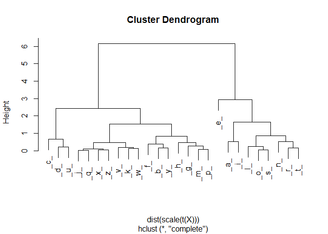
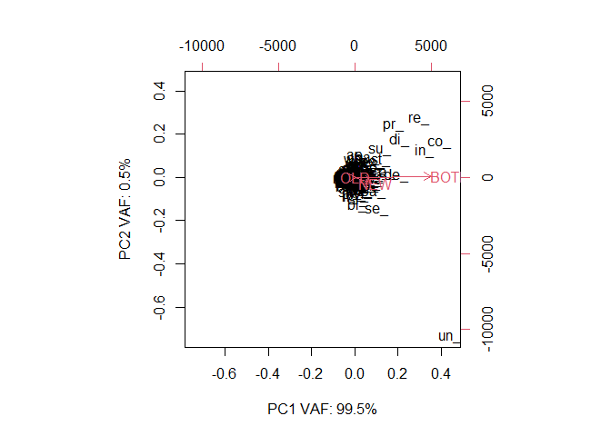

```r
# CHANGE PATH HERE:

mypath = "D:\\_nj_\\-github-\\Resources\\2022-07-21\\Evolution\\";


# YOU need to install these packages for this to work.
library(SentimentAnalysis);
```

```
## Warning: package 'SentimentAnalysis' was built under R version 4.1.3
```

```
## 
## Attaching package: 'SentimentAnalysis'
```

```
## The following object is masked from 'package:base':
## 
##     write
```

```r
library(wordcloud2);
```

```
## Warning: package 'wordcloud2' was built under R version 4.1.3
```

```r
library(wordcloud);
```

```
## Warning: package 'wordcloud' was built under R version 4.1.3
```

```
## Loading required package: RColorBrewer
```

```
## Warning: package 'RColorBrewer' was built under R version 4.1.3
```

```r
library(tm);
```

```
## Warning: package 'tm' was built under R version 4.1.3
```

```
## Loading required package: NLP
```

```r
library(textclean);
```

```
## Warning: package 'textclean' was built under R version 4.1.3
```

```r
library(slam);
```

```
## Warning: package 'slam' was built under R version 4.1.2
```

# Inputs

I am comparing the ORIG 1828 NOAH WEBSTER AMERICAN DICTIONARY to the COPY of 1844.


## [1828] ORIG


```r
myFile = paste0(mypath,"1828.txt");
#ORIG = readChar(myFile, file.info(myFile)$size);
ORIG = readLines(myFile);
length(ORIG);
```

```
## [1] 62977
```

```r
ORIG = unique(ORIG);  # replicates are same word with "multiple meanings" ... still ? SPELLED THE SAME
length(ORIG);
```

```
## [1] 62956
```


## [1844] COPY


```r
myFile = paste0(mypath,"1844.txt");
#COPY = readChar(myFile, file.info(myFile)$size);
COPY = readLines(myFile);
length(COPY);
```

```
## [1] 85571
```

```r
COPY = unique(COPY);  # replicates are same word with "multiple meanings" ... still ? SPELLED THE SAME
length(COPY);
```

```
## [1] 75305
```


```r
ALL = union(ORIG,COPY);
```


## Summary


```r
if(!file.exists(paste0(mypath,"BOTH.txt")))
{
ALL = union(ORIG,COPY);
OLD = setdiff(ORIG,COPY);
NEW = setdiff(COPY,ORIG);
BOTH = intersect(ORIG,COPY);

writeLines(sort(ALL), paste0(mypath,"ALL.txt"));
writeLines(sort(OLD), paste0(mypath,"OLD.txt"));
writeLines(sort(NEW), paste0(mypath,"NEW.txt"));
writeLines(sort(BOTH), paste0(mypath,"BOTH.txt"));
}
```


```r
if(!file.exists(paste0(mypath,"BOTH.txt")))
{
df = as.data.frame(ALL);
colnames(df) = "words";

df$ALL = 1;
df$OLD = as.integer( is.element(ALL,OLD) );
df$NEW = as.integer( is.element(ALL,NEW) );
df$BOTH = as.integer( is.element(ALL,BOTH) );

rownames(df) = ALL;
df;
}
```


```r
# FULL
# STARTS
# END

revS = function(str, sep="", delimiter="")
{
  vec = toVec(str,sep);
  vecR = rev(vec);
  toStr(vecR, delimiter);
}

toStr = function(vec, delimiter="")
{
paste0(vec, collapse = delimiter);  
}
toVec = function(str, sep="")
{
  strsplit(str, sep, fixed=TRUE)[[1]];
}

# 1,2,3,4,5
# 26, 26^2, 26^3, 26^4, 26^5

parseWord = function(word)
{
  mylist = list();
  mylist$word = word;
  
  wl = nchar(word);
    mylist$wl = wl;
    
  
  start = end = full = NULL;
  
  ## let's do start and end ...
  myl = 5;
  if(wl < myl) { myl = wl; }
  
  
  stem = substr(word, 1, myl);
    now = substring(stem, 1, 1:myl);
    
    start = c(start, now);
    full = c(full, now);
    
    stemR = substr(revS(word), 1, myl);
    nowR = substring(stemR, 1, 1:myl);
    
    end = c(end, unlist(lapply(nowR, FUN=revS)) );
  
  ## let's now step into the middle of the word ... ONLY do full
  n = 1;
  myl = 5;
  # loops = wl - myl;
  loops = wl;
  
  if(loops > 0)
  {
  for(n in 1:loops)
  {
  
  stem = substr(word, n+1, myl+n);
    now = unique(substring(stem, 1, 1:myl));
    full = c(full, now);
  }
  }
  
  full[nchar(full)>0] 
  
  mylist$full = full[nchar(full)>0] ;
  mylist$start = start[nchar(start)>0] ;
  mylist$end = end[nchar(end)>0] ;
  
  mylist;
  
  
  
  
}


parseWord("abatis");
```

```
## $word
## [1] "abatis"
## 
## $wl
## [1] 6
## 
## $full
##  [1] "a"     "ab"    "aba"   "abat"  "abati" "b"     "ba"    "bat"   "bati" 
## [10] "batis" "a"     "at"    "ati"   "atis"  "t"     "ti"    "tis"   "i"    
## [19] "is"    "s"    
## 
## $start
## [1] "a"     "ab"    "aba"   "abat"  "abati"
## 
## $end
## [1] "s"     "is"    "tis"   "atis"  "batis"
```

```r
parseWord("recommissioning");
```

```
## $word
## [1] "recommissioning"
## 
## $wl
## [1] 15
## 
## $full
##  [1] "r"     "re"    "rec"   "reco"  "recom" "e"     "ec"    "eco"   "ecom" 
## [10] "ecomm" "c"     "co"    "com"   "comm"  "commi" "o"     "om"    "omm"  
## [19] "ommi"  "ommis" "m"     "mm"    "mmi"   "mmis"  "mmiss" "m"     "mi"   
## [28] "mis"   "miss"  "missi" "i"     "is"    "iss"   "issi"  "issio" "s"    
## [37] "ss"    "ssi"   "ssio"  "ssion" "s"     "si"    "sio"   "sion"  "sioni"
## [46] "i"     "io"    "ion"   "ioni"  "ionin" "o"     "on"    "oni"   "onin" 
## [55] "oning" "n"     "ni"    "nin"   "ning"  "i"     "in"    "ing"   "n"    
## [64] "ng"    "g"    
## 
## $start
## [1] "r"     "re"    "rec"   "reco"  "recom"
## 
## $end
## [1] "g"     "ng"    "ing"   "ning"  "oning"
```

```r
parseWord("a");
```

```
## $word
## [1] "a"
## 
## $wl
## [1] 1
## 
## $full
## [1] "a"
## 
## $start
## [1] "a"
## 
## $end
## [1] "a"
```

```r
parseWord("the");
```

```
## $word
## [1] "the"
## 
## $wl
## [1] 3
## 
## $full
## [1] "t"   "th"  "the" "h"   "he"  "e"  
## 
## $start
## [1] "t"   "th"  "the"
## 
## $end
## [1] "e"   "he"  "the"
```

```r
parseWord("apply");
```

```
## $word
## [1] "apply"
## 
## $wl
## [1] 5
## 
## $full
##  [1] "a"     "ap"    "app"   "appl"  "apply" "p"     "pp"    "ppl"   "pply" 
## [10] "p"     "pl"    "ply"   "l"     "ly"    "y"    
## 
## $start
## [1] "a"     "ap"    "app"   "appl"  "apply"
## 
## $end
## [1] "y"     "ly"    "ply"   "pply"  "apply"
```

## This will take some time, so let's cache the result ...


```r
myFile = paste0(mypath,"raw-ch.RDS");
timer.start = as.numeric( Sys.time() );
if(!file.exists(myFile))
{
  res = list();
  for(i in 1:length(ALL))
  {
    word = ALL[i];
    res[[word]] = parseWord(word);
    
    if(i %% 10000 == 0)
    {
    print(paste0(i," : ",word));
    }
    
  }


## eend lop

saveRDS(res, file=myFile);
}

timer.end = as.numeric( Sys.time() );

timer.diff = timer.end - timer.start;
print(paste0( timer.diff, " seconds "));
```

```
## [1] "0.0159571170806885 seconds "
```


```r
# grab from CACHE ...
parsed = invisible( readRDS(myFile) );
```


## Organize the features into the df


```r
myFile2 = paste0(mypath,"features-ch.RDS");
timer.start = as.numeric( Sys.time() );
if(!file.exists(myFile2))
{
  res = list();
    m = c("OLD","NEW","BOTH");
    d = c("full", "start", "end");
    ### INIT ###
  for(mm in 1:3) 
    { 
    whichM = m[mm];
    res[[whichM]] = list(); 
  for(j in 1:3) 
    { 
    whichD = d[j];
    res[[whichM]][[whichD]] = list(); 
    for(i in 1:5)
    {
      res[[whichM]][[whichD]][[i]] = list();
    }
  }
    
  }
    ## END INIT

  for(i in 1:length(ALL))
  {
    word = ALL[i];
    data = parsed[[word]];
    
    whichM = 0;
    if(is.element(word,OLD)) {whichM = 1;}
    if(is.element(word,NEW)) {whichM = 2;}
    if(is.element(word,BOTH)) {whichM = 3;}
    
    for(j in 1:3) 
    { 
    whichD = d[j];
    data.j = data[[whichD]];
    for(k in 1:length(data.j))
      {
      ss = data.j[k];
      sl = nchar(ss);
      
      if(is.null(res[[whichM]][[whichD]][[sl]][[ss]]))
      {
        res[[whichM]][[whichD]][[sl]][[ss]] = 0;
      }
      
      res[[whichM]][[whichD]][[sl]][[ss]] = 1 + res[[whichM]][[whichD]][[sl]][[ss]]; # increment
      
      # names(res[[whichD]][[sl]]);
      # we will alphabatize them ... 
      
      }
    
    }
    
    if(i %% 1000 == 0)
    {
    print(paste0(i," : ",word));
    }
    
  }


saveRDS(res, file=myFile2);
}

timer.end = as.numeric( Sys.time() );

timer.diff = timer.end - timer.start;
print(paste0( timer.diff, " seconds "));
```

```
## [1] "0.00697994232177734 seconds "
```


```r
# grab from CACHE ...
counted = invisible( readRDS(myFile2) );
```

## BUILD DATAFRAME for FREQ table

```r
m = c("OLD","NEW","BOTH");
d = c("full", "start", "end");

myFile3 = paste0(mypath,"df-ch.RDS");
timer.start = as.numeric( Sys.time() );
if(!file.exists(myFile3))
{
  nnn = 0;
  # counted
  df = NULL;
  
  for(mm in 1:3) 
    { 
    whichM = m[mm]; 
  for(j in 1:3) 
    { 
    whichD = d[j];
    for(i in 1:5)
    {
      # res[[whichM]][[whichD]][[i]] = list();
      mynames = sort(names(counted[[whichM]][[whichD]][[i]]));
      
      nnl = length(mynames);
      print( paste0(whichM," => ",whichD," => ",i," => ",nnl," => ",nnn ) );
      for(nn in 1:nnl)
      {
        nnn = 1 + nnn;
        myname = mynames[nn];
        myvalue = counted[[whichM]][[whichD]][[i]][[myname]];
        
        #Mmyname = paste0(myname,"_");
        #if(whichD == "end") { Mmyname = paste0("_",myname); }
        #if(whichD == "full") { Mmyname = paste0("_",myname,"_"); }
        
      row = c(whichM, whichD, i, myname, myvalue);
      #row = c(whichM, whichD, i, myname, Mmyname, myvalue);
      df = rbind(df, row);
      
      if(nn %% 1000 == 0)
    {
    print(paste0("               ",nn," / ",nnl," : ",myname," --> ", myvalue));
      }
      
      }
      
    }
  }
    
  }
    ## END INIT
  
  

df = as.data.frame(df);
colnames(df) = c("SET","DIRECTION", "NUMBER", "STEM", "FREQ");

saveRDS(df, file=myFile3);  
}
  
  
timer.end = as.numeric( Sys.time() );

timer.diff = timer.end - timer.start;
print(paste0( timer.diff, " seconds "));
```

```
## [1] "0.0029909610748291 seconds "
```


```r
FEATURES = readRDS(myFile3);

FEATURES$NUMBER = as.numeric(FEATURES$NUMBER);
FEATURES$FREQ = as.numeric(FEATURES$FREQ);
```

# ---FULL (one-length)

```r
# rows are features
# cols what we want to compare

# JUST FULL

SUB = subset(FEATURES, DIRECTION=="full");
SUB = subset(SUB, NUMBER==1);
SUB$STEM2 = paste0("_",SUB$STEM,"_");

SUB.BOTH = subset(SUB, SET=="BOTH");
SUB.OLD = subset(SUB, SET=="OLD");
SUB.NEW = subset(SUB, SET=="NEW");

FREQ.BOTH = SUB.BOTH[,c(6,5)];
FREQ.OLD = SUB.OLD[,c(6,5)];
FREQ.NEW = SUB.NEW[,c(6,5)];


TABLE.FREQ = merge(FREQ.BOTH, FREQ.OLD, by="STEM2", all.x=TRUE, all.y=TRUE);
TABLE.FREQ = merge(TABLE.FREQ, FREQ.NEW, by="STEM2", all.x=TRUE, all.y=TRUE);
colnames(TABLE.FREQ) = c("FEATURE", "BOTH", "OLD", "NEW");
rownames(TABLE.FREQ) = TABLE.FREQ$FEATURE;

TABLE.FREQ[is.na(TABLE.FREQ)] = 0;
TABLE.FREQ;
```

```
##     FEATURE  BOTH OLD   NEW
## _a_     _a_ 42585 793  9961
## _b_     _b_ 10704 206  2532
## _c_     _c_ 23430 454  5356
## _d_     _d_ 20624 276  5813
## _e_     _e_ 63448 974 14397
## _f_     _f_  8043 118  1857
## _g_     _g_ 14762 182  4096
## _h_     _h_ 12049 288  3168
## _i_     _i_ 46491 806 11816
## _j_     _j_   834   6   188
## _k_     _k_  3479  47   883
## _l_     _l_ 30648 546  7891
## _m_     _m_ 14615 252  3724
## _n_     _n_ 40823 599 10276
## _o_     _o_ 33226 572  7990
## _p_     _p_ 15868 256  3760
## _q_     _q_  1058  11   237
## _r_     _r_ 39508 609  8625
## _s_     _s_ 34117 576  8014
## _t_     _t_ 37662 590  8306
## _u_     _u_ 21042 311  5164
## _v_     _v_  5984  67  1321
## _w_     _w_  4521  78   893
## _x_     _x_  1665  24   363
## _y_     _y_ 10350 168  2758
## _z_     _z_  1265  29   494
```

## SETUP X

```r
names.features = TABLE.FREQ$FEATURE;
names.docs = colnames(TABLE.FREQ)[-1];
X = t( TABLE.FREQ[,-1] );
rownames(X) = names.docs;
colnames(X) = names.features;
```

### HCLUST

```r
Xclust = hclust(dist(scale(t(X))));
# transpose, then scale?
plot(Xclust);
```

<!-- -->

### Compute bigraph (BOTH,OLD,NEW)

```r
# prcomp vs princomp?
X.PCA = prcomp(t(X));  
summary(X.PCA);
```

```
## Importance of components:
##                              PC1       PC2      PC3
## Standard deviation     1.754e+04 395.31060 44.47832
## Proportion of Variance 9.995e-01   0.00051  0.00001
## Cumulative Proportion  9.995e-01   0.99999  1.00000
```

```r
str(X.PCA);
```

```
## List of 5
##  $ sdev    : num [1:3] 17543.4 395.3 44.5
##  $ rotation: num [1:3, 1:3] -0.973657 -0.015843 -0.227465 -0.227498 0.000282 ...
##   ..- attr(*, "dimnames")=List of 2
##   .. ..$ : chr [1:3] "BOTH" "OLD" "NEW"
##   .. ..$ : chr [1:3] "PC1" "PC2" "PC3"
##  $ center  : Named num [1:3] 20723 340 4996
##   ..- attr(*, "names")= chr [1:3] "BOTH" "OLD" "NEW"
##  $ scale   : logi FALSE
##  $ x       : num [1:26, 1:3] -22422.6 10317.7 -2719.4 -88.4 -43748 ...
##   ..- attr(*, "dimnames")=List of 2
##   .. ..$ : chr [1:26] "_a_" "_b_" "_c_" "_d_" ...
##   .. ..$ : chr [1:3] "PC1" "PC2" "PC3"
##  - attr(*, "class")= chr "prcomp"
```

```r
X.PCA;
```

```
## Standard deviations (1, .., p=3):
## [1] 17543.43099   395.31060    44.47832
## 
## Rotation (n x k) = (3 x 3):
##              PC1           PC2          PC3
## BOTH -0.97365734 -0.2274979852  0.015363874
## OLD  -0.01584349  0.0002821404 -0.999874444
## NEW  -0.22746509  0.9737785103  0.003879071
```

```r
biplot(X.PCA, 
       xlab=paste0("PC1 VAF: ",round(summary(X.PCA)$importance[2,1] * 100,1 ), "%"),
       ylab=paste0("PC2 VAF: ",round(summary(X.PCA)$importance[2,2] * 100,1 ), "%"),
      );
```

<!-- -->


### Compute bigraph (OLD,NEW)

```r
# prcomp vs princomp?
X.PCA = prcomp(t(X[-1,]));  # GET RID OF BOTH
summary(X.PCA);
```

```
## Importance of components:
##                              PC1      PC2
## Standard deviation     4018.5791 51.69635
## Proportion of Variance    0.9998  0.00017
## Cumulative Proportion     0.9998  1.00000
```

```r
str(X.PCA);
```

```
## List of 5
##  $ sdev    : num [1:2] 4018.6 51.7
##  $ rotation: num [1:2, 1:2] 0.0689 0.9976 0.9976 -0.0689
##   ..- attr(*, "dimnames")=List of 2
##   .. ..$ : chr [1:2] "OLD" "NEW"
##   .. ..$ : chr [1:2] "PC1" "PC2"
##  $ center  : Named num [1:2] 340 4996
##   ..- attr(*, "names")= chr [1:2] "OLD" "NEW"
##  $ scale   : logi FALSE
##  $ x       : num [1:26, 1:2] 4985 -2467 367 811 9423 ...
##   ..- attr(*, "dimnames")=List of 2
##   .. ..$ : chr [1:26] "_a_" "_b_" "_c_" "_d_" ...
##   .. ..$ : chr [1:2] "PC1" "PC2"
##  - attr(*, "class")= chr "prcomp"
```

```r
X.PCA;
```

```
## Standard deviations (1, .., p=2):
## [1] 4018.57911   51.69635
## 
## Rotation (n x k) = (2 x 2):
##            PC1         PC2
## OLD 0.06886007  0.99762633
## NEW 0.99762633 -0.06886007
```

```r
biplot(X.PCA, 
       xlab=paste0("PC1 VAF: ",round(summary(X.PCA)$importance[2,1] * 100,1 ), "%"),
       ylab=paste0("PC2 VAF: ",round(summary(X.PCA)$importance[2,2] * 100,1 ), "%"),
      );
```

<!-- -->


## TF-IDF

```r
# https://www.mathworks.com/help/textanalytics/ref/bagofwords.tfidf.html

X.tf = colSums(X);  # term freq
X.idf = colSums(X != 0); # document freq

# NORM technique?
# https://en.wikipedia.org/wiki/Tf%E2%80%93idf#Inverse_document_frequency
X.tf.s = log(1 + X.tf);
X.idf.s = log( nrow(X) / (1+X.idf) ) + 1;

X.tf.idf.s = X.tf.s * X.idf.s;  # PAIRWISE products

# https://en.wikipedia.org/wiki/Latent_semantic_analysis


## scaled X
Xs = X * X.tf.idf.s # PAIRWISE products
```

### HCLUST

```r
Xclust = hclust(dist(scale(t(Xs))));
# transpose, then scale? No scale on Xs? double scale?
plot(Xclust);
```

<!-- -->

### Compute bigraph (BOTH,OLD,NEW)

```r
# prcomp vs princomp?
Xs.PCA = prcomp(t(Xs));  
summary(Xs.PCA);
```

```
## Importance of components:
##                              PC1       PC2       PC3
## Standard deviation     1.223e+05 7.306e+03 562.58719
## Proportion of Variance 9.964e-01 3.560e-03   0.00002
## Cumulative Proportion  9.964e-01 1.000e+00   1.00000
```

```r
str(Xs.PCA);
```

```
## List of 5
##  $ sdev    : num [1:3] 122300 7306 563
##  $ rotation: num [1:3, 1:3] -0.9709 -0.016 -0.2389 -0.2392 0.0188 ...
##   ..- attr(*, "dimnames")=List of 2
##   .. ..$ : chr [1:3] "BOTH" "OLD" "NEW"
##   .. ..$ : chr [1:3] "PC1" "PC2" "PC3"
##  $ center  : Named num [1:3] 141146 2377 35241
##   ..- attr(*, "names")= chr [1:3] "BOTH" "OLD" "NEW"
##  $ scale   : logi FALSE
##  $ x       : num [1:26, 1:3] -192585 66045 -24248 36075 -312058 ...
##   ..- attr(*, "dimnames")=List of 2
##   .. ..$ : chr [1:26] "_a_" "_b_" "_c_" "_d_" ...
##   .. ..$ : chr [1:3] "PC1" "PC2" "PC3"
##  - attr(*, "class")= chr "prcomp"
```

```r
Xs.PCA;
```

```
## Standard deviations (1, .., p=3):
## [1] 122299.8271   7306.0999    562.5872
## 
## Rotation (n x k) = (3 x 3):
##              PC1         PC2         PC3
## BOTH -0.97090916 -0.23919340 -0.01104176
## OLD  -0.01599898  0.01879299  0.99969538
## NEW  -0.23891303  0.97079006 -0.02207314
```

```r
biplot(Xs.PCA, 
       xlab=paste0("PC1 VAF: ",round(summary(Xs.PCA)$importance[2,1] * 100,1 ), "%"),
       ylab=paste0("PC2 VAF: ",round(summary(Xs.PCA)$importance[2,2] * 100,1 ), "%"),
      );
```

<!-- -->


### Compute bigraph (OLD,NEW)

```r
# prcomp vs princomp?
X.PCA = prcomp(t(X[-1,]));  # GET RID OF BOTH
summary(X.PCA);
```

```
## Importance of components:
##                              PC1      PC2
## Standard deviation     4018.5791 51.69635
## Proportion of Variance    0.9998  0.00017
## Cumulative Proportion     0.9998  1.00000
```

```r
str(X.PCA);
```

```
## List of 5
##  $ sdev    : num [1:2] 4018.6 51.7
##  $ rotation: num [1:2, 1:2] 0.0689 0.9976 0.9976 -0.0689
##   ..- attr(*, "dimnames")=List of 2
##   .. ..$ : chr [1:2] "OLD" "NEW"
##   .. ..$ : chr [1:2] "PC1" "PC2"
##  $ center  : Named num [1:2] 340 4996
##   ..- attr(*, "names")= chr [1:2] "OLD" "NEW"
##  $ scale   : logi FALSE
##  $ x       : num [1:26, 1:2] 4985 -2467 367 811 9423 ...
##   ..- attr(*, "dimnames")=List of 2
##   .. ..$ : chr [1:26] "_a_" "_b_" "_c_" "_d_" ...
##   .. ..$ : chr [1:2] "PC1" "PC2"
##  - attr(*, "class")= chr "prcomp"
```

```r
X.PCA;
```

```
## Standard deviations (1, .., p=2):
## [1] 4018.57911   51.69635
## 
## Rotation (n x k) = (2 x 2):
##            PC1         PC2
## OLD 0.06886007  0.99762633
## NEW 0.99762633 -0.06886007
```

```r
biplot(X.PCA, 
       xlab=paste0("PC1 VAF: ",round(summary(X.PCA)$importance[2,1] * 100,1 ), "%"),
       ylab=paste0("PC2 VAF: ",round(summary(X.PCA)$importance[2,2] * 100,1 ), "%"),
      );
```

<!-- -->


# ---FULL (two-length)

```r
# rows are features
# cols what we want to compare

# JUST FULL

SUB = subset(FEATURES, DIRECTION=="full");
SUB = subset(SUB, NUMBER==2);
SUB$STEM2 = paste0("_",SUB$STEM,"_");

SUB.BOTH = subset(SUB, SET=="BOTH");
SUB.OLD = subset(SUB, SET=="OLD");
SUB.NEW = subset(SUB, SET=="NEW");

FREQ.BOTH = SUB.BOTH[,c(6,5)];
FREQ.OLD = SUB.OLD[,c(6,5)];
FREQ.NEW = SUB.NEW[,c(6,5)];


TABLE.FREQ = merge(FREQ.BOTH, FREQ.OLD, by="STEM2", all.x=TRUE, all.y=TRUE);
TABLE.FREQ = merge(TABLE.FREQ, FREQ.NEW, by="STEM2", all.x=TRUE, all.y=TRUE);
colnames(TABLE.FREQ) = c("FEATURE", "BOTH", "OLD", "NEW");
rownames(TABLE.FREQ) = TABLE.FREQ$FEATURE;

TABLE.FREQ[is.na(TABLE.FREQ)] = 0;
TABLE.FREQ;
```

```
##      FEATURE  BOTH OLD  NEW
## _aa_    _aa_    13   4    6
## _ab_    _ab_  2489  41  568
## _ac_    _ac_  2474  53  676
## _ad_    _ad_  1612  26  381
## _ae_    _ae_    67   7   51
## _af_    _af_   442   4   91
## _ag_    _ag_  1397  19  269
## _ah_    _ah_   110   4   22
## _ai_    _ai_  1229  21  271
## _aj_    _aj_    39   0    7
## _ak_    _ak_   385   6   55
## _al_    _al_  5277 108 1294
## _am_    _am_  1457  30  373
## _an_    _an_  5592 124 1336
## _ao_    _ao_    33   1   11
## _ap_    _ap_  1559  27  392
## _aq_    _aq_    28   1    6
## _ar_    _ar_  5049 115 1182
## _as_    _as_  2382  27  490
## _at_    _at_  7806 120 1623
## _au_    _au_   697   9  185
## _av_    _av_   717  10  158
## _aw_    _aw_   356   1   80
## _ax_    _ax_   121   3   28
## _ay_    _ay_   504   2   75
## _az_    _az_   183   2   39
## _ba_    _ba_  1218  43  260
## _bb_    _bb_   274   9   63
## _bc_    _bc_    20   0    6
## _bd_    _bd_    72   2    9
## _be_    _be_  1652  32  364
## _bf_    _bf_    12   0    2
## _bg_    _bg_     3   0    5
## _bh_    _bh_    13   0    2
## _bi_    _bi_  1131  18  279
## _bj_    _bj_    46   2   12
## _bk_    _bk_     1   0    2
## _bl_    _bl_  2808  34  672
## _bm_    _bm_    31   0   11
## _bn_    _bn_    25   0   10
## _bo_    _bo_  1053  30  274
## _bp_    _bp_     7   0    4
## _bq_    _bq_     4   0    0
## _br_    _br_   977  18  235
## _bs_    _bs_   261   1   65
## _bt_    _bt_   109   1   14
## _bu_    _bu_   680  12  180
## _bv_    _bv_    25   1    5
## _bw_    _bw_     7   0    1
## _by_    _by_    94   0   43
## _ca_    _ca_  3559  83  832
## _cb_    _cb_     3   0    0
## _cc_    _cc_   390   7   94
## _cd_    _cd_     5   0    3
## _ce_    _ce_  2689  47  527
## _cf_    _cf_     0   0    1
## _cg_    _cg_     1   0    3
## _ch_    _ch_  2550  60  699
## _ci_    _ci_  1796  45  463
## _cj_    _cj_     0   0    1
## _ck_    _ck_  1078  19  287
## _cl_    _cl_   852  20  179
## _cm_    _cm_    10   0    1
## _cn_    _cn_    13   1    4
## _co_    _co_  4429  65  974
## _cp_    _cp_     2   0    2
## _cq_    _cq_    39   0    7
## _cr_    _cr_  1187  24  268
## _cs_    _cs_    84   1   24
## _ct_    _ct_  1767  17  322
## _cu_    _cu_  1324  13  295
## _cv_    _cv_     0   0    1
## _cy_    _cy_   483  14   93
## _cz_    _cz_     3   0    1
## _da_    _da_   979  21  257
## _db_    _db_    58   5   22
## _dc_    _dc_    33   0   24
## _dd_    _dd_   359   5   92
## _de_    _de_  4046  46  993
## _df_    _df_    89   3   28
## _dg_    _dg_   235   3   52
## _dh_    _dh_    54   1   25
## _di_    _di_  3489  44  787
## _dj_    _dj_    59   0   10
## _dk_    _dk_     6   1    1
## _dl_    _dl_   591  12  163
## _dm_    _dm_   139   2   28
## _dn_    _dn_   315   6   59
## _do_    _do_   866  10  239
## _dp_    _dp_    34   1    9
## _dq_    _dq_     1   0    0
## _dr_    _dr_   750  12  159
## _ds_    _ds_   185  13   65
## _dt_    _dt_    31   0   11
## _du_    _du_   619   2  117
## _dv_    _dv_   108   1   19
## _dw_    _dw_    75   0   34
## _dy_    _dy_   209  10   61
## _dz_    _dz_     1   0    0
## _ea_    _ea_  2904  38  659
## _eb_    _eb_   450   4   90
## _ec_    _ec_  2163  23  419
## _ed_    _ed_  7255  90 2639
## _ee_    _ee_  1432  18  315
## _ef_    _ef_   865   5  178
## _eg_    _eg_   654   9  144
## _eh_    _eh_   242   4   51
## _ei_    _ei_   484  16  132
## _ej_    _ej_    78   1   23
## _ek_    _ek_    91   2   21
## _el_    _el_  3168  59  876
## _em_    _em_  1805  27  426
## _en_    _en_  6826 103 1558
## _eo_    _eo_   617  16  147
## _ep_    _ep_  1260  23  301
## _eq_    _eq_   214   0   39
## _er_    _er_ 10554 166 2145
## _es_    _es_  5790  92 1373
## _et_    _et_  2494  47  544
## _eu_    _eu_   242   6   87
## _ev_    _ev_   779   7  166
## _ew_    _ew_   447   5   73
## _ex_    _ex_  1118  16  238
## _ey_    _ey_   305   7   66
## _ez_    _ez_    51   1    8
## _fa_    _fa_   793   9  174
## _fb_    _fb_     9   1    7
## _fc_    _fc_    18   3   10
## _fd_    _fd_    20   2   14
## _fe_    _fe_  1103  14  286
## _ff_    _ff_   685  19  154
## _fg_    _fg_     2   0    2
## _fh_    _fh_     7   0    4
## _fi_    _fi_  1302  11  275
## _fj_    _fj_     1   0    2
## _fk_    _fk_     3   0    0
## _fl_    _fl_   790   7  165
## _fm_    _fm_    11   0    6
## _fn_    _fn_    10   1    2
## _fo_    _fo_  1113  15  248
## _fp_    _fp_    12   0    4
## _fr_    _fr_   580   5  147
## _fs_    _fs_    26   1   13
## _ft_    _ft_   253   5   43
## _fu_    _fu_   882  11  194
## _fv_    _fv_     1   0    1
## _fw_    _fw_     9   1    3
## _fy_    _fy_   197   0   64
## _ga_    _ga_  1117  10  239
## _gb_    _gb_    44   1   13
## _gc_    _gc_    20   1    7
## _gd_    _gd_    27   1    5
## _ge_    _ge_  1961  24  374
## _gf_    _gf_    20   0    5
## _gg_    _gg_   363   2   62
## _gh_    _gh_   714   9  156
## _gi_    _gi_  1089  14  302
## _gj_    _gj_     1   0    0
## _gk_    _gk_     5   1    2
## _gl_    _gl_   898   8  432
## _gm_    _gm_   136   1   10
## _gn_    _gn_   486   8  138
## _go_    _go_   640  16  135
## _gp_    _gp_    40   0    9
## _gr_    _gr_  1195  20  286
## _gs_    _gs_   134   3   38
## _gt_    _gt_    48   1   12
## _gu_    _gu_   658  13  163
## _gv_    _gv_     6   0    1
## _gw_    _gw_    33   1    7
## _gy_    _gy_   276   1   84
## _gz_    _gz_     1   0    2
## _ha_    _ha_  1833  44  490
## _hb_    _hb_    48   1   17
## _hc_    _hc_    26   1    6
## _hd_    _hd_    30   0    6
## _he_    _he_  2685  67  716
## _hf_    _hf_    76   2   27
## _hg_    _hg_     8   0    7
## _hh_    _hh_    30   2    4
## _hi_    _hi_  1831  42  549
## _hk_    _hk_     3   0    1
## _hl_    _hl_   220  11   78
## _hm_    _hm_   123   3   17
## _hn_    _hn_   136   2   32
## _ho_    _ho_  1672  48  445
## _hp_    _hp_    39   1   12
## _hq_    _hq_     2   0    0
## _hr_    _hr_   455   9  127
## _hs_    _hs_    47   3   15
## _ht_    _ht_   493   6  123
## _hu_    _hu_   414  11  112
## _hv_    _hv_     4   1    1
## _hw_    _hw_    71   1   10
## _hy_    _hy_   579  12  188
## _ia_    _ia_  1910  57  557
## _ib_    _ib_   861  11  183
## _ic_    _ic_  4216 118 1073
## _id_    _id_  1312  21  366
## _ie_    _ie_  1138  14  311
## _if_    _if_  1070  25  297
## _ig_    _ig_  1400  23  314
## _ih_    _ih_    33   3    9
## _ii_    _ii_     2   8    8
## _ij_    _ij_     6   0    5
## _ik_    _ik_   177   1   51
## _il_    _il_  2595  49  657
## _im_    _im_  1632  26  371
## _in_    _in_ 12008 162 3528
## _io_    _io_  3983  48  653
## _ip_    _ip_   949  26  252
## _iq_    _iq_    98   1   20
## _ir_    _ir_  1233  20  339
## _is_    _is_  5020  74 1182
## _it_    _it_  4190  73  793
## _iu_    _iu_   120   3   55
## _iv_    _iv_  1579  17  375
## _iw_    _iw_     7   1    0
## _ix_    _ix_   138   1   19
## _iy_    _iy_     0   2    0
## _iz_    _iz_   746  17  346
## _ja_    _ja_   148   1   35
## _je_    _je_   182   2   34
## _ji_    _ji_    14   0    9
## _jo_    _jo_   201   0   48
## _ju_    _ju_   288   3   61
## _ka_    _ka_   118   5   41
## _kb_    _kb_    34   0   17
## _kc_    _kc_    11   0   11
## _kd_    _kd_     6   0    1
## _ke_    _ke_  1106  12  307
## _kf_    _kf_    27   0   12
## _kg_    _kg_     5   0    3
## _kh_    _kh_    25   0   12
## _ki_    _ki_   555   4  147
## _kj_    _kj_     2   0    1
## _kk_    _kk_     3   0    5
## _kl_    _kl_   210   2   56
## _km_    _km_    37   2   18
## _kn_    _kn_   179   2   40
## _ko_    _ko_    48   1   15
## _kp_    _kp_    21   1    5
## _kr_    _kr_    30   0   13
## _ks_    _ks_   107   1   29
## _kt_    _kt_    14   1    7
## _ku_    _ku_    21   0    6
## _kv_    _kv_     2   0    3
## _kw_    _kw_    26   2   19
## _ky_    _ky_    73   2   20
## _la_    _la_  3489  49  862
## _lb_    _lb_   104   3   29
## _lc_    _lc_   242   4   71
## _ld_    _ld_   460  14  139
## _le_    _le_  6496  96 1408
## _lf_    _lf_   269   4  116
## _lg_    _lg_   109   2   34
## _lh_    _lh_    37   0   17
## _li_    _li_  4354  88 1233
## _lj_    _lj_     2   0    1
## _lk_    _lk_   158   1   41
## _ll_    _ll_  2884  66  803
## _lm_    _lm_   208  11   66
## _ln_    _ln_   254   4   47
## _lo_    _lo_  2472  52  660
## _lp_    _lp_   174   7   64
## _lq_    _lq_     3   0    0
## _lr_    _lr_    19   0   15
## _ls_    _ls_   261   2   64
## _lt_    _lt_   640   8  169
## _lu_    _lu_  1084  20  237
## _lv_    _lv_   222   5   51
## _lw_    _lw_    45   0   11
## _lx_    _lx_     1   0    0
## _ly_    _ly_  3412  43 1263
## _lz_    _lz_     2   0    2
## _ma_    _ma_  2533  45  625
## _mb_    _mb_   858  20  202
## _mc_    _mc_    10   1   11
## _md_    _md_     6   0    4
## _me_    _me_  2703  42  655
## _mf_    _mf_    68   1   14
## _mg_    _mg_     8   0    3
## _mh_    _mh_     4   0    1
## _mi_    _mi_  2392  46  588
## _mj_    _mj_     1   0    1
## _mk_    _mk_     3   0    0
## _ml_    _ml_    59   2   12
## _mm_    _mm_   651  12  169
## _mn_    _mn_   140   1   45
## _mo_    _mo_  1537  23  426
## _mp_    _mp_  1542  17  333
## _mq_    _mq_     0   0    1
## _mr_    _mr_    12   0    3
## _ms_    _ms_    93   4   22
## _mt_    _mt_    11   2    7
## _mu_    _mu_   608  11  156
## _mv_    _mv_    29   0    3
## _mw_    _mw_     9   0    3
## _my_    _my_   182   3   51
## _na_    _na_  2521  42  675
## _nb_    _nb_   214   0   88
## _nc_    _nc_  2787  44  596
## _nd_    _nd_  2700  31  638
## _ne_    _ne_  5495 101 1267
## _nf_    _nf_   618   6  130
## _ng_    _ng_  6563  68 2284
## _nh_    _nh_   220   1   61
## _ni_    _ni_  2550  53  788
## _nj_    _nj_    96   0   15
## _nk_    _nk_   343   3   91
## _nl_    _nl_   276  10   92
## _nm_    _nm_   188   3   82
## _nn_    _nn_   581  15  134
## _no_    _no_  1331  29  402
## _np_    _np_   259   6   98
## _nq_    _nq_   126   1   25
## _nr_    _nr_   268   2  103
## _ns_    _ns_  1899  18  481
## _nt_    _nt_  5266  80 1161
## _nu_    _nu_   473  13  130
## _nv_    _nv_   345   2   65
## _nw_    _nw_   156   5   50
## _nx_    _nx_    11   0    4
## _ny_    _ny_   264   6   57
## _nz_    _nz_    22   0    8
## _oa_    _oa_   521  15  146
## _ob_    _ob_   596   8  129
## _oc_    _oc_  1044  19  246
## _od_    _od_   812  17  288
## _oe_    _oe_   176   5   48
## _of_    _of_   282   6   72
## _og_    _og_  1040  25  311
## _oh_    _oh_    59   6   21
## _oi_    _oi_   586  13  182
## _oj_    _oj_    17   0    0
## _ok_    _ok_   250   3   81
## _ol_    _ol_  2291  36  557
## _om_    _om_  2053  34  527
## _on_    _on_  7012  88 1378
## _oo_    _oo_  1100  21  319
## _op_    _op_  1262  31  380
## _oq_    _oq_    45   1   26
## _or_    _or_  4940  80 1081
## _os_    _os_  1454  27  379
## _ot_    _ot_  1377  21  344
## _ou_    _ou_  3754  78  824
## _ov_    _ov_   776   3  199
## _ow_    _ow_  1006  14  230
## _ox_    _ox_   189   2   46
## _oy_    _oy_   191   6   34
## _oz_    _oz_    40   1   13
## _pa_    _pa_  1773  28  482
## _pb_    _pb_    29   0   17
## _pc_    _pc_    11   0    5
## _pd_    _pd_    14   0   10
## _pe_    _pe_  2783  47  629
## _pf_    _pf_    18   1    4
## _pg_    _pg_     8   0    3
## _ph_    _ph_  1104  43  430
## _pi_    _pi_  1506  28  387
## _pj_    _pj_     1   0    2
## _pk_    _pk_     7   0    3
## _pl_    _pl_  1237  12  243
## _pm_    _pm_    26   0    9
## _pn_    _pn_    34   1    6
## _po_    _po_  1856  19  415
## _pp_    _pp_   766   7  165
## _pr_    _pr_  2253  17  448
## _ps_    _ps_   208   7   79
## _pt_    _pt_   657  21  151
## _pu_    _pu_   769   7  149
## _pv_    _pv_     3   0    0
## _pw_    _pw_    17   1    4
## _py_    _py_   174   8   39
## _qi_    _qi_     0   1    0
## _qu_    _qu_  1057  10  237
## _ra_    _ra_  5233  91 1199
## _rb_    _rb_   471  18  124
## _rc_    _rc_   907  24  203
## _rd_    _rd_  1006  20  219
## _re_    _re_  7369  95 1545
## _rf_    _rf_   252   3   54
## _rg_    _rg_   530   5  108
## _rh_    _rh_   150   8   52
## _ri_    _ri_  4828  88 1300
## _rj_    _rj_    25   0    4
## _rk_    _rk_   309   1   78
## _rl_    _rl_   543   8  114
## _rm_    _rm_   966  11  239
## _rn_    _rn_   869  13  196
## _ro_    _ro_  3686  55  957
## _rp_    _rp_   468   8  131
## _rq_    _rq_    17   1    4
## _rr_    _rr_  1040  17  241
## _rs_    _rs_  1045  19  226
## _rt_    _rt_  1756  15  408
## _ru_    _ru_  1086  17  234
## _rv_    _rv_   349   2   63
## _rw_    _rw_   148   4   20
## _rx_    _rx_     1   0    0
## _ry_    _ry_  1451  25  287
## _rz_    _rz_     8   0    6
## _sa_    _sa_  1376  24  353
## _sb_    _sb_    96   1   39
## _sc_    _sc_  1572  29  334
## _sd_    _sd_    60   1   17
## _se_    _se_  3347  53  729
## _sf_    _sf_   112   2   35
## _sg_    _sg_    71   1   11
## _sh_    _sh_  2068  31  466
## _si_    _si_  2547  50  639
## _sj_    _sj_    20   0    4
## _sk_    _sk_   262   4   83
## _sl_    _sl_   759  13  225
## _sm_    _sm_   669   8  266
## _sn_    _sn_   533   7  101
## _so_    _so_  1252  17  325
## _sp_    _sp_  1487  32  332
## _sq_    _sq_   123   3   41
## _sr_    _sr_    66   0   13
## _ss_    _ss_  4530  59  988
## _st_    _st_  5277  74 1250
## _su_    _su_  1601  15  310
## _sv_    _sv_    14   1    6
## _sw_    _sw_   316  10   55
## _sy_    _sy_   320   7   89
## _sz_    _sz_     1   0    0
## _ta_    _ta_  3130  56  658
## _tb_    _tb_    90   1   26
## _tc_    _tc_   329   4   89
## _td_    _td_    30   1   14
## _te_    _te_  8312 147 1815
## _tf_    _tf_   176   3   48
## _tg_    _tg_    31   1   11
## _th_    _th_  2041  57  608
## _ti_    _ti_  8104 114 1853
## _tj_    _tj_     7   0    5
## _tk_    _tk_     6   0    0
## _tl_    _tl_   806   8  198
## _tm_    _tm_   143   3   34
## _tn_    _tn_   161   3   18
## _to_    _to_  2284  41  576
## _tp_    _tp_    43   0   18
## _tq_    _tq_     3   0    1
## _tr_    _tr_  2911  43  673
## _ts_    _ts_   227   5   63
## _tt_    _tt_   977  18  233
## _tu_    _tu_  1361  24  341
## _tv_    _tv_     9   1    2
## _tw_    _tw_   215   2   43
## _ty_    _ty_  1309  17  184
## _tz_    _tz_    12   2    6
## _ua_    _ua_   682  10  151
## _ub_    _ub_   721   7  158
## _uc_    _uc_   768  13  169
## _ud_    _ud_   602   2  149
## _ue_    _ue_   639   3  131
## _uf_    _uf_   207   6   42
## _ug_    _ug_   449   4   80
## _uh_    _uh_     3   0    0
## _ui_    _ui_   778  14  187
## _uj_    _uj_     2   0    1
## _uk_    _uk_    39   1    3
## _ul_    _ul_  2265  45  544
## _um_    _um_  1176  19  347
## _un_    _un_  4361  42 1288
## _uo_    _uo_   197   7   50
## _up_    _up_   642   6  151
## _uq_    _uq_     1   0    3
## _ur_    _ur_  2436  28  456
## _us_    _us_  3512  79  820
## _ut_    _ut_  1353  18  352
## _uu_    _uu_     6   0    5
## _uv_    _uv_    38   2   19
## _ux_    _ux_    66   0   15
## _uy_    _uy_    16   0    8
## _uz_    _uz_    32   1   12
## _va_    _va_   806  11  180
## _ve_    _ve_  3320  38  721
## _vi_    _vi_  1240  11  271
## _vl_    _vl_     1   1    0
## _vm_    _vm_     0   0    1
## _vn_    _vn_     0   1    1
## _vo_    _vo_   513   3  118
## _vr_    _vr_     6   0    3
## _vt_    _vt_     1   0    0
## _vu_    _vu_    57   1   16
## _vv_    _vv_     0   0    2
## _vy_    _vy_    39   0    8
## _wa_    _wa_   886  17  162
## _wb_    _wb_    43   0   13
## _wc_    _wc_    15   2    8
## _wd_    _wd_    54   0    8
## _we_    _we_   775   8  194
## _wf_    _wf_    33   0    9
## _wg_    _wg_    13   0    3
## _wh_    _wh_   341   9   42
## _wi_    _wi_   717  13  127
## _wk_    _wk_    34   0    4
## _wl_    _wl_   137   0   22
## _wm_    _wm_    22   0    6
## _wn_    _wn_   191   3   61
## _wo_    _wo_   574  17  125
## _wp_    _wp_    11   0    6
## _wq_    _wq_     1   0    0
## _wr_    _wr_   164   2   32
## _ws_    _ws_    79   0   17
## _wt_    _wt_    27   2    6
## _wu_    _wu_     3   0    0
## _ww_    _ww_    19   0    6
## _wy_    _wy_    27   0    4
## _wz_    _wz_     2   0    0
## _xa_    _xa_   159   3   35
## _xb_    _xb_     2   0    0
## _xc_    _xc_   163   2   42
## _xd_    _xd_     4   0    1
## _xe_    _xe_   136   3   28
## _xf_    _xf_     8   0    0
## _xg_    _xg_     2   0    0
## _xh_    _xh_    47   0   12
## _xi_    _xi_   206   4   55
## _xl_    _xl_    11   0    5
## _xm_    _xm_     3   0    1
## _xn_    _xn_     5   0    1
## _xo_    _xo_    62   0   21
## _xp_    _xp_   235   2   51
## _xq_    _xq_     6   0    0
## _xr_    _xr_     2   0    0
## _xs_    _xs_    33   0    1
## _xt_    _xt_   242   5   34
## _xu_    _xu_    48   2   21
## _xv_    _xv_     0   0    1
## _xw_    _xw_     3   0    1
## _xy_    _xy_    86   2   20
## _ya_    _ya_   144   2   34
## _yb_    _yb_    62   5   22
## _yc_    _yc_   109   4   34
## _yd_    _yd_   138   4   27
## _ye_    _ye_   307   5   83
## _yf_    _yf_    42   1    7
## _yg_    _yg_    90   4   23
## _yh_    _yh_    43   1    8
## _yi_    _yi_   227   4  129
## _yj_    _yj_     1   0    0
## _yk_    _yk_     5   0    0
## _yl_    _yl_   224   2   68
## _ym_    _ym_   245   8   62
## _yn_    _yn_   155   2   65
## _yo_    _yo_    97   3   30
## _yp_    _yp_   209   4   71
## _yr_    _yr_   184   8   68
## _ys_    _ys_   248  11   91
## _yt_    _yt_   112   3   55
## _yu_    _yu_     7   0    1
## _yv_    _yv_     6   0    6
## _yw_    _yw_    45   0   11
## _yx_    _yx_     9   0    6
## _yy_    _yy_     2   0    0
## _yz_    _yz_     9   0    9
## _za_    _za_   142   0   62
## _zb_    _zb_     1   0    0
## _zd_    _zd_     0   0    1
## _ze_    _ze_   657  17  228
## _zg_    _zg_     1   0    0
## _zi_    _zi_   179   5  123
## _zk_    _zk_     1   0    0
## _zl_    _zl_    48   1   11
## _zm_    _zm_     1   0    0
## _zo_    _zo_    91   4   23
## _zt_    _zt_     1   0    0
## _zu_    _zu_    18   0    4
## _zv_    _zv_     2   0    1
## _zy_    _zy_    25   0    9
## _zz_    _zz_    70   2   25
```
## SETUP X

```r
names.features = TABLE.FREQ$FEATURE;
names.docs = colnames(TABLE.FREQ)[-1];
X = t( TABLE.FREQ[,-1] );
rownames(X) = names.docs;
colnames(X) = names.features;
```

### HCLUST

```r
Xclust = hclust(dist(scale(t(X))));
# transpose, then scale?
plot(Xclust);
```

<!-- -->

### Compute bigraph  (BOTH,OLD,NEW)

```r
# prcomp vs princomp?
X.PCA = prcomp(t(X));  
summary(X.PCA);
```

```
## Importance of components:
##                              PC1      PC2     PC3
## Standard deviation     1551.8487 72.62195 6.81641
## Proportion of Variance    0.9978  0.00219 0.00002
## Cumulative Proportion     0.9978  0.99998 1.00000
```

```r
str(X.PCA);
```

```
## List of 5
##  $ sdev    : num [1:3] 1551.85 72.62 6.82
##  $ rotation: num [1:3, 1:3] 0.97158 0.01514 0.23624 0.23614 0.00842 ...
##   ..- attr(*, "dimnames")=List of 2
##   .. ..$ : chr [1:3] "BOTH" "OLD" "NEW"
##   .. ..$ : chr [1:3] "PC1" "PC2" "PC3"
##  $ center  : Named num [1:3] 830.6 13.7 203.1
##   ..- attr(*, "names")= chr [1:3] "BOTH" "OLD" "NEW"
##  $ scale   : logi FALSE
##  $ x       : num [1:574, 1:3] -841 1698 1709 801 -778 ...
##   ..- attr(*, "dimnames")=List of 2
##   .. ..$ : chr [1:574] "_aa_" "_ab_" "_ac_" "_ad_" ...
##   .. ..$ : chr [1:3] "PC1" "PC2" "PC3"
##  - attr(*, "class")= chr "prcomp"
```

```r
X.PCA;
```

```
## Standard deviations (1, .., p=3):
## [1] 1551.848734   72.621947    6.816409
## 
## Rotation (n x k) = (3 x 3):
##            PC1          PC2          PC3
## BOTH 0.9715766  0.236135636  0.016698109
## OLD  0.0151377  0.008419619 -0.999849969
## NEW  0.2362408 -0.971683627 -0.004605756
```

```r
biplot(X.PCA, 
       xlab=paste0("PC1 VAF: ",round(summary(X.PCA)$importance[2,1] * 100,1 ), "%"),
       ylab=paste0("PC2 VAF: ",round(summary(X.PCA)$importance[2,2] * 100,1 ), "%"),
      );
```

<!-- -->


### Compute bigraph (OLD,NEW)

```r
# prcomp vs princomp?
X.PCA = prcomp(t(X[-1,]));  # GET RID OF BOTH
summary(X.PCA);
```

```
## Importance of components:
##                             PC1     PC2
## Standard deviation     374.0448 8.45932
## Proportion of Variance   0.9995 0.00051
## Cumulative Proportion    0.9995 1.00000
```

```r
str(X.PCA);
```

```
## List of 5
##  $ sdev    : num [1:2] 374.04 8.46
##  $ rotation: num [1:2, 1:2] 0.0614 0.9981 -0.9981 0.0614
##   ..- attr(*, "dimnames")=List of 2
##   .. ..$ : chr [1:2] "OLD" "NEW"
##   .. ..$ : chr [1:2] "PC1" "PC2"
##  $ center  : Named num [1:2] 13.7 203.1
##   ..- attr(*, "names")= chr [1:2] "OLD" "NEW"
##  $ scale   : logi FALSE
##  $ x       : num [1:574, 1:2] -197 366 474 178 -152 ...
##   ..- attr(*, "dimnames")=List of 2
##   .. ..$ : chr [1:574] "_aa_" "_ab_" "_ac_" "_ad_" ...
##   .. ..$ : chr [1:2] "PC1" "PC2"
##  - attr(*, "class")= chr "prcomp"
```

```r
X.PCA;
```

```
## Standard deviations (1, .., p=2):
## [1] 374.044771   8.459316
## 
## Rotation (n x k) = (2 x 2):
##            PC1         PC2
## OLD 0.06139572 -0.99811350
## NEW 0.99811350  0.06139572
```

```r
biplot(X.PCA, 
       xlab=paste0("PC1 VAF: ",round(summary(X.PCA)$importance[2,1] * 100,1 ), "%"),
       ylab=paste0("PC2 VAF: ",round(summary(X.PCA)$importance[2,2] * 100,1 ), "%"),
      );
```

<!-- -->


## TF-IDF

```r
# https://www.mathworks.com/help/textanalytics/ref/bagofwords.tfidf.html

X.tf = colSums(X);  # term freq
X.idf = colSums(X != 0); # document freq

# NORM technique?
# https://en.wikipedia.org/wiki/Tf%E2%80%93idf#Inverse_document_frequency
X.tf.s = log(1 + X.tf);
X.idf.s = log( nrow(X) / (1+X.idf) ) + 1;

X.tf.idf.s = X.tf.s * X.idf.s;  # PAIRWISE products

# https://en.wikipedia.org/wiki/Latent_semantic_analysis


## scaled X
Xs = X * X.tf.idf.s # PAIRWISE products
```

### HCLUST

```r
Xclust = hclust(dist(scale(t(Xs))));
# transpose, then scale? No scale on Xs? double scale?
plot(Xclust);
```

<!-- -->

### Compute bigraph (BOTH,OLD,NEW)

```r
# prcomp vs princomp?
Xs.PCA = prcomp(t(Xs));  
summary(Xs.PCA);
```

```
## Importance of components:
##                              PC1       PC2      PC3
## Standard deviation     6777.5854 954.55478 57.94542
## Proportion of Variance    0.9805   0.01945  0.00007
## Cumulative Proportion     0.9805   0.99993  1.00000
```

```r
str(Xs.PCA);
```

```
## List of 5
##  $ sdev    : num [1:3] 6777.6 954.6 57.9
##  $ rotation: num [1:3, 1:3] 0.9781 0.013 0.2079 0.2081 -0.0198 ...
##   ..- attr(*, "dimnames")=List of 2
##   .. ..$ : chr [1:3] "BOTH" "OLD" "NEW"
##   .. ..$ : chr [1:3] "PC1" "PC2" "PC3"
##  $ center  : Named num [1:3] 3340.3 55.4 832.4
##   ..- attr(*, "names")= chr [1:3] "BOTH" "OLD" "NEW"
##  $ scale   : logi FALSE
##  $ x       : num [1:574, 1:3] -3405 10288 10102 3128 -3060 ...
##   ..- attr(*, "dimnames")=List of 2
##   .. ..$ : chr [1:574] "_aa_" "_ab_" "_ac_" "_ad_" ...
##   .. ..$ : chr [1:3] "PC1" "PC2" "PC3"
##  - attr(*, "class")= chr "prcomp"
```

```r
Xs.PCA;
```

```
## Standard deviations (1, .., p=3):
## [1] 6777.58541  954.55478   57.94542
## 
## Rotation (n x k) = (3 x 3):
##             PC1        PC2          PC3
## BOTH 0.97806395  0.2081270 -0.008607129
## OLD  0.01300183 -0.0197567  0.999720273
## NEW  0.20789870 -0.9779023 -0.022029352
```

```r
biplot(Xs.PCA, 
       xlab=paste0("PC1 VAF: ",round(summary(Xs.PCA)$importance[2,1] * 100,1 ), "%"),
       ylab=paste0("PC2 VAF: ",round(summary(Xs.PCA)$importance[2,2] * 100,1 ), "%"),
      );
```

<!-- -->


### Compute bigraph (OLD,NEW)

```r
# prcomp vs princomp?
X.PCA = prcomp(t(X[-1,]));  # GET RID OF BOTH
summary(X.PCA);
```

```
## Importance of components:
##                             PC1     PC2
## Standard deviation     374.0448 8.45932
## Proportion of Variance   0.9995 0.00051
## Cumulative Proportion    0.9995 1.00000
```

```r
str(X.PCA);
```

```
## List of 5
##  $ sdev    : num [1:2] 374.04 8.46
##  $ rotation: num [1:2, 1:2] 0.0614 0.9981 -0.9981 0.0614
##   ..- attr(*, "dimnames")=List of 2
##   .. ..$ : chr [1:2] "OLD" "NEW"
##   .. ..$ : chr [1:2] "PC1" "PC2"
##  $ center  : Named num [1:2] 13.7 203.1
##   ..- attr(*, "names")= chr [1:2] "OLD" "NEW"
##  $ scale   : logi FALSE
##  $ x       : num [1:574, 1:2] -197 366 474 178 -152 ...
##   ..- attr(*, "dimnames")=List of 2
##   .. ..$ : chr [1:574] "_aa_" "_ab_" "_ac_" "_ad_" ...
##   .. ..$ : chr [1:2] "PC1" "PC2"
##  - attr(*, "class")= chr "prcomp"
```

```r
X.PCA;
```

```
## Standard deviations (1, .., p=2):
## [1] 374.044771   8.459316
## 
## Rotation (n x k) = (2 x 2):
##            PC1         PC2
## OLD 0.06139572 -0.99811350
## NEW 0.99811350  0.06139572
```

```r
biplot(X.PCA, 
       xlab=paste0("PC1 VAF: ",round(summary(X.PCA)$importance[2,1] * 100,1 ), "%"),
       ylab=paste0("PC2 VAF: ",round(summary(X.PCA)$importance[2,2] * 100,1 ), "%"),
      );
```

<!-- -->


# ---START (one-length)

```r
# rows are features
# cols what we want to compare

# JUST START

SUB = subset(FEATURES, DIRECTION=="start");
SUB = subset(SUB, NUMBER==1);
SUB$STEM2 = paste0(SUB$STEM,"_");

SUB.BOTH = subset(SUB, SET=="BOTH");
SUB.OLD = subset(SUB, SET=="OLD");
SUB.NEW = subset(SUB, SET=="NEW");

FREQ.BOTH = SUB.BOTH[,c(6,5)];
FREQ.OLD = SUB.OLD[,c(6,5)];
FREQ.NEW = SUB.NEW[,c(6,5)];


TABLE.FREQ = merge(FREQ.BOTH, FREQ.OLD, by="STEM2", all.x=TRUE, all.y=TRUE);
TABLE.FREQ = merge(TABLE.FREQ, FREQ.NEW, by="STEM2", all.x=TRUE, all.y=TRUE);
colnames(TABLE.FREQ) = c("FEATURE", "BOTH", "OLD", "NEW");
rownames(TABLE.FREQ) = TABLE.FREQ$FEATURE;

TABLE.FREQ[is.na(TABLE.FREQ)] = 0;
TABLE.FREQ;
```

```
##    FEATURE BOTH OLD  NEW
## a_      a_ 4598  85  787
## b_      b_ 3147  70  705
## c_      c_ 6102 102 1222
## d_      d_ 4040  39  782
## e_      e_ 2872  31  638
## f_      f_ 2672  27  531
## g_      g_ 1779  16  364
## h_      h_ 2154  49  466
## i_      i_ 3355  51  732
## j_      j_  430   3   94
## k_      k_  310   4   74
## l_      l_ 1698  32  425
## m_      m_ 2883  52  654
## n_      n_  937  10  228
## o_      o_ 1519  31  354
## p_      p_ 4847  57  970
## q_      q_  347   3   64
## r_      r_ 3197  23  588
## s_      s_ 6492 129 1489
## t_      t_ 2760  52  644
## u_      u_ 3165  30 1044
## v_      v_  970  14  173
## w_      w_ 1511  30  232
## x_      x_   11   2    7
## y_      y_  132   1   11
## z_      z_   82   3   17
```
## SETUP X

```r
names.features = TABLE.FREQ$FEATURE;
names.docs = colnames(TABLE.FREQ)[-1];
X = t( TABLE.FREQ[,-1] );
rownames(X) = names.docs;
colnames(X) = names.features;
```


### HCLUST

```r
Xclust = hclust(dist(scale(t(X))));
# transpose, then scale?
plot(Xclust);
```

<!-- -->

### Compute bigraph (BOTH,OLD,NEW)

```r
# prcomp vs princomp?
X.PCA = prcomp(t(X));  
summary(X.PCA);
```

```
## Importance of components:
##                              PC1      PC2      PC3
## Standard deviation     1858.7508 94.48240 13.37661
## Proportion of Variance    0.9974  0.00258  0.00005
## Cumulative Proportion     0.9974  0.99995  1.00000
```

```r
str(X.PCA);
```

```
## List of 5
##  $ sdev    : num [1:3] 1858.8 94.5 13.4
##  $ rotation: num [1:3, 1:3] -0.97833 -0.01598 -0.20642 -0.20642 -0.00177 ...
##   ..- attr(*, "dimnames")=List of 2
##   .. ..$ : chr [1:3] "BOTH" "OLD" "NEW"
##   .. ..$ : chr [1:3] "PC1" "PC2" "PC3"
##  $ center  : Named num [1:3] 2385 36.4 511.3
##   ..- attr(*, "names")= chr [1:3] "BOTH" "OLD" "NEW"
##  $ scale   : logi FALSE
##  $ x       : num [1:26, 1:3] -2223 -786 -3784 -1675 -503 ...
##   ..- attr(*, "dimnames")=List of 2
##   .. ..$ : chr [1:26] "a_" "b_" "c_" "d_" ...
##   .. ..$ : chr [1:3] "PC1" "PC2" "PC3"
##  - attr(*, "class")= chr "prcomp"
```

```r
X.PCA;
```

```
## Standard deviations (1, .., p=3):
## [1] 1858.75085   94.48240   13.37661
## 
## Rotation (n x k) = (3 x 3):
##              PC1          PC2          PC3
## BOTH -0.97833267 -0.206419708  0.016002834
## OLD  -0.01598174 -0.001769727 -0.999870718
## NEW  -0.20642134  0.978461942  0.001567564
```

```r
biplot(X.PCA, 
       xlab=paste0("PC1 VAF: ",round(summary(X.PCA)$importance[2,1] * 100,1 ), "%"),
       ylab=paste0("PC2 VAF: ",round(summary(X.PCA)$importance[2,2] * 100,1 ), "%"),
      );
```

<!-- -->


### Compute bigraph (OLD,NEW)

```r
# prcomp vs princomp?
X.PCA = prcomp(t(X[-1,]));  # GET RID OF BOTH
summary(X.PCA);
```

```
## Importance of components:
##                             PC1      PC2
## Standard deviation     395.7200 15.11341
## Proportion of Variance   0.9985  0.00146
## Cumulative Proportion    0.9985  1.00000
```

```r
str(X.PCA);
```

```
## List of 5
##  $ sdev    : num [1:2] 395.7 15.1
##  $ rotation: num [1:2, 1:2] 0.073 0.997 0.997 -0.073
##   ..- attr(*, "dimnames")=List of 2
##   .. ..$ : chr [1:2] "OLD" "NEW"
##   .. ..$ : chr [1:2] "PC1" "PC2"
##  $ center  : Named num [1:2] 36.4 511.3
##   ..- attr(*, "names")= chr [1:2] "OLD" "NEW"
##  $ scale   : logi FALSE
##  $ x       : num [1:26, 1:2] 278 196 714 270 126 ...
##   ..- attr(*, "dimnames")=List of 2
##   .. ..$ : chr [1:26] "a_" "b_" "c_" "d_" ...
##   .. ..$ : chr [1:2] "PC1" "PC2"
##  - attr(*, "class")= chr "prcomp"
```

```r
X.PCA;
```

```
## Standard deviations (1, .., p=2):
## [1] 395.71998  15.11341
## 
## Rotation (n x k) = (2 x 2):
##            PC1         PC2
## OLD 0.07298586  0.99733298
## NEW 0.99733298 -0.07298586
```

```r
biplot(X.PCA, 
       xlab=paste0("PC1 VAF: ",round(summary(X.PCA)$importance[2,1] * 100,1 ), "%"),
       ylab=paste0("PC2 VAF: ",round(summary(X.PCA)$importance[2,2] * 100,1 ), "%"),
      );
```

<!-- -->


## TF-IDF

```r
# https://www.mathworks.com/help/textanalytics/ref/bagofwords.tfidf.html

X.tf = colSums(X);  # term freq
X.idf = colSums(X != 0); # document freq

# NORM technique?
# https://en.wikipedia.org/wiki/Tf%E2%80%93idf#Inverse_document_frequency
X.tf.s = log(1 + X.tf);
X.idf.s = log( nrow(X) / (1+X.idf) ) + 1;

X.tf.idf.s = X.tf.s * X.idf.s;  # PAIRWISE products

# https://en.wikipedia.org/wiki/Latent_semantic_analysis


## scaled X
Xs = X * X.tf.idf.s # PAIRWISE products
```

### HCLUST

```r
Xclust = hclust(dist(scale(t(Xs))));
# transpose, then scale? No scale on Xs? double scale?
plot(Xclust);
```

<!-- -->

### Compute bigraph (BOTH,OLD,NEW)

```r
# prcomp vs princomp?
Xs.PCA = prcomp(t(Xs));  
summary(Xs.PCA);
```

```
## Importance of components:
##                              PC1       PC2      PC3
## Standard deviation     1.092e+04 695.41716 78.79679
## Proportion of Variance 9.959e-01   0.00404  0.00005
## Cumulative Proportion  9.959e-01   0.99995  1.00000
```

```r
str(Xs.PCA);
```

```
## List of 5
##  $ sdev    : num [1:3] 10915.1 695.4 78.8
##  $ rotation: num [1:3, 1:3] -0.97998 -0.01606 -0.19842 -0.1984 -0.00314 ...
##   ..- attr(*, "dimnames")=List of 2
##   .. ..$ : chr [1:3] "BOTH" "OLD" "NEW"
##   .. ..$ : chr [1:3] "PC1" "PC2" "PC3"
##  $ center  : Named num [1:3] 12856 199 2787
##   ..- attr(*, "names")= chr [1:3] "BOTH" "OLD" "NEW"
##  $ scale   : logi FALSE
##  $ x       : num [1:26, 1:3] -15471 -6305 -20997 -5376 -3940 ...
##   ..- attr(*, "dimnames")=List of 2
##   .. ..$ : chr [1:26] "a_" "b_" "c_" "d_" ...
##   .. ..$ : chr [1:3] "PC1" "PC2" "PC3"
##  - attr(*, "class")= chr "prcomp"
```

```r
Xs.PCA;
```

```
## Standard deviations (1, .., p=3):
## [1] 10915.08370   695.41716    78.79679
## 
## Rotation (n x k) = (3 x 3):
##              PC1          PC2          PC3
## BOTH -0.97998489 -0.198398029 -0.016365952
## OLD  -0.01606155 -0.003143604  0.999866063
## NEW  -0.19842290  0.980116493 -0.000105895
```

```r
biplot(Xs.PCA, 
       xlab=paste0("PC1 VAF: ",round(summary(Xs.PCA)$importance[2,1] * 100,1 ), "%"),
       ylab=paste0("PC2 VAF: ",round(summary(Xs.PCA)$importance[2,2] * 100,1 ), "%"),
      );
```

<!-- -->


### Compute bigraph (OLD,NEW)

```r
# prcomp vs princomp?
X.PCA = prcomp(t(X[-1,]));  # GET RID OF BOTH
summary(X.PCA);
```

```
## Importance of components:
##                             PC1      PC2
## Standard deviation     395.7200 15.11341
## Proportion of Variance   0.9985  0.00146
## Cumulative Proportion    0.9985  1.00000
```

```r
str(X.PCA);
```

```
## List of 5
##  $ sdev    : num [1:2] 395.7 15.1
##  $ rotation: num [1:2, 1:2] 0.073 0.997 0.997 -0.073
##   ..- attr(*, "dimnames")=List of 2
##   .. ..$ : chr [1:2] "OLD" "NEW"
##   .. ..$ : chr [1:2] "PC1" "PC2"
##  $ center  : Named num [1:2] 36.4 511.3
##   ..- attr(*, "names")= chr [1:2] "OLD" "NEW"
##  $ scale   : logi FALSE
##  $ x       : num [1:26, 1:2] 278 196 714 270 126 ...
##   ..- attr(*, "dimnames")=List of 2
##   .. ..$ : chr [1:26] "a_" "b_" "c_" "d_" ...
##   .. ..$ : chr [1:2] "PC1" "PC2"
##  - attr(*, "class")= chr "prcomp"
```

```r
X.PCA;
```

```
## Standard deviations (1, .., p=2):
## [1] 395.71998  15.11341
## 
## Rotation (n x k) = (2 x 2):
##            PC1         PC2
## OLD 0.07298586  0.99733298
## NEW 0.99733298 -0.07298586
```

```r
biplot(X.PCA, 
       xlab=paste0("PC1 VAF: ",round(summary(X.PCA)$importance[2,1] * 100,1 ), "%"),
       ylab=paste0("PC2 VAF: ",round(summary(X.PCA)$importance[2,2] * 100,1 ), "%"),
      );
```

<!-- -->


# ---START (two-length)

```r
# rows are features
# cols what we want to compare

# JUST START

SUB = subset(FEATURES, DIRECTION=="start");
SUB = subset(SUB, NUMBER==2);
SUB$STEM2 = paste0(SUB$STEM,"_");

SUB.BOTH = subset(SUB, SET=="BOTH");
SUB.OLD = subset(SUB, SET=="OLD");
SUB.NEW = subset(SUB, SET=="NEW");

FREQ.BOTH = SUB.BOTH[,c(6,5)];
FREQ.OLD = SUB.OLD[,c(6,5)];
FREQ.NEW = SUB.NEW[,c(6,5)];


TABLE.FREQ = merge(FREQ.BOTH, FREQ.OLD, by="STEM2", all.x=TRUE, all.y=TRUE);
TABLE.FREQ = merge(TABLE.FREQ, FREQ.NEW, by="STEM2", all.x=TRUE, all.y=TRUE);
colnames(TABLE.FREQ) = c("FEATURE", "BOTH", "OLD", "NEW");
rownames(TABLE.FREQ) = TABLE.FREQ$FEATURE;

TABLE.FREQ[is.na(TABLE.FREQ)] = 0;
TABLE.FREQ;
```

```
##     FEATURE BOTH OLD NEW
## aa_     aa_    2   0   1
## ab_     ab_  297   9  67
## ac_     ac_  363   6  79
## ad_     ad_  364   3  52
## ae_     ae_   36   1  15
## af_     af_  179   1  21
## ag_     ag_  153   0  25
## ah_     ah_   13   0   0
## ai_     ai_   55   0   8
## aj_     aj_    6   0   1
## ak_     ak_    4   0   0
## al_     al_  543  10  88
## am_     am_  255  11  52
## an_     an_  625  13 150
## ao_     ao_    6   0   0
## ap_     ap_  377   4  38
## aq_     aq_   13   0   1
## ar_     ar_  455  16  77
## as_     as_  348   1  39
## at_     at_  180   4  19
## au_     au_  147   3  28
## av_     av_   97   1   7
## aw_     aw_   44   0   4
## ax_     ax_   16   1   8
## ay_     ay_    4   0   0
## az_     az_   15   1   7
## ba_     ba_  590  20  87
## bb_     bb_    0   2   0
## bd_     bd_    1   0   0
## be_     be_  748  11 129
## bh_     bh_    1   0   0
## bi_     bi_  273   6  82
## bl_     bl_  295   5 120
## bo_     bo_  420  10  88
## bp_     bp_    1   0   0
## br_     br_  484  11  98
## bu_     bu_  314   5  78
## by_     by_   19   0  23
## ca_     ca_ 1067  27 224
## cc_     cc_    0   1   0
## ce_     ce_  210   6  54
## ch_     ch_  716  12 153
## ci_     ci_  213   3  41
## cl_     cl_  382   8  61
## co_     co_ 2705  36 519
## cr_     cr_  484   7  93
## ct_     ct_    0   0   1
## cu_     cu_  268   1  50
## cy_     cy_   53   1  25
## cz_     cz_    3   0   1
## da_     da_  222   3  65
## de_     de_ 1437  17 309
## di_     di_ 1543  15 259
## do_     do_  362   1  65
## dr_     dr_  275   2  39
## du_     du_  164   1  33
## dw_     dw_   14   0   2
## dy_     dy_   23   0   9
## ea_     ea_  100   0  13
## eb_     eb_   15   0   2
## ec_     ec_   50   0  14
## ed_     ed_   60   0  11
## ee_     ee_    7   1   0
## ef_     ef_   68   1  16
## eg_     eg_   26   0  10
## ei_     ei_   14   0   4
## ej_     ej_   10   0   2
## ek_     ek_    3   1   1
## el_     el_  197   2  53
## em_     em_  277   1  62
## en_     en_  576   8 134
## eo_     eo_    4   0   1
## ep_     ep_  122   2  34
## eq_     eq_   79   0  14
## er_     er_   97   1  20
## es_     es_  120   2  27
## et_     et_   55   3  21
## eu_     eu_   53   1  22
## ev_     ev_  142   0  37
## ew_     ew_    3   0   0
## ex_     ex_  756   6 136
## ey_     ey_   37   2   4
## fa_     fa_  419   2  85
## fe_     fe_  335   6  74
## fi_     fi_  361   3  57
## fl_     fl_  394   6  83
## fn_     fn_    0   1   0
## fo_     fo_  579   4 106
## fr_     fr_  356   4  76
## fu_     fu_  226   1  50
## fy_     fy_    1   0   0
## ga_     ga_  329   3  77
## ge_     ge_  196   0  35
## gh_     gh_   11   0   4
## gi_     gi_  120   4  21
## gl_     gl_  226   2  35
## gn_     gn_   28   0   2
## go_     go_  228   2  42
## gr_     gr_  449   4  98
## gu_     gu_  164   1  36
## gw_     gw_    1   0   0
## gy_     gy_   26   0  14
## ha_     ha_  516  10  95
## he_     he_  570  13 140
## hi_     hi_  210   3  45
## ho_     ho_  467  18 103
## hu_     hu_  194   2  42
## hy_     hy_  196   3  41
## ia_     ia_    3   0   0
## ib_     ib_    2   0   1
## ic_     ic_   46   1  16
## id_     id_   56   1  19
## ie_     ie_    1   0   1
## if_     if_    1   0   0
## ig_     ig_   26   1   6
## il_     il_   96   2  60
## im_     im_  617   9 124
## in_     in_ 2262  33 439
## io_     io_    8   1   2
## ip_     ip_    1   0   2
## ir_     ir_  168   2  40
## is_     is_   40   1  14
## it_     it_   23   0   7
## iv_     iv_    4   0   1
## ja_     ja_  118   1  23
## je_     je_   81   1  15
## ji_     ji_   14   0   9
## jo_     jo_   98   0  23
## ju_     ju_  118   1  24
## ka_     ka_   17   2   8
## ke_     ke_   69   0  19
## kh_     kh_    2   0   0
## ki_     ki_  109   0  19
## kl_     kl_    1   0   0
## kn_     kn_   89   1  21
## ko_     ko_   11   0   1
## kr_     kr_    5   0   4
## ku_     ku_    4   0   0
## ky_     ky_    2   1   2
## la_     la_  450   6 124
## ld_     ld_    1   0   0
## le_     le_  311   1  67
## lh_     lh_    1   0   0
## li_     li_  414   8 105
## ll_     ll_    0   0   1
## lo_     lo_  313  12  82
## lp_     lp_    1   0   0
## lu_     lu_  181   4  32
## lv_     lv_    0   1   0
## ly_     ly_   25   0  14
## ma_     ma_  852  13 177
## md_     md_    0   0   1
## me_     me_  465  10 108
## mi_     mi_  678  13 152
## mn_     mn_    2   0   1
## mo_     mo_  547  10 120
## mu_     mu_  294   6  72
## my_     my_   44   0  23
## na_     na_  154   1  45
## ne_     ne_  233   2  63
## ni_     ni_  158   3  24
## no_     no_  287   3  71
## nu_     nu_   92   1  22
## ny_     ny_   12   0   3
## oa_     oa_   22   0   4
## ob_     ob_  215   2  30
## oc_     oc_   77   0  12
## od_     od_   20   0  14
## oe_     oe_    3   3   1
## of_     of_   45   0   3
## og_     og_   12   0   1
## oh_     oh_    1   0   0
## oi_     oi_   15   0   6
## ok_     ok_    2   0   0
## ol_     ol_   36   3  14
## om_     om_   51   0   8
## on_     on_   29   5  16
## oo_     oo_    4   0   2
## op_     op_  143   8  28
## or_     or_  214   4  29
## os_     os_   57   0  11
## ot_     ot_   11   1   1
## ou_     ou_  201   1  60
## ov_     ov_  299   0 104
## ow_     ow_   14   0   3
## ox_     ox_   42   1   5
## oy_     oy_    5   3   1
## oz_     oz_    0   0   1
## pa_     pa_  762  10 198
## pe_     pe_  780  16 153
## ph_     ph_  179   7  73
## pi_     pi_  317   2  71
## pl_     pl_  341   3  57
## pn_     pn_   10   0   2
## po_     po_  613   5 124
## pr_     pr_ 1382   3 194
## ps_     ps_   26   1  19
## pt_     pt_    4   1   4
## pu_     pu_  357   2  56
## py_     py_   75   7  19
## qu_     qu_  346   3  64
## ra_     ra_  344   1  68
## re_     re_ 2132  13 345
## rh_     rh_   49   3  13
## ri_     ri_  182   1  53
## ro_     ro_  292   4  77
## ru_     ru_  192   1  32
## ry_     ry_    5   0   0
## sa_     sa_  524   8 133
## sc_     sc_  480  11  84
## sd_     sd_    2   0   0
## se_     se_  856  23 254
## sf_     sf_    0   0   1
## sh_     sh_  460  13  95
## si_     si_  317  12 115
## sk_     sk_   80   3  47
## sl_     sl_  222   5  56
## sm_     sm_  104   0  34
## sn_     sn_  127   2  19
## so_     so_  380   8 114
## sp_     sp_  543  14 115
## sq_     sq_   67   0  13
## st_     st_  987  13 178
## su_     su_  969   7 155
## sw_     sw_  215   7  30
## sy_     sy_  158   3  46
## ta_     ta_  333   7  72
## te_     te_  406  10 103
## th_     th_  377  15 109
## ti_     ti_  217   5  45
## tm_     tm_    0   0   1
## to_     to_  292   4  71
## tr_     tr_  801   6 168
## tu_     tu_  201   3  46
## tw_     tw_   90   1  13
## ty_     ty_   42   1  14
## tz_     tz_    0   0   2
## ub_     ub_    7   0   4
## ud_     ud_    2   0   3
## ug_     ug_    3   0   0
## uk_     uk_    1   0   0
## ul_     ul_   26   2  15
## um_     um_   31   2   6
## un_     un_ 2933  22 973
## up_     up_   60   2  26
## ur_     ur_   39   2   7
## us_     us_   38   0   2
## ut_     ut_   19   0   8
## uv_     uv_    2   0   0
## ux_     ux_    3   0   0
## va_     va_  207   3  32
## ve_     ve_  305   6  59
## vi_     vi_  322   5  56
## vo_     vo_  118   0  20
## vu_     vu_   17   0   5
## vy_     vy_    0   0   1
## wa_     wa_  431   7  63
## we_     we_  215   0  66
## wh_     wh_  276   5  23
## wi_     wi_  286   5  34
## wo_     wo_  206  12  34
## wr_     wr_   95   1  12
## wy_     wy_    1   0   0
## xa_     xa_    1   2   4
## xe_     xe_    5   0   1
## xi_     xi_    2   0   0
## xy_     xy_    2   0   2
## ya_     ya_   26   0   3
## yc_     yc_    2   0   0
## yd_     yd_    1   0   0
## ye_     ye_   51   0   6
## yf_     yf_    1   0   0
## yi_     yi_    8   0   0
## yo_     yo_   29   1   2
## yp_     yp_    1   0   0
## yt_     yt_    6   0   0
## yu_     yu_    6   0   0
## za_     za_    6   0   2
## ze_     ze_   26   1   3
## zi_     zi_   12   0   3
## zo_     zo_   26   2   4
## zu_     zu_    8   0   1
## zy_     zy_    3   0   4
```
## SETUP X

```r
names.features = TABLE.FREQ$FEATURE;
names.docs = colnames(TABLE.FREQ)[-1];
X = t( TABLE.FREQ[,-1] );
rownames(X) = names.docs;
colnames(X) = names.features;
```


### HCLUST

```r
Xclust = hclust(dist(scale(t(X))));
# transpose, then scale?
plot(Xclust);
```

<!-- -->

### Compute bigraph (BOTH,OLD,NEW)

```r
# prcomp vs princomp?
X.PCA = prcomp(t(X));  
summary(X.PCA);
```

```
## Importance of components:
##                             PC1      PC2     PC3
## Standard deviation     382.8273 26.09843 3.06153
## Proportion of Variance   0.9953  0.00463 0.00006
## Cumulative Proportion    0.9953  0.99994 1.00000
```

```r
str(X.PCA);
```

```
## List of 5
##  $ sdev    : num [1:3] 382.83 26.1 3.06
##  $ rotation: num [1:3, 1:3] 0.97676 0.01144 0.21404 0.21401 0.00358 ...
##   ..- attr(*, "dimnames")=List of 2
##   .. ..$ : chr [1:3] "BOTH" "OLD" "NEW"
##   .. ..$ : chr [1:3] "PC1" "PC2" "PC3"
##  $ center  : Named num [1:3] 219.03 3.34 46.98
##   ..- attr(*, "names")= chr [1:3] "BOTH" "OLD" "NEW"
##  $ scale   : logi FALSE
##  $ x       : num [1:283, 1:3] -221.9 80.5 147.5 142.7 -185.6 ...
##   ..- attr(*, "dimnames")=List of 2
##   .. ..$ : chr [1:283] "aa_" "ab_" "ac_" "ad_" ...
##   .. ..$ : chr [1:3] "PC1" "PC2" "PC3"
##  - attr(*, "class")= chr "prcomp"
```

```r
X.PCA;
```

```
## Standard deviations (1, .., p=3):
## [1] 382.827262  26.098434   3.061532
## 
## Rotation (n x k) = (3 x 3):
##            PC1          PC2          PC3
## BOTH 0.9767585  0.214010052  0.011940473
## OLD  0.0114396  0.003578768 -0.999928161
## NEW  0.2140374 -0.976824903 -0.001047404
```

```r
biplot(X.PCA, 
       xlab=paste0("PC1 VAF: ",round(summary(X.PCA)$importance[2,1] * 100,1 ), "%"),
       ylab=paste0("PC2 VAF: ",round(summary(X.PCA)$importance[2,2] * 100,1 ), "%"),
      );
```

<!-- -->


### Compute bigraph (OLD,NEW)

```r
# prcomp vs princomp?
X.PCA = prcomp(t(X[-1,]));  # GET RID OF BOTH
summary(X.PCA);
```

```
## Importance of components:
##                            PC1     PC2
## Standard deviation     85.9143 3.35811
## Proportion of Variance  0.9985 0.00153
## Cumulative Proportion   0.9985 1.00000
```

```r
str(X.PCA);
```

```
## List of 5
##  $ sdev    : num [1:2] 85.91 3.36
##  $ rotation: num [1:2, 1:2] 0.0484 0.9988 -0.9988 0.0484
##   ..- attr(*, "dimnames")=List of 2
##   .. ..$ : chr [1:2] "OLD" "NEW"
##   .. ..$ : chr [1:2] "PC1" "PC2"
##  $ center  : Named num [1:2] 3.34 46.98
##   ..- attr(*, "names")= chr [1:2] "OLD" "NEW"
##  $ scale   : logi FALSE
##  $ x       : num [1:283, 1:2] -46.1 20.3 32.1 5 -32.1 ...
##   ..- attr(*, "dimnames")=List of 2
##   .. ..$ : chr [1:283] "aa_" "ab_" "ac_" "ad_" ...
##   .. ..$ : chr [1:2] "PC1" "PC2"
##  - attr(*, "class")= chr "prcomp"
```

```r
X.PCA;
```

```
## Standard deviations (1, .., p=2):
## [1] 85.914284  3.358112
## 
## Rotation (n x k) = (2 x 2):
##            PC1         PC2
## OLD 0.04842502 -0.99882682
## NEW 0.99882682  0.04842502
```

```r
biplot(X.PCA, 
       xlab=paste0("PC1 VAF: ",round(summary(X.PCA)$importance[2,1] * 100,1 ), "%"),
       ylab=paste0("PC2 VAF: ",round(summary(X.PCA)$importance[2,2] * 100,1 ), "%"),
      );
```

<!-- -->


## TF-IDF

```r
# https://www.mathworks.com/help/textanalytics/ref/bagofwords.tfidf.html

X.tf = colSums(X);  # term freq
X.idf = colSums(X != 0); # document freq

# NORM technique?
# https://en.wikipedia.org/wiki/Tf%E2%80%93idf#Inverse_document_frequency
X.tf.s = log(1 + X.tf);
X.idf.s = log( nrow(X) / (1+X.idf) ) + 1;

X.tf.idf.s = X.tf.s * X.idf.s;  # PAIRWISE products

# https://en.wikipedia.org/wiki/Latent_semantic_analysis


## scaled X
Xs = X * X.tf.idf.s # PAIRWISE products
```

### HCLUST

```r
Xclust = hclust(dist(scale(t(Xs))));
# transpose, then scale? No scale on Xs? double scale?
plot(Xclust);
```

<!-- -->

### Compute bigraph (BOTH,OLD,NEW)

```r
# prcomp vs princomp?
Xs.PCA = prcomp(t(Xs));  
summary(Xs.PCA);
```

```
## Importance of components:
##                              PC1      PC2      PC3
## Standard deviation     1481.6252 185.9245 13.47057
## Proportion of Variance    0.9844   0.0155  0.00008
## Cumulative Proportion     0.9844   0.9999  1.00000
```

```r
str(Xs.PCA);
```

```
## List of 5
##  $ sdev    : num [1:3] 1481.6 185.9 13.5
##  $ rotation: num [1:3, 1:3] 0.98082 0.00797 0.19477 -0.19492 0.02721 ...
##   ..- attr(*, "dimnames")=List of 2
##   .. ..$ : chr [1:3] "BOTH" "OLD" "NEW"
##   .. ..$ : chr [1:3] "PC1" "PC2" "PC3"
##  $ center  : Named num [1:3] 749 11 164
##   ..- attr(*, "names")= chr [1:3] "BOTH" "OLD" "NEW"
##  $ scale   : logi FALSE
##  $ x       : num [1:283, 1:3] -762.7 536.6 1144.8 22.8 -613.2 ...
##   ..- attr(*, "dimnames")=List of 2
##   .. ..$ : chr [1:283] "aa_" "ab_" "ac_" "ad_" ...
##   .. ..$ : chr [1:3] "PC1" "PC2" "PC3"
##  - attr(*, "class")= chr "prcomp"
```

```r
Xs.PCA;
```

```
## Standard deviations (1, .., p=3):
## [1] 1481.62521  185.92449   13.47057
## 
## Rotation (n x k) = (3 x 3):
##             PC1         PC2          PC3
## BOTH 0.98081595 -0.19491991  0.002510755
## OLD  0.00796566  0.02720656 -0.999598095
## NEW  0.19477326  0.98044175  0.028237293
```

```r
biplot(Xs.PCA, 
       xlab=paste0("PC1 VAF: ",round(summary(Xs.PCA)$importance[2,1] * 100,1 ), "%"),
       ylab=paste0("PC2 VAF: ",round(summary(Xs.PCA)$importance[2,2] * 100,1 ), "%"),
      );
```

<!-- -->


### Compute bigraph (OLD,NEW)

```r
# prcomp vs princomp?
X.PCA = prcomp(t(X[-1,]));  # GET RID OF BOTH
summary(X.PCA);
```

```
## Importance of components:
##                            PC1     PC2
## Standard deviation     85.9143 3.35811
## Proportion of Variance  0.9985 0.00153
## Cumulative Proportion   0.9985 1.00000
```

```r
str(X.PCA);
```

```
## List of 5
##  $ sdev    : num [1:2] 85.91 3.36
##  $ rotation: num [1:2, 1:2] 0.0484 0.9988 -0.9988 0.0484
##   ..- attr(*, "dimnames")=List of 2
##   .. ..$ : chr [1:2] "OLD" "NEW"
##   .. ..$ : chr [1:2] "PC1" "PC2"
##  $ center  : Named num [1:2] 3.34 46.98
##   ..- attr(*, "names")= chr [1:2] "OLD" "NEW"
##  $ scale   : logi FALSE
##  $ x       : num [1:283, 1:2] -46.1 20.3 32.1 5 -32.1 ...
##   ..- attr(*, "dimnames")=List of 2
##   .. ..$ : chr [1:283] "aa_" "ab_" "ac_" "ad_" ...
##   .. ..$ : chr [1:2] "PC1" "PC2"
##  - attr(*, "class")= chr "prcomp"
```

```r
X.PCA;
```

```
## Standard deviations (1, .., p=2):
## [1] 85.914284  3.358112
## 
## Rotation (n x k) = (2 x 2):
##            PC1         PC2
## OLD 0.04842502 -0.99882682
## NEW 0.99882682  0.04842502
```

```r
biplot(X.PCA, 
       xlab=paste0("PC1 VAF: ",round(summary(X.PCA)$importance[2,1] * 100,1 ), "%"),
       ylab=paste0("PC2 VAF: ",round(summary(X.PCA)$importance[2,2] * 100,1 ), "%"),
      );
```

<!-- -->


