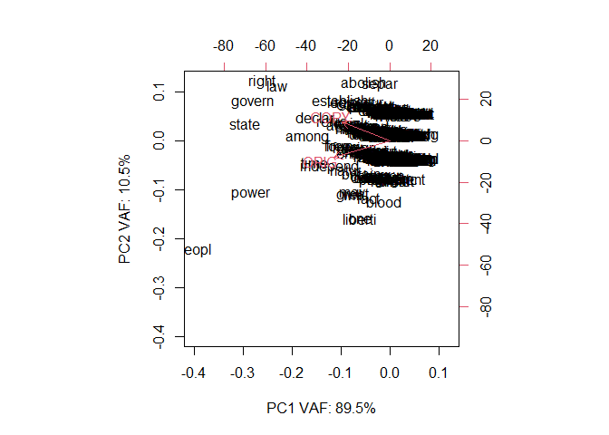
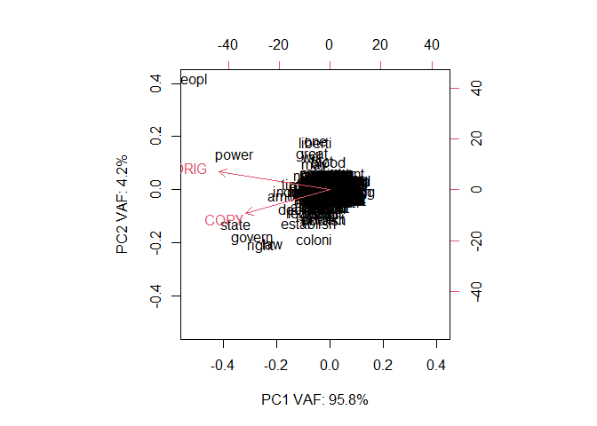
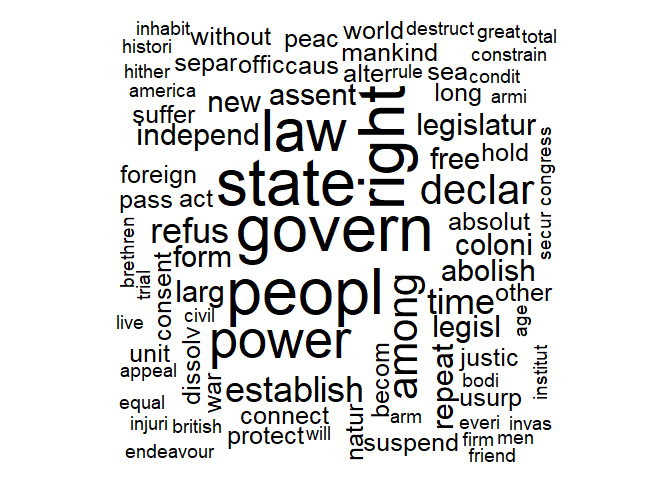

```r
# CHANGE PATH HERE:

mypath = "D:\\_nj_\\-github-\\Resources\\2022-07-21\\Pursuit of Happiness\\";


# YOU need to install these packages for this to work.
library(SentimentAnalysis);
```

```
## Warning: package 'SentimentAnalysis' was built under R version 4.1.3
```

```
## 
## Attaching package: 'SentimentAnalysis'
```

```
## The following object is masked from 'package:base':
## 
##     write
```

```r
library(wordcloud2);
```

```
## Warning: package 'wordcloud2' was built under R version 4.1.3
```

```r
library(wordcloud);
```

```
## Warning: package 'wordcloud' was built under R version 4.1.3
```

```
## Loading required package: RColorBrewer
```

```
## Warning: package 'RColorBrewer' was built under R version 4.1.3
```

```r
library(tm);
```

```
## Warning: package 'tm' was built under R version 4.1.3
```

```
## Loading required package: NLP
```

```r
library(textclean);
```

```
## Warning: package 'textclean' was built under R version 4.1.3
```

```r
library(slam);
```

```
## Warning: package 'slam' was built under R version 4.1.2
```

# Inputs

I am comparing the ORIG draft of the Declaration of Independence to the COPY that was approved by Congress after imposing edits.

https://www.ushistory.org/declaration/document/compare.html

## [Slavery challenged] ORIG


```r
myFile = paste0(mypath,"ORIG.txt");
ORIG = readChar(myFile, file.info(myFile)$size);
```


## [Slavery ignored] COPY


```r
# https://www.churchofjesuschrist.org/study/scriptures/the-family-a-proclamation-to-the-world/the-family-a-proclamation-to-the-world?lang=eng
myFile = paste0(mypath,"COPY.txt");
COPY = readChar(myFile, file.info(myFile)$size);
```


# COMPARISONS

## Sentiment

Is the message negative or positive?


```r
# https://cran.r-project.org/web/packages/SentimentAnalysis/vignettes/SentimentAnalysis.html

sentiment = analyzeSentiment( c(ORIG,COPY) );
rownames(sentiment) = c("ORIG", "COPY");
sentiment;
```

```
##      WordCount SentimentGI NegativityGI PositivityGI SentimentHE NegativityHE
## ORIG       816  0.06985294    0.1789216    0.2487745 0.004901961  0.001225490
## COPY       635  0.09291339    0.1637795    0.2566929 0.007874016  0.001574803
##      PositivityHE SentimentLM NegativityLM PositivityLM RatioUncertaintyLM
## ORIG  0.006127451 -0.06740196   0.09191176   0.02450980         0.01960784
## COPY  0.009448819 -0.06456693   0.09133858   0.02677165         0.01889764
##      SentimentQDAP NegativityQDAP PositivityQDAP
## ORIG    0.04289216      0.1470588       0.189951
## COPY    0.04566929      0.1385827       0.184252
```

## PREP using tm


```r
# https://riptutorial.com/r/example/31050/create-a-term-frequency-matrix
# docs = Corpus(VectorSource( c(ORIG,COPY) ));


prepString = function(vec, stemMe=FALSE)
{
docs = Corpus(VectorSource( vec ));

docs = tm_map(docs, replace_non_ascii);

# function from textclean to remove curly quotes ” and ’
docs = tm_map(docs, replace_curly_quote);
# function from textclean to replace "it's" to "it is"
docs = tm_map(docs, replace_contraction);


docs = tm_map(docs,removeNumbers);
docs = tm_map(docs,removePunctuation);
docs = tm_map(docs,stripWhitespace);
docs = tm_map(docs, PlainTextDocument);

docs = tm_map(docs,content_transformer(tolower));
docs = tm_map(docs,removeWords, stopwords("english"));


if(stemMe)
{
docs <- tm_map(docs, stemDocument, language="english");
}


# inspect(docs);

docs;
}
```


```r
doc.ORIG = prepString(c(ORIG));
```

```
## Warning in tm_map.SimpleCorpus(docs, replace_non_ascii): transformation drops
## documents
```

```
## Warning in tm_map.SimpleCorpus(docs, replace_curly_quote): transformation drops
## documents
```

```
## Warning in tm_map.SimpleCorpus(docs, replace_contraction): transformation drops
## documents
```

```
## Warning in tm_map.SimpleCorpus(docs, removeNumbers): transformation drops
## documents
```

```
## Warning in tm_map.SimpleCorpus(docs, removePunctuation): transformation drops
## documents
```

```
## Warning in tm_map.SimpleCorpus(docs, stripWhitespace): transformation drops
## documents
```

```
## Warning in tm_map.SimpleCorpus(docs, PlainTextDocument): transformation drops
## documents
```

```
## Warning in tm_map.SimpleCorpus(docs, content_transformer(tolower)):
## transformation drops documents
```

```
## Warning in tm_map.SimpleCorpus(docs, removeWords, stopwords("english")):
## transformation drops documents
```

```r
doc.COPY= prepString(c(COPY));
```

```
## Warning in tm_map.SimpleCorpus(docs, replace_non_ascii): transformation drops
## documents
```

```
## Warning in tm_map.SimpleCorpus(docs, replace_curly_quote): transformation drops
## documents
```

```
## Warning in tm_map.SimpleCorpus(docs, replace_contraction): transformation drops
## documents
```

```
## Warning in tm_map.SimpleCorpus(docs, removeNumbers): transformation drops
## documents
```

```
## Warning in tm_map.SimpleCorpus(docs, removePunctuation): transformation drops
## documents
```

```
## Warning in tm_map.SimpleCorpus(docs, stripWhitespace): transformation drops
## documents
```

```
## Warning in tm_map.SimpleCorpus(docs, PlainTextDocument): transformation drops
## documents
```

```
## Warning in tm_map.SimpleCorpus(docs, content_transformer(tolower)):
## transformation drops documents
```

```
## Warning in tm_map.SimpleCorpus(docs, removeWords, stopwords("english")):
## transformation drops documents
```

```r
doc.BOTH = prepString(c(ORIG,COPY));
```

```
## Warning in tm_map.SimpleCorpus(docs, replace_non_ascii): transformation drops
## documents
```

```
## Warning in tm_map.SimpleCorpus(docs, replace_curly_quote): transformation drops
## documents
```

```
## Warning in tm_map.SimpleCorpus(docs, replace_contraction): transformation drops
## documents
```

```
## Warning in tm_map.SimpleCorpus(docs, removeNumbers): transformation drops
## documents
```

```
## Warning in tm_map.SimpleCorpus(docs, removePunctuation): transformation drops
## documents
```

```
## Warning in tm_map.SimpleCorpus(docs, stripWhitespace): transformation drops
## documents
```

```
## Warning in tm_map.SimpleCorpus(docs, PlainTextDocument): transformation drops
## documents
```


## WordCloud "RAW"

```r
buildFreq = function(docs)
{
dtm     = TermDocumentMatrix(docs);
words   = sort(rowSums(as.matrix(dtm)),decreasing=TRUE);
words.f = data.frame(word = names(words),freq=words);

words.f;
}

# ORIG.freq = termFreq(inspect(docs[1])$content); # ORIG
# COPY.freq = termFreq(inspect(docs[1])$content); # COPY
```

### ORIG

```r
ORIG.freq = buildFreq(doc.ORIG);
set.seed(1234);
wordcloud2(ORIG.freq);
```

```{=html}
<div id="htmlwidget-1b4ff99564eb6e8884a5" style="width:672px;height:480px;" class="wordcloud2 html-widget"></div>
<script type="application/json" data-for="htmlwidget-1b4ff99564eb6e8884a5">{"x":{"word":["people","states","laws","among","government","power","independent","right","time","free","great","may","one","powers","will","assent","britain","large","liberty","new","others","war","acts","blood","colonies","common","equal","every","foreign","former","forms","happiness","history","hold","justice","lives","long","mankind","men","nature","pass","peace","refused","rights","shall","tyranny","usurpations","warfare","without","absolute","ages","allegiance","america","another","armies","assembled","begun","brethren","causes","circumstances","commerce","commit","conditions","congress","connection","consent","constitution","course","created","crimes","death","declaration","declare","declaring","endeavoured","ends","fact","facts","form","foundation","future","general","given","good","governments","governors","hereafter","hither","human","indeed","inhabitants","jurisdiction","king","laying","legislative","legislature","life","likely","manly","mean","mercenaries","might","necessary","necessity","now","object","offices","open","parliament","pledge","pretended","principles","refusing","renounce","repeated","representatives","rest","sacred","seas","suspended","thus","transporting","united","unless","utterly","whose","within","world","abdicated","abolish","abolishing","abuses","accommodation","accordingly","accustomed","acquiesce","act","administration","adopted","advance","adventured","affected","affection","agonizing","alliances","allurement","alone","already","also","alter","altering","amity","amount","annihilation","answered","apart","appealed","appropriations","armed","arms","assemblage","assert","assume","attempt","attempts","attend","attentions","authority","away","become","becomes","believe","benefits","beyond","bids","bodies","bought","break","bring","british","burnt","candid","captivating","carrying","cases","cause","cease","change","changed","character","charters","chief","christian","citizens","civil","civilized","claim","climb","coasts","combined","committed","communication","compass","complete","conclude","confiscation","consanguinity","constituting","constrains","continually","contract","contradict","convulsions","correspondence","councils","creation","credited","cruel","cruelty","cutting","dangers","deaf","decent","define","deluge","denounces","dependent","deprived","depriving","derive","deriving","design","desolation","destroyed","destruction","destructive","determined","dictate","die","dignity","direct","disavow","disposed","dissolutions","dissolve","dissolved","distant","distinguishd","distinguished","districts","disturbers","duty","earth","eat","effect","effected","elected","election","emigration","encourage","endeavour","enemies","entitle","establish","established","establishing","establishment","eternal","events","ever","evident","evils","evinces","exciting","execrable","exercise","existence","expense","experience","exposed","expunge","extend","faith","falsehood","fellow","finally","firmness","fixed","forbidden","foreigners","forever","forfeiture","forget","formidable","fortunes","fostered","freedom","friends","frontiers","fundamentally","giving","glory","god","governed","grandeur","guards","harass","hardiness","harmony","hath","head","hemisphere","heretofore","hitherto","honour","horrors","houses","humble","idea","immediate","impell","importance","imposing","incapable","incited","incur","indian","inestimable","infidel","inherent","injuries","injury","institute","instituted","insurrections","interrupt","invade","invariably","invasion","invasions","invested","judges","judiciary","jury","just","keep","kept","kindred","kings","known","lands","last","league","legislate","legislation","legislatures","let","levy","liberties","light","love","made","magistrate","magnanimity","majesty","man","many","marked","market","mask","merciless","migrations","military","miserable","mock","multitude","murdering","murders","must","mutually","name","nation","naturalization","natures","negative","neglected","never","obstructing","obtained","obtruded","occasions","offended","offenses","officers","operation","opinions","opposing","oppressions","opprobrium","organizing","part","parts","patient","paying","perfidy","period","permitting","perpetual","persons","petitioned","petitions","piratical","plundered","political","population","present","preservation","pressing","pretension","prevent","prince","prohibit","property","prostituted","protecting","protection","prove","provide","prudence","public","punishment","purchase","purpose","pursuing","pursuit","quartering","raising","ravaged","redress","reduce","reestablished","regular","reject","relinquish","remained","remaining","reminded","removing","render","repeatedly","representation","representative","requires","respect","restrain","returned","rise","road","rule","ruler","safety","salaries","savages","scarce","scotch","secure","security","seem","seems","self","selfassumed","send","sent","separation","settlement","several","sexes","ships","short","shown","since","single","slavery","sold","soldiers","solitary","space","spirit","stab","stage","standing","stands","state","station","strange","strength","subject","subjection","submission","submitted","subordination","subsisted","substance","suffer","sufferable","sufferance","suffered","superiour","support","suppressing","suspending","swarms","systems","taking","taxes","tenor","tenure","terms","thereby","therefore","things","thither","throw","ties","till","times","together","totally","towns","trade","train","transient","transportation","treasonable","treasure","trial","tried","troops","truth","truths","tryal","twelve","tyrant","tyrants","unacknowledged","unalienable","unassisted","undistinguished","unfeeling","unfit","uniform","unremitting","unsullied","unworthy","upon","urges","violating","voice","waged","want","wanting","warned","warrant","wealth","well","whatsoever","whenever","whereby","wholesome","withdrawing","works","years","yet"],"freq":[17,10,8,7,7,7,6,6,6,5,5,5,5,5,5,4,4,4,4,4,4,4,3,3,3,3,3,3,3,3,3,3,3,3,3,3,3,3,3,3,3,3,3,3,3,3,3,3,3,2,2,2,2,2,2,2,2,2,2,2,2,2,2,2,2,2,2,2,2,2,2,2,2,2,2,2,2,2,2,2,2,2,2,2,2,2,2,2,2,2,2,2,2,2,2,2,2,2,2,2,2,2,2,2,2,2,2,2,2,2,2,2,2,2,2,2,2,2,2,2,2,2,2,2,2,2,2,2,1,1,1,1,1,1,1,1,1,1,1,1,1,1,1,1,1,1,1,1,1,1,1,1,1,1,1,1,1,1,1,1,1,1,1,1,1,1,1,1,1,1,1,1,1,1,1,1,1,1,1,1,1,1,1,1,1,1,1,1,1,1,1,1,1,1,1,1,1,1,1,1,1,1,1,1,1,1,1,1,1,1,1,1,1,1,1,1,1,1,1,1,1,1,1,1,1,1,1,1,1,1,1,1,1,1,1,1,1,1,1,1,1,1,1,1,1,1,1,1,1,1,1,1,1,1,1,1,1,1,1,1,1,1,1,1,1,1,1,1,1,1,1,1,1,1,1,1,1,1,1,1,1,1,1,1,1,1,1,1,1,1,1,1,1,1,1,1,1,1,1,1,1,1,1,1,1,1,1,1,1,1,1,1,1,1,1,1,1,1,1,1,1,1,1,1,1,1,1,1,1,1,1,1,1,1,1,1,1,1,1,1,1,1,1,1,1,1,1,1,1,1,1,1,1,1,1,1,1,1,1,1,1,1,1,1,1,1,1,1,1,1,1,1,1,1,1,1,1,1,1,1,1,1,1,1,1,1,1,1,1,1,1,1,1,1,1,1,1,1,1,1,1,1,1,1,1,1,1,1,1,1,1,1,1,1,1,1,1,1,1,1,1,1,1,1,1,1,1,1,1,1,1,1,1,1,1,1,1,1,1,1,1,1,1,1,1,1,1,1,1,1,1,1,1,1,1,1,1,1,1,1,1,1,1,1,1,1,1,1,1,1,1,1,1,1,1,1,1,1,1,1,1,1,1,1,1,1,1,1,1,1,1,1,1,1,1,1,1,1,1,1,1,1,1,1,1,1,1,1,1,1,1,1,1,1,1,1,1,1,1,1,1,1,1,1,1,1,1,1,1,1,1,1,1,1,1,1,1,1,1,1,1,1,1,1,1,1,1,1,1,1,1,1,1,1,1,1,1,1,1,1,1,1,1,1,1,1,1,1,1,1,1,1,1],"fontFamily":"Segoe UI","fontWeight":"bold","color":"random-dark","minSize":0,"weightFactor":10.5882352941176,"backgroundColor":"white","gridSize":0,"minRotation":-0.785398163397448,"maxRotation":0.785398163397448,"shuffle":true,"rotateRatio":0.4,"shape":"circle","ellipticity":0.65,"figBase64":null,"hover":null},"evals":[],"jsHooks":{"render":[{"code":"function(el,x){\n                        console.log(123);\n                        if(!iii){\n                          window.location.reload();\n                          iii = False;\n\n                        }\n  }","data":null}]}}</script>
```

### COPY

```r
COPY.freq = buildFreq(doc.COPY);
set.seed(1234);
wordcloud2(COPY.freq);
```

```{=html}
<div id="htmlwidget-8f836166d559454ecd73" style="width:672px;height:480px;" class="wordcloud2 html-widget"></div>
<script type="application/json" data-for="htmlwidget-8f836166d559454ecd73">{"x":{"word":["people","laws","states","right","among","government","powers","assent","colonies","free","independent","large","new","time","abolishing","absolute","consent","governments","hold","justice","long","mankind","others","pass","peace","power","refused","repeated","rights","seas","united","usurpations","war","without","world","acts","ages","alter","america","armies","becomes","bodies","brethren","britain","british","cases","causes","circumstances","conditions","congress","connection","declaration","declare","declaring","dissolved","endeavoured","equal","establishing","every","foreign","form","forms","friends","good","great","happiness","history","hither","inhabitants","injuries","jurisdiction","legislative","legislature","legislatures","lives","may","men","necessary","necessity","object","offices","political","pretended","protection","public","purpose","refusing","render","rule","separation","state","suspended","therefore","totally","transporting","trial","tyranny","unless","whose","will","abdicated","abolish","absolved","abuses","accommodation","accordingly","accustomed","acquiesce","act","administration","affected","allegiance","alliances","alone","already","altering","amount","annihilation","another","answered","appealed","appealing","appropriations","arbitrary","armed","arms","assembled","assume","attempts","attend","attentions","authority","away","bands","barbarous","bear","become","begun","benefits","beyond","boundaries","bring","burnt","called","candid","captive","cause","certain","changed","character","charters","citizens","civil","civilized","coasts","combined","commerce","commit","common","compleat","compliance","conclude","conjured","connected","consanguinity","constitution","constrained","constrains","contract","convulsions","correspondence","country","course","created","creator","crown","cruelty","cutting","dangers","deaf","death","decent","define","denounces","dependent","depository","depriving","deriving","design","desolation","despotism","destroyed","destruction","destructive","dictate","direct","disavow","disposed","dissolutions","dissolve","distant","districts","divine","domestic","duty","earth","eat","effect","elected","emigration","encourage","endowed","ends","enemies","english","enlarging","entitle","erected","establish","established","establishment","events","evils","evinces","example","excited","executioners","exercise","experience","exposed","extend","facts","fall","fatiguing","fellow","firm","firmness","fit","forbidden","foreigners","former","formidable","fortunes","foundation","frontiers","full","fundamentally","future","general","giving","god","governed","governors","guards","hands","harass","hath","head","high","honor","houses","human","humble","immediate","impel","importance","imposing","incapable","indeed","indian","inestimable","inevitably","institute","instituted","instrument","insurrection","intentions","interrupt","introducing","invariably","invasion","invasions","invested","judge","judges","judiciary","july","jury","just","kept","kindred","king","known","lands","laying","legislate","legislation","let","levy","liberty","life","light","likely","made","magnanimity","manly","many","marked","meantime","measures","mercenaries","merciless","migrations","military","mock","multitude","murders","must","mutually","name","nation","native","naturalization","nature","natures","neglected","neighbouring","now","obstructed","obstructing","obtained","offences","officers","one","operation","opinions","opposing","oppressions","organizing","paralleled","parts","patient","payment","perfidy","petitioned","petitions","places","pledge","plundered","population","present","pressing","prevent","prince","principles","protecting","prove","provide","providence","province","prudence","publish","punishment","pursuing","pursuit","quartering","raising","ravaged","records","rectitude","redress","reduce","reliance","relinquish","remaining","reminded","repeatedly","representation","representative","representatives","requires","respect","rest","returned","ruler","sacred","safety","salaries","savages","scarcely","secure","security","seem","selfevident","sent","separate","settlement","sexes","shall","shown","sole","solemnly","stage","standing","station","subject","submitted","substance","suffer","sufferable","sufferance","superior","support","supreme","suspending","swarms","system","systems","taken","taking","taxes","tenure","terms","therein","things","thirteen","throw","thus","ties","till","times","together","towns","trade","train","transient","tried","troops","truths","tyrant","tyrants","unacknowledged","unalienable","unanimous","uncomfortable","undistinguished","unfit","unusual","unwarrantable","unworthy","utterly","valuable","voice","waging","wanting","warfare","warned","whatsoever","whenever","whereby","wholesome","within","works"],"freq":[10,9,8,7,6,6,5,4,4,4,4,4,4,4,3,3,3,3,3,3,3,3,3,3,3,3,3,3,3,3,3,3,3,3,3,2,2,2,2,2,2,2,2,2,2,2,2,2,2,2,2,2,2,2,2,2,2,2,2,2,2,2,2,2,2,2,2,2,2,2,2,2,2,2,2,2,2,2,2,2,2,2,2,2,2,2,2,2,2,2,2,2,2,2,2,2,2,2,2,2,1,1,1,1,1,1,1,1,1,1,1,1,1,1,1,1,1,1,1,1,1,1,1,1,1,1,1,1,1,1,1,1,1,1,1,1,1,1,1,1,1,1,1,1,1,1,1,1,1,1,1,1,1,1,1,1,1,1,1,1,1,1,1,1,1,1,1,1,1,1,1,1,1,1,1,1,1,1,1,1,1,1,1,1,1,1,1,1,1,1,1,1,1,1,1,1,1,1,1,1,1,1,1,1,1,1,1,1,1,1,1,1,1,1,1,1,1,1,1,1,1,1,1,1,1,1,1,1,1,1,1,1,1,1,1,1,1,1,1,1,1,1,1,1,1,1,1,1,1,1,1,1,1,1,1,1,1,1,1,1,1,1,1,1,1,1,1,1,1,1,1,1,1,1,1,1,1,1,1,1,1,1,1,1,1,1,1,1,1,1,1,1,1,1,1,1,1,1,1,1,1,1,1,1,1,1,1,1,1,1,1,1,1,1,1,1,1,1,1,1,1,1,1,1,1,1,1,1,1,1,1,1,1,1,1,1,1,1,1,1,1,1,1,1,1,1,1,1,1,1,1,1,1,1,1,1,1,1,1,1,1,1,1,1,1,1,1,1,1,1,1,1,1,1,1,1,1,1,1,1,1,1,1,1,1,1,1,1,1,1,1,1,1,1,1,1,1,1,1,1,1,1,1,1,1,1,1,1,1,1,1,1,1,1,1,1,1,1,1,1,1,1,1,1,1,1,1,1,1,1,1,1,1,1,1,1,1,1,1,1,1,1,1,1,1,1,1,1,1,1,1,1,1,1,1,1,1,1,1,1,1,1,1],"fontFamily":"Segoe UI","fontWeight":"bold","color":"random-dark","minSize":0,"weightFactor":18,"backgroundColor":"white","gridSize":0,"minRotation":-0.785398163397448,"maxRotation":0.785398163397448,"shuffle":true,"rotateRatio":0.4,"shape":"circle","ellipticity":0.65,"figBase64":null,"hover":null},"evals":[],"jsHooks":{"render":[{"code":"function(el,x){\n                        console.log(123);\n                        if(!iii){\n                          window.location.reload();\n                          iii = False;\n\n                        }\n  }","data":null}]}}</script>
```


## STEMMED

```r
doc.ORIG.s = prepString(c(ORIG), stemMe=TRUE);
```

```
## Warning in tm_map.SimpleCorpus(docs, replace_non_ascii): transformation drops
## documents
```

```
## Warning in tm_map.SimpleCorpus(docs, replace_curly_quote): transformation drops
## documents
```

```
## Warning in tm_map.SimpleCorpus(docs, replace_contraction): transformation drops
## documents
```

```
## Warning in tm_map.SimpleCorpus(docs, removeNumbers): transformation drops
## documents
```

```
## Warning in tm_map.SimpleCorpus(docs, removePunctuation): transformation drops
## documents
```

```
## Warning in tm_map.SimpleCorpus(docs, stripWhitespace): transformation drops
## documents
```

```
## Warning in tm_map.SimpleCorpus(docs, PlainTextDocument): transformation drops
## documents
```

```
## Warning in tm_map.SimpleCorpus(docs, content_transformer(tolower)):
## transformation drops documents
```

```
## Warning in tm_map.SimpleCorpus(docs, removeWords, stopwords("english")):
## transformation drops documents
```

```
## Warning in tm_map.SimpleCorpus(docs, stemDocument, language = "english"):
## transformation drops documents
```

```r
doc.COPY.s= prepString(c(COPY), stemMe=TRUE);
```

```
## Warning in tm_map.SimpleCorpus(docs, replace_non_ascii): transformation drops
## documents
```

```
## Warning in tm_map.SimpleCorpus(docs, replace_curly_quote): transformation drops
## documents
```

```
## Warning in tm_map.SimpleCorpus(docs, replace_contraction): transformation drops
## documents
```

```
## Warning in tm_map.SimpleCorpus(docs, removeNumbers): transformation drops
## documents
```

```
## Warning in tm_map.SimpleCorpus(docs, removePunctuation): transformation drops
## documents
```

```
## Warning in tm_map.SimpleCorpus(docs, stripWhitespace): transformation drops
## documents
```

```
## Warning in tm_map.SimpleCorpus(docs, PlainTextDocument): transformation drops
## documents
```

```
## Warning in tm_map.SimpleCorpus(docs, content_transformer(tolower)):
## transformation drops documents
```

```
## Warning in tm_map.SimpleCorpus(docs, removeWords, stopwords("english")):
## transformation drops documents
```

```
## Warning in tm_map.SimpleCorpus(docs, stemDocument, language = "english"):
## transformation drops documents
```

```r
doc.BOTH.s = prepString(c(ORIG,COPY), stemMe=TRUE);
```

```
## Warning in tm_map.SimpleCorpus(docs, replace_non_ascii): transformation drops
## documents
```

```
## Warning in tm_map.SimpleCorpus(docs, replace_curly_quote): transformation drops
## documents
```

```
## Warning in tm_map.SimpleCorpus(docs, replace_contraction): transformation drops
## documents
```

```
## Warning in tm_map.SimpleCorpus(docs, removeNumbers): transformation drops
## documents
```

```
## Warning in tm_map.SimpleCorpus(docs, removePunctuation): transformation drops
## documents
```

```
## Warning in tm_map.SimpleCorpus(docs, stripWhitespace): transformation drops
## documents
```

```
## Warning in tm_map.SimpleCorpus(docs, PlainTextDocument): transformation drops
## documents
```

### ORIG

```r
ORIG.freq.s = buildFreq(doc.ORIG.s);
set.seed(1234);
wordcloud2(ORIG.freq.s);
```

```{=html}
<div id="htmlwidget-0d7db73d03839427d3b7" style="width:672px;height:480px;" class="wordcloud2 html-widget"></div>
<script type="application/json" data-for="htmlwidget-0d7db73d03839427d3b7">{"x":{"word":["peopl","power","state","govern","right","law","among","time","declar","independ","form","free","great","liberti","may","natur","one","refus","will","act","assent","britain","establish","fact","foreign","larg","legisl","new","other","suffer","war","blood","caus","coloni","commit","common","constitut","endeavour","equal","everi","former","happi","histori","hold","justic","king","legislatur","live","long","man","mankind","men","offic","pass","peac","repeat","repres","shall","suspend","transport","tyranni","usurp","warfar","without","abolish","absolut","affect","age","allegi","alter","america","anoth","arm","armi","assembl","attempt","becom","begun","brethren","chang","circumst","civil","commerc","condit","congress","connect","consent","cours","creat","crime","death","depriv","deriv","destruct","dissolv","effect","elect","end","foundat","futur","general","given","good","governor","hereaft","hither","human","inde","inhabit","injuri","institut","invas","jurisdict","lay","life","like","mean","mercenari","might","murder","necess","necessari","now","object","open","parliament","part","petit","pledg","pretend","principl","protect","remain","renounc","rest","sacr","sea","secur","seem","stand","subject","thus","truth","tyrant","unit","unless","utter","want","whose","within","world","abdic","abus","accommod","accord","accustom","acquiesc","administr","adopt","advanc","adventur","agon","allianc","allur","alon","alreadi","also","amiti","amount","annihil","answer","apart","appeal","appropri","assemblag","assert","assum","attend","attent","author","away","believ","benefit","beyond","bid","bodi","bought","break","bring","british","burnt","candid","captiv","carri","case","ceas","charact","charter","chief","christian","citizen","claim","climb","coast","combin","communic","compass","complet","conclud","confisc","consanguin","constrain","continu","contract","contradict","convuls","correspond","council","creation","credit","cruel","cruelti","cut","danger","deaf","decent","defin","delug","denounc","depend","design","desol","destroy","determin","dictat","die","digniti","direct","disavow","dispos","dissolut","distant","distinguish","distinguishd","district","disturb","duti","earth","eat","emigr","encourag","enemi","entitl","etern","event","ever","evid","evil","evinc","excit","execr","exercis","exist","expens","experi","expos","expung","extend","faith","falsehood","fellow","final","firm","fix","forbidden","forev","forfeitur","forget","formid","fortun","foster","freedom","friend","frontier","fundament","give","glori","god","grandeur","guard","harass","hardi","harmoni","hath","head","hemispher","heretofor","hitherto","honour","horror","hous","humbl","idea","immedi","impel","import","impos","incap","incit","incur","indian","inestim","infidel","inher","insurrect","interrupt","invad","invari","invest","judg","judiciari","juri","just","keep","kept","kindr","known","land","last","leagu","let","levi","light","love","made","magistr","magnanim","majesti","mani","mark","market","mask","merciless","migrat","militari","miser","mock","multitud","must","mutual","name","nation","negat","neglect","never","obstruct","obtain","obtrud","occas","offend","offens","oper","opinion","oppos","oppress","opprobrium","organ","patient","pay","perfidi","period","permit","perpetu","person","pirat","plunder","polit","popul","present","preserv","press","pretens","prevent","princ","prohibit","properti","prostitut","prove","provid","prudenc","public","punish","purchas","purpos","pursu","pursuit","quarter","rais","ravag","redress","reduc","reestablish","regular","reject","relinquish","remind","remov","render","represent","requir","respect","restrain","return","rise","road","rule","ruler","safeti","salari","savag","scarc","scotch","self","selfassum","send","sent","separ","settlement","sever","sex","ship","short","shown","sinc","singl","slaveri","sold","soldier","solitari","space","spirit","stab","stage","station","strang","strength","submiss","submit","subordin","subsist","substanc","superiour","support","suppress","swarm","system","take","tax","tenor","tenur","term","therebi","therefor","thing","thither","throw","tie","till","togeth","total","town","trade","train","transient","treason","treasur","tri","trial","troop","tryal","twelv","unacknowledg","unalien","unassist","undistinguish","unfeel","unfit","uniform","unremit","unsulli","unworthi","upon","urg","violat","voic","wage","warn","warrant","wealth","well","whatsoev","whenev","wherebi","wholesom","withdraw","work","year","yet"],"freq":[17,12,11,10,9,8,7,7,6,6,5,5,5,5,5,5,5,5,5,4,4,4,4,4,4,4,4,4,4,4,4,3,3,3,3,3,3,3,3,3,3,3,3,3,3,3,3,3,3,3,3,3,3,3,3,3,3,3,3,3,3,3,3,3,2,2,2,2,2,2,2,2,2,2,2,2,2,2,2,2,2,2,2,2,2,2,2,2,2,2,2,2,2,2,2,2,2,2,2,2,2,2,2,2,2,2,2,2,2,2,2,2,2,2,2,2,2,2,2,2,2,2,2,2,2,2,2,2,2,2,2,2,2,2,2,2,2,2,2,2,2,2,2,2,2,2,2,2,2,2,2,1,1,1,1,1,1,1,1,1,1,1,1,1,1,1,1,1,1,1,1,1,1,1,1,1,1,1,1,1,1,1,1,1,1,1,1,1,1,1,1,1,1,1,1,1,1,1,1,1,1,1,1,1,1,1,1,1,1,1,1,1,1,1,1,1,1,1,1,1,1,1,1,1,1,1,1,1,1,1,1,1,1,1,1,1,1,1,1,1,1,1,1,1,1,1,1,1,1,1,1,1,1,1,1,1,1,1,1,1,1,1,1,1,1,1,1,1,1,1,1,1,1,1,1,1,1,1,1,1,1,1,1,1,1,1,1,1,1,1,1,1,1,1,1,1,1,1,1,1,1,1,1,1,1,1,1,1,1,1,1,1,1,1,1,1,1,1,1,1,1,1,1,1,1,1,1,1,1,1,1,1,1,1,1,1,1,1,1,1,1,1,1,1,1,1,1,1,1,1,1,1,1,1,1,1,1,1,1,1,1,1,1,1,1,1,1,1,1,1,1,1,1,1,1,1,1,1,1,1,1,1,1,1,1,1,1,1,1,1,1,1,1,1,1,1,1,1,1,1,1,1,1,1,1,1,1,1,1,1,1,1,1,1,1,1,1,1,1,1,1,1,1,1,1,1,1,1,1,1,1,1,1,1,1,1,1,1,1,1,1,1,1,1,1,1,1,1,1,1,1,1,1,1,1,1,1,1,1,1,1,1,1,1,1,1,1,1,1,1,1,1,1,1,1,1,1,1,1,1,1,1,1,1,1,1,1,1,1,1,1,1,1,1,1,1,1,1,1,1,1,1,1,1,1,1,1,1],"fontFamily":"Segoe UI","fontWeight":"bold","color":"random-dark","minSize":0,"weightFactor":10.5882352941176,"backgroundColor":"white","gridSize":0,"minRotation":-0.785398163397448,"maxRotation":0.785398163397448,"shuffle":true,"rotateRatio":0.4,"shape":"circle","ellipticity":0.65,"figBase64":null,"hover":null},"evals":[],"jsHooks":{"render":[{"code":"function(el,x){\n                        console.log(123);\n                        if(!iii){\n                          window.location.reload();\n                          iii = False;\n\n                        }\n  }","data":null}]}}</script>
```


### COPY

```r
COPY.freq.s = buildFreq(doc.COPY.s);
set.seed(1234);
wordcloud2(COPY.freq.s);
```

```{=html}
<div id="htmlwidget-c2e3fede5c798441fdae" style="width:672px;height:480px;" class="wordcloud2 html-widget"></div>
<script type="application/json" data-for="htmlwidget-c2e3fede5c798441fdae">{"x":{"word":["govern","peopl","right","state","law","power","among","declar","establish","refus","time","abolish","assent","coloni","form","free","independ","larg","legisl","legislatur","new","repeat","absolut","act","alter","becom","caus","connect","consent","dissolv","foreign","hold","justic","long","mankind","natur","offic","other","pass","peac","protect","sea","separ","suffer","suspend","unit","usurp","war","without","world","age","america","appeal","arm","armi","bodi","brethren","britain","british","case","circumst","civil","condit","congress","constrain","destruct","endeavour","equal","everi","firm","friend","good","great","happi","histori","hither","inhabit","injuri","institut","invas","judg","jurisdict","live","may","men","necess","necessari","object","obstruct","petit","polit","pretend","provid","public","purpos","render","repres","rule","secur","system","therefor","total","transport","trial","tyranni","tyrant","unless","whose","will","abdic","absolv","abus","accommod","accord","accustom","acquiesc","administr","affect","allegi","allianc","alon","alreadi","amount","annihil","anoth","answer","appropri","arbitrari","assembl","assum","attempt","attend","attent","author","away","band","barbar","bear","begun","benefit","beyond","boundari","bring","burnt","call","candid","captiv","certain","chang","charact","charter","citizen","coast","combin","commerc","commit","common","compleat","complianc","conclud","conjur","consanguin","constitut","contract","convuls","correspond","countri","cours","creat","creator","crown","cruelti","cut","danger","deaf","death","decent","defin","denounc","depend","depositori","depriv","deriv","design","desol","despot","destroy","dictat","direct","disavow","dispos","dissolut","distant","district","divin","domest","duti","earth","eat","effect","elect","emigr","encourag","end","endow","enemi","english","enlarg","entitl","erect","event","evil","evinc","exampl","excit","execution","exercis","experi","expos","extend","fact","fall","fatigu","fellow","fit","forbidden","former","formid","fortun","foundat","frontier","full","fundament","futur","general","give","god","governor","guard","hand","harass","hath","head","high","honor","hous","human","humbl","immedi","impel","import","impos","incap","inde","indian","inestim","inevit","instrument","insurrect","intent","interrupt","introduc","invari","invest","judiciari","juli","juri","just","kept","kindr","king","known","land","lay","let","levi","liberti","life","light","like","made","magnanim","man","mani","mark","meantim","measur","mercenari","merciless","migrat","militari","mock","multitud","murder","must","mutual","name","nation","nativ","neglect","neighbour","now","obtain","offenc","one","oper","opinion","oppos","oppress","organ","parallel","part","patient","payment","perfidi","place","pledg","plunder","popul","present","press","prevent","princ","principl","prove","provinc","prudenc","publish","punish","pursu","pursuit","quarter","rais","ravag","record","rectitud","redress","reduc","relianc","relinquish","remain","remind","represent","requir","respect","rest","return","ruler","sacr","safeti","salari","savag","scarc","seem","selfevid","sent","settlement","sex","shall","shown","sole","solemn","stage","stand","station","subject","submit","substanc","superior","support","suprem","swarm","take","taken","tax","tenur","term","therein","thing","thirteen","throw","thus","tie","till","togeth","town","trade","train","transient","tri","troop","truth","unacknowledg","unalien","unanim","uncomfort","undistinguish","unfit","unusu","unwarrant","unworthi","utter","valuabl","voic","wage","want","warfar","warn","whatsoev","whenev","wherebi","wholesom","within","work"],"freq":[10,10,10,10,9,8,6,6,5,5,5,4,4,4,4,4,4,4,4,4,4,4,3,3,3,3,3,3,3,3,3,3,3,3,3,3,3,3,3,3,3,3,3,3,3,3,3,3,3,3,2,2,2,2,2,2,2,2,2,2,2,2,2,2,2,2,2,2,2,2,2,2,2,2,2,2,2,2,2,2,2,2,2,2,2,2,2,2,2,2,2,2,2,2,2,2,2,2,2,2,2,2,2,2,2,2,2,2,2,1,1,1,1,1,1,1,1,1,1,1,1,1,1,1,1,1,1,1,1,1,1,1,1,1,1,1,1,1,1,1,1,1,1,1,1,1,1,1,1,1,1,1,1,1,1,1,1,1,1,1,1,1,1,1,1,1,1,1,1,1,1,1,1,1,1,1,1,1,1,1,1,1,1,1,1,1,1,1,1,1,1,1,1,1,1,1,1,1,1,1,1,1,1,1,1,1,1,1,1,1,1,1,1,1,1,1,1,1,1,1,1,1,1,1,1,1,1,1,1,1,1,1,1,1,1,1,1,1,1,1,1,1,1,1,1,1,1,1,1,1,1,1,1,1,1,1,1,1,1,1,1,1,1,1,1,1,1,1,1,1,1,1,1,1,1,1,1,1,1,1,1,1,1,1,1,1,1,1,1,1,1,1,1,1,1,1,1,1,1,1,1,1,1,1,1,1,1,1,1,1,1,1,1,1,1,1,1,1,1,1,1,1,1,1,1,1,1,1,1,1,1,1,1,1,1,1,1,1,1,1,1,1,1,1,1,1,1,1,1,1,1,1,1,1,1,1,1,1,1,1,1,1,1,1,1,1,1,1,1,1,1,1,1,1,1,1,1,1,1,1,1,1,1,1,1,1,1,1,1,1,1,1,1,1,1,1,1,1,1,1,1,1,1,1,1,1,1,1,1,1,1,1,1,1],"fontFamily":"Segoe UI","fontWeight":"bold","color":"random-dark","minSize":0,"weightFactor":18,"backgroundColor":"white","gridSize":0,"minRotation":-0.785398163397448,"maxRotation":0.785398163397448,"shuffle":true,"rotateRatio":0.4,"shape":"circle","ellipticity":0.65,"figBase64":null,"hover":null},"evals":[],"jsHooks":{"render":[{"code":"function(el,x){\n                        console.log(123);\n                        if(!iii){\n                          window.location.reload();\n                          iii = False;\n\n                        }\n  }","data":null}]}}</script>
```
## Summary


```r
TABLE.both = merge(ORIG.freq.s, COPY.freq.s, by="word", all.x=TRUE, all.y=TRUE);  # does this drop 0,1 ?
colnames(TABLE.both)=c("words","ORIG","COPY");
TABLE.both = TABLE.both[order(-TABLE.both$ORIG, -TABLE.both$COPY),];

TABLE.both[is.na(TABLE.both)] = 0; # NA from merge
TABLE.both;
```

```
##             words ORIG COPY
## 371         peopl   17   10
## 384         power   12    8
## 474         state   11   10
## 225        govern   10   10
## 434         right    9   10
## 293           law    8    9
## 27          among    7    6
## 509          time    7    5
## 127        declar    6    6
## 260      independ    6    4
## 416         refus    5    5
## 206          form    5    4
## 212          free    5    4
## 336         natur    5    3
## 228         great    5    2
## 317           may    5    2
## 563          will    5    2
## 300       liberti    5    1
## 354           one    5    1
## 172     establish    4    5
## 40         assent    4    4
## 291          larg    4    4
## 296        legisl    4    4
## 343           new    4    4
## 10            act    4    3
## 202       foreign    4    3
## 362         other    4    3
## 484        suffer    4    3
## 552           war    4    3
## 64        britain    4    2
## 191          fact    4    1
## 86         coloni    3    4
## 297    legislatur    3    4
## 426        repeat    3    4
## 72           caus    3    3
## 244          hold    3    3
## 284        justic    3    3
## 305          long    3    3
## 313       mankind    3    3
## 353         offic    3    3
## 366          pass    3    3
## 370          peac    3    3
## 490       suspend    3    3
## 545         usurp    3    3
## 566       without    3    3
## 164     endeavour    3    2
## 170         equal    3    2
## 176         everi    3    2
## 231         happi    3    2
## 241       histori    3    2
## 304          live    3    2
## 321           men    3    2
## 427        repres    3    2
## 516     transport    3    2
## 525       tyranni    3    2
## 89         commit    3    1
## 90         common    3    1
## 104     constitut    3    1
## 207        former    3    1
## 288          king    3    1
## 311           man    3    1
## 457         shall    3    1
## 553        warfar    3    1
## 57          blood    3    0
## 2         abolish    2    4
## 3         absolut    2    3
## 24          alter    2    3
## 51          becom    2    3
## 101       connect    2    3
## 103       consent    2    3
## 148       dissolv    2    3
## 396       protect    2    3
## 445           sea    2    3
## 536          unit    2    3
## 568         world    2    3
## 16            age    2    2
## 25        america    2    2
## 36            arm    2    2
## 37           armi    2    2
## 62       brethren    2    2
## 80       circumst    2    2
## 82          civil    2    2
## 97         condit    2    2
## 99       congress    2    2
## 139      destruct    2    2
## 224          good    2    2
## 242        hither    2    2
## 265       inhabit    2    2
## 267        injuri    2    2
## 268      institut    2    2
## 276         invas    2    2
## 282     jurisdict    2    2
## 337        necess    2    2
## 338     necessari    2    2
## 345        object    2    2
## 377         petit    2    2
## 388       pretend    2    2
## 446         secur    2    2
## 526        tyrant    2    2
## 537        unless    2    2
## 562         whose    2    2
## 15         affect    2    1
## 18         allegi    2    1
## 30          anoth    2    1
## 38        assembl    2    1
## 43        attempt    2    1
## 52          begun    2    1
## 75          chang    2    1
## 88        commerc    2    1
## 113         cours    2    1
## 114         creat    2    1
## 125         death    2    1
## 133        depriv    2    1
## 134         deriv    2    1
## 159        effect    2    1
## 160         elect    2    1
## 163           end    2    1
## 211       foundat    2    1
## 218         futur    2    1
## 219       general    2    1
## 226      governor    2    1
## 249         human    2    1
## 259          inde    2    1
## 294           lay    2    1
## 301          life    2    1
## 303          like    2    1
## 322     mercenari    2    1
## 330        murder    2    1
## 344           now    2    1
## 365          part    2    1
## 380         pledg    2    1
## 392      principl    2    1
## 421        remain    2    1
## 431          rest    2    1
## 439          sacr    2    1
## 447          seem    2    1
## 473         stand    2    1
## 478       subject    2    1
## 506          thus    2    1
## 522         truth    2    1
## 546         utter    2    1
## 551          want    2    1
## 565        within    2    1
## 118         crime    2    0
## 221         given    2    0
## 238       hereaft    2    0
## 318          mean    2    0
## 324         might    2    0
## 355          open    2    0
## 364    parliament    2    0
## 425       renounc    2    0
## 453         separ    1    3
## 33         appeal    1    2
## 58           bodi    1    2
## 65        british    1    2
## 71           case    1    2
## 105     constrain    1    2
## 198          firm    1    2
## 214        friend    1    2
## 278          judg    1    2
## 346      obstruct    1    2
## 382         polit    1    2
## 398        provid    1    2
## 401        public    1    2
## 405        purpos    1    2
## 424        render    1    2
## 437          rule    1    2
## 492        system    1    2
## 500      therefor    1    2
## 511         total    1    2
## 520         trial    1    2
## 1           abdic    1    1
## 5            abus    1    1
## 6        accommod    1    1
## 7          accord    1    1
## 8        accustom    1    1
## 9        acquiesc    1    1
## 11      administr    1    1
## 19        allianc    1    1
## 21           alon    1    1
## 22        alreadi    1    1
## 28         amount    1    1
## 29        annihil    1    1
## 31         answer    1    1
## 34       appropri    1    1
## 42          assum    1    1
## 44         attend    1    1
## 45         attent    1    1
## 46         author    1    1
## 47           away    1    1
## 54        benefit    1    1
## 55         beyond    1    1
## 63          bring    1    1
## 66          burnt    1    1
## 68         candid    1    1
## 69         captiv    1    1
## 76        charact    1    1
## 77        charter    1    1
## 81        citizen    1    1
## 85          coast    1    1
## 87         combin    1    1
## 96        conclud    1    1
## 102    consanguin    1    1
## 107      contract    1    1
## 109       convuls    1    1
## 110    correspond    1    1
## 121       cruelti    1    1
## 122           cut    1    1
## 123        danger    1    1
## 124          deaf    1    1
## 126        decent    1    1
## 128         defin    1    1
## 130       denounc    1    1
## 131        depend    1    1
## 135        design    1    1
## 136         desol    1    1
## 138       destroy    1    1
## 141        dictat    1    1
## 144        direct    1    1
## 145       disavow    1    1
## 146        dispos    1    1
## 147      dissolut    1    1
## 149       distant    1    1
## 152      district    1    1
## 156          duti    1    1
## 157         earth    1    1
## 158           eat    1    1
## 161         emigr    1    1
## 162      encourag    1    1
## 166         enemi    1    1
## 169        entitl    1    1
## 174         event    1    1
## 178          evil    1    1
## 179         evinc    1    1
## 181         excit    1    1
## 184       exercis    1    1
## 187        experi    1    1
## 188         expos    1    1
## 190        extend    1    1
## 196        fellow    1    1
## 201     forbidden    1    1
## 208        formid    1    1
## 209        fortun    1    1
## 215      frontier    1    1
## 217     fundament    1    1
## 220          give    1    1
## 223           god    1    1
## 229         guard    1    1
## 232        harass    1    1
## 235          hath    1    1
## 236          head    1    1
## 248          hous    1    1
## 250         humbl    1    1
## 252        immedi    1    1
## 253         impel    1    1
## 254        import    1    1
## 255         impos    1    1
## 256         incap    1    1
## 261        indian    1    1
## 262       inestim    1    1
## 270     insurrect    1    1
## 272     interrupt    1    1
## 275        invari    1    1
## 277        invest    1    1
## 279     judiciari    1    1
## 281          juri    1    1
## 283          just    1    1
## 286          kept    1    1
## 287         kindr    1    1
## 289         known    1    1
## 290          land    1    1
## 298           let    1    1
## 299          levi    1    1
## 302         light    1    1
## 307          made    1    1
## 309      magnanim    1    1
## 312          mani    1    1
## 314          mark    1    1
## 323     merciless    1    1
## 325        migrat    1    1
## 326      militari    1    1
## 328          mock    1    1
## 329      multitud    1    1
## 331          must    1    1
## 332        mutual    1    1
## 333          name    1    1
## 334        nation    1    1
## 340       neglect    1    1
## 347        obtain    1    1
## 356          oper    1    1
## 357       opinion    1    1
## 358         oppos    1    1
## 359       oppress    1    1
## 361         organ    1    1
## 367       patient    1    1
## 372       perfidi    1    1
## 381       plunder    1    1
## 383         popul    1    1
## 385       present    1    1
## 387         press    1    1
## 390       prevent    1    1
## 391         princ    1    1
## 397         prove    1    1
## 400       prudenc    1    1
## 403        punish    1    1
## 406         pursu    1    1
## 407       pursuit    1    1
## 408       quarter    1    1
## 409          rais    1    1
## 410         ravag    1    1
## 413       redress    1    1
## 414         reduc    1    1
## 420    relinquish    1    1
## 422        remind    1    1
## 428     represent    1    1
## 429        requir    1    1
## 430       respect    1    1
## 433        return    1    1
## 438         ruler    1    1
## 440        safeti    1    1
## 441        salari    1    1
## 442         savag    1    1
## 443         scarc    1    1
## 452          sent    1    1
## 454    settlement    1    1
## 456           sex    1    1
## 460         shown    1    1
## 472         stage    1    1
## 475       station    1    1
## 480        submit    1    1
## 483      substanc    1    1
## 487       support    1    1
## 491         swarm    1    1
## 493          take    1    1
## 495           tax    1    1
## 497         tenur    1    1
## 498          term    1    1
## 502         thing    1    1
## 505         throw    1    1
## 507           tie    1    1
## 508          till    1    1
## 510        togeth    1    1
## 512          town    1    1
## 513         trade    1    1
## 514         train    1    1
## 515     transient    1    1
## 519           tri    1    1
## 521         troop    1    1
## 527  unacknowledg    1    1
## 528       unalien    1    1
## 532 undistinguish    1    1
## 534         unfit    1    1
## 542      unworthi    1    1
## 549          voic    1    1
## 550          wage    1    1
## 554          warn    1    1
## 558      whatsoev    1    1
## 559        whenev    1    1
## 560       wherebi    1    1
## 561      wholesom    1    1
## 567          work    1    1
## 12          adopt    1    0
## 13         advanc    1    0
## 14       adventur    1    0
## 17           agon    1    0
## 20          allur    1    0
## 23           also    1    0
## 26          amiti    1    0
## 32          apart    1    0
## 39      assemblag    1    0
## 41         assert    1    0
## 53         believ    1    0
## 56            bid    1    0
## 59         bought    1    0
## 61          break    1    0
## 70          carri    1    0
## 73           ceas    1    0
## 78          chief    1    0
## 79      christian    1    0
## 83          claim    1    0
## 84          climb    1    0
## 91       communic    1    0
## 92        compass    1    0
## 94        complet    1    0
## 98        confisc    1    0
## 106       continu    1    0
## 108    contradict    1    0
## 111       council    1    0
## 115      creation    1    0
## 117        credit    1    0
## 120         cruel    1    0
## 129         delug    1    0
## 140      determin    1    0
## 142           die    1    0
## 143       digniti    1    0
## 150   distinguish    1    0
## 151  distinguishd    1    0
## 153       disturb    1    0
## 173         etern    1    0
## 175          ever    1    0
## 177          evid    1    0
## 182         execr    1    0
## 185         exist    1    0
## 186        expens    1    0
## 189        expung    1    0
## 192         faith    1    0
## 194     falsehood    1    0
## 197         final    1    0
## 200           fix    1    0
## 203         forev    1    0
## 204     forfeitur    1    0
## 205        forget    1    0
## 210        foster    1    0
## 213       freedom    1    0
## 222         glori    1    0
## 227      grandeur    1    0
## 233         hardi    1    0
## 234       harmoni    1    0
## 237     hemispher    1    0
## 239     heretofor    1    0
## 243      hitherto    1    0
## 246        honour    1    0
## 247        horror    1    0
## 251          idea    1    0
## 257         incit    1    0
## 258         incur    1    0
## 264       infidel    1    0
## 266         inher    1    0
## 274         invad    1    0
## 285          keep    1    0
## 292          last    1    0
## 295         leagu    1    0
## 306          love    1    0
## 308       magistr    1    0
## 310       majesti    1    0
## 315        market    1    0
## 316          mask    1    0
## 327         miser    1    0
## 339         negat    1    0
## 342         never    1    0
## 348        obtrud    1    0
## 349         occas    1    0
## 351        offend    1    0
## 352        offens    1    0
## 360    opprobrium    1    0
## 368           pay    1    0
## 373        period    1    0
## 374        permit    1    0
## 375       perpetu    1    0
## 376        person    1    0
## 378         pirat    1    0
## 386       preserv    1    0
## 389       pretens    1    0
## 393      prohibit    1    0
## 394      properti    1    0
## 395     prostitut    1    0
## 404       purchas    1    0
## 415   reestablish    1    0
## 417       regular    1    0
## 418        reject    1    0
## 423         remov    1    0
## 432      restrain    1    0
## 435          rise    1    0
## 436          road    1    0
## 444        scotch    1    0
## 448          self    1    0
## 449     selfassum    1    0
## 451          send    1    0
## 455         sever    1    0
## 458          ship    1    0
## 459         short    1    0
## 461          sinc    1    0
## 462         singl    1    0
## 463       slaveri    1    0
## 464          sold    1    0
## 465       soldier    1    0
## 468      solitari    1    0
## 469         space    1    0
## 470        spirit    1    0
## 471          stab    1    0
## 476        strang    1    0
## 477      strength    1    0
## 479       submiss    1    0
## 481      subordin    1    0
## 482       subsist    1    0
## 486     superiour    1    0
## 488      suppress    1    0
## 496         tenor    1    0
## 499       therebi    1    0
## 504       thither    1    0
## 517       treason    1    0
## 518       treasur    1    0
## 523         tryal    1    0
## 524         twelv    1    0
## 530      unassist    1    0
## 533        unfeel    1    0
## 535       uniform    1    0
## 538       unremit    1    0
## 539       unsulli    1    0
## 543          upon    1    0
## 544           urg    1    0
## 548        violat    1    0
## 555       warrant    1    0
## 556        wealth    1    0
## 557          well    1    0
## 564      withdraw    1    0
## 569          year    1    0
## 570           yet    1    0
## 4          absolv    0    1
## 35      arbitrari    0    1
## 48           band    0    1
## 49         barbar    0    1
## 50           bear    0    1
## 60       boundari    0    1
## 67           call    0    1
## 74        certain    0    1
## 93       compleat    0    1
## 95      complianc    0    1
## 100        conjur    0    1
## 112       countri    0    1
## 116       creator    0    1
## 119         crown    0    1
## 132    depositori    0    1
## 137        despot    0    1
## 154         divin    0    1
## 155        domest    0    1
## 165         endow    0    1
## 167       english    0    1
## 168        enlarg    0    1
## 171         erect    0    1
## 180        exampl    0    1
## 183     execution    0    1
## 193          fall    0    1
## 195        fatigu    0    1
## 199           fit    0    1
## 216          full    0    1
## 230          hand    0    1
## 240          high    0    1
## 245         honor    0    1
## 263        inevit    0    1
## 269    instrument    0    1
## 271        intent    0    1
## 273      introduc    0    1
## 280          juli    0    1
## 319       meantim    0    1
## 320        measur    0    1
## 335         nativ    0    1
## 341     neighbour    0    1
## 350        offenc    0    1
## 363      parallel    0    1
## 369       payment    0    1
## 379         place    0    1
## 399       provinc    0    1
## 402       publish    0    1
## 411        record    0    1
## 412      rectitud    0    1
## 419       relianc    0    1
## 450      selfevid    0    1
## 466          sole    0    1
## 467        solemn    0    1
## 485      superior    0    1
## 489        suprem    0    1
## 494         taken    0    1
## 501       therein    0    1
## 503      thirteen    0    1
## 529        unanim    0    1
## 531     uncomfort    0    1
## 540         unusu    0    1
## 541     unwarrant    0    1
## 547       valuabl    0    1
```

## Cosine Similarity

### RAW

```r
tdm = TermDocumentMatrix(doc.BOTH);
crossprod_simple_triplet_matrix(tdm)/(sqrt(col_sums(tdm^2) %*% t(col_sums(tdm^2))));
```

```
##          Docs
## Docs        content      meta
##   content 1.0000000 0.8546681
##   meta    0.8546681 1.0000000
```

### STEMMED

```r
tdm = TermDocumentMatrix(doc.BOTH.s);
crossprod_simple_triplet_matrix(tdm)/(sqrt(col_sums(tdm^2) %*% t(col_sums(tdm^2))))
```

```
##          Docs
## Docs        content      meta
##   content 1.0000000 0.8822055
##   meta    0.8822055 1.0000000
```


# Latent Semantic Analysis

Find U,V,W and reduce "bag of words" to concepts.  The correlations should be higher.  

## Prep as matrix

```r
names.words = TABLE.both$words;
names.docs = colnames(TABLE.both)[-1];
X = t( TABLE.both[,-1] );
rownames(X) = names.docs;
colnames(X) = names.words;

dim(X);
```

```
## [1]   2 570
```

```r
head(X[,1:10]);
```

```
##      peopl power state govern right law among time declar independ
## ORIG    17    12    11     10     9   8     7    7      6        6
## COPY    10     8    10     10    10   9     6    5      6        4
```

### Compute deviations

```r
X[,abs(X[1,] - X[2,]) > 3];
```

```
##      peopl power liberti one
## ORIG    17    12       5   5
## COPY    10     8       1   1
```


### Compute bigraph

```r
# prcomp vs princomp?
X.PCA = prcomp(t(X));  # this is only on STEM
summary(X.PCA);
```

```
## Importance of components:
##                           PC1    PC2
## Standard deviation     1.8489 0.6335
## Proportion of Variance 0.8949 0.1051
## Cumulative Proportion  0.8949 1.0000
```

```r
str(X.PCA);
```

```
## List of 5
##  $ sdev    : num [1:2] 1.849 0.634
##  $ rotation: num [1:2, 1:2] -0.76 -0.65 -0.65 0.76
##   ..- attr(*, "dimnames")=List of 2
##   .. ..$ : chr [1:2] "ORIG" "COPY"
##   .. ..$ : chr [1:2] "PC1" "PC2"
##  $ center  : Named num [1:2] 1.43 1.11
##   ..- attr(*, "names")= chr [1:2] "ORIG" "COPY"
##  $ scale   : logi FALSE
##  $ x       : num [1:570, 1:2] -17.6 -12.5 -13 -12.3 -11.5 ...
##   ..- attr(*, "dimnames")=List of 2
##   .. ..$ : chr [1:570] "peopl" "power" "state" "govern" ...
##   .. ..$ : chr [1:2] "PC1" "PC2"
##  - attr(*, "class")= chr "prcomp"
```

```r
X.PCA;
```

```
## Standard deviations (1, .., p=2):
## [1] 1.8488789 0.6335332
## 
## Rotation (n x k) = (2 x 2):
##            PC1       PC2
## ORIG -0.759965 -0.649964
## COPY -0.649964  0.759965
```

```r
biplot(X.PCA, 
       xlab=paste0("PC1 VAF: ",round(summary(X.PCA)$importance[2,1] * 100,1 ), "%"),
       ylab=paste0("PC2 VAF: ",round(summary(X.PCA)$importance[2,2] * 100,1 ), "%"),
      );
```

<!-- -->

### Compute Cosine Similarity

```r
head(X[,1:10]); 
```

```
##      peopl power state govern right law among time declar independ
## ORIG    17    12    11     10     9   8     7    7      6        6
## COPY    10     8    10     10    10   9     6    5      6        4
```

```r
a = X[1,];  # ORIG
b = X[2,];  # COPY
theta = as.numeric( (a %*% b) / (sqrt(sum(a^2)) * sqrt(sum(b^2))) );  # cosine similarity of weighted vectors (TF-IDF)

theta;
```

```
## [1] 0.8822055
```


## TF-IDF

```r
# https://www.mathworks.com/help/textanalytics/ref/bagofwords.tfidf.html

X.tf = colSums(X);  # term freq
X.idf = colSums(X != 0); # document freq

# NORM technique?
# https://en.wikipedia.org/wiki/Tf%E2%80%93idf#Inverse_document_frequency
X.tf.s = log(1 + X.tf);
X.idf.s = log( nrow(X) / (1+X.idf) ) + 1;

X.tf.idf.s = X.tf.s * X.idf.s;  # PAIRWISE products

# https://en.wikipedia.org/wiki/Latent_semantic_analysis


## scaled X
Xs = X * X.tf.idf.s # PAIRWISE products
```


### Compute deviations

```r
round(Xs[,abs(Xs[1,] - Xs[2,]) > 3],2);
```

```
##      peopl power great will liberti  one
## ORIG 33.68 22.05  6.18 6.18    5.78 5.78
## COPY 18.10 14.48  2.31 2.47    1.16 1.16
```

```r
round(Xs[,(Xs[1,] - Xs[2,]) < -1.5],2);
```

```
##      coloni abolish protect
## ORIG   2.87    1.65    1.65
## COPY   5.55    3.30    3.30
```

### Compute bigraph

```r
# prcomp vs princomp?
Xs.PCA = prcomp(t(Xs));  # this is only on STEM
summary(Xs.PCA);
```

```
## Importance of components:
##                           PC1     PC2
## Standard deviation     2.8865 0.60391
## Proportion of Variance 0.9581 0.04194
## Cumulative Proportion  0.9581 1.00000
```

```r
str(Xs.PCA);
```

```
## List of 5
##  $ sdev    : num [1:2] 2.886 0.604
##  $ rotation: num [1:2, 1:2] -0.797 -0.604 0.604 -0.797
##   ..- attr(*, "dimnames")=List of 2
##   .. ..$ : chr [1:2] "ORIG" "COPY"
##   .. ..$ : chr [1:2] "PC1" "PC2"
##  $ center  : Named num [1:2] 1.3 1.03
##   ..- attr(*, "names")= chr [1:2] "ORIG" "COPY"
##  $ scale   : logi FALSE
##  $ x       : num [1:570, 1:2] -36.1 -24.7 -24.3 -20.1 -17.9 ...
##   ..- attr(*, "dimnames")=List of 2
##   .. ..$ : chr [1:570] "peopl" "power" "state" "govern" ...
##   .. ..$ : chr [1:2] "PC1" "PC2"
##  - attr(*, "class")= chr "prcomp"
```

```r
Xs.PCA;
```

```
## Standard deviations (1, .., p=2):
## [1] 2.8864936 0.6039131
## 
## Rotation (n x k) = (2 x 2):
##             PC1        PC2
## ORIG -0.7967622  0.6042930
## COPY -0.6042930 -0.7967622
```

```r
biplot(Xs.PCA, 
       xlab=paste0("PC1 VAF: ",round(summary(Xs.PCA)$importance[2,1] * 100,1 ), "%"),
       ylab=paste0("PC2 VAF: ",round(summary(Xs.PCA)$importance[2,2] * 100,1 ), "%"),
      );
```

<!-- -->

### Compute Cosine Similarity

```r
head(Xs[,1:10]);
```

```
##         peopl    power    state   govern    right      law   among     time
## ORIG 33.67890 22.05279 19.59174 15.69012 13.72457 11.40506 9.58277 8.654104
## COPY 18.10075 14.48060 17.18427 15.24952 14.25632 12.32070 7.83796 6.181503
##        declar independ
## ORIG 7.417803 6.941469
## COPY 6.941469 5.475869
```

```r
a = Xs[1,];  # ORIG
b = Xs[2,];  # COPY
theta = as.numeric( (a %*% b) / (sqrt(sum(a^2)) * sqrt(sum(b^2))) );  # cosine similarity of weighted vectors (TF-IDF)

theta;
```

```
## [1] 0.9319901
```


# Conclusion

YES, emphatically.


```r
#which(names.words == "unalien");
#which(startsWith(names.words, "spir"));

#which(endsWith(names.words, "ip")); # relationship
                                    # why not STEMMED

# closer = c(1,2,4,8,9, 42, 61,62,34,13,36, 57,37,33,  76,55);
# from names.words
 closer = c(  which(names.words == "public"), which(names.words == "polit"), which(names.words == "british"), which(names.words == "sacr"), which(names.words == "friend"), which(names.words == "rule"), which(names.words == "system"), which(names.words == "trial"), which(names.words == "stand"), which(names.words == "pledg"), which(names.words == "rest"), which(names.words == "mercenari"), which(names.words == "life"), which(names.words == "truth"), which(names.words == "separ"), which(names.words == "judg"), which(names.words == "death"), which(names.words == "cours"), which(names.words == "creat"), which(names.words == "good"), which(names.words == "america"), which(names.words == "abolish"), which(names.words == "sea"), which(names.words == "king"), which(names.words == "men"), which(names.words == "live"), which(names.words == "histori"), which(names.words == "constitut"), which(names.words == "happi"), which(names.words == "common"), which(names.words == "britain"), which(names.words == "foreign"), which(names.words == "war"), which(names.words == "liberti"), which(names.words == "legislatur"), which(names.words == "coloni"), which(names.words == "establish"), which(names.words == "legisl"), which(names.words == "peopl"), which(names.words == "power"), which(names.words == "state"), which(names.words == "govern"), which(names.words == "right"), which(names.words == "law"), which(names.words == "time"),  which(names.words == "declar"), which(names.words == "independ"), which(names.words == "free"), which(names.words == "will"), which(names.words == "natur"), which(names.words == "great"), which(names.words == "will"),  which(names.words == "slaveri") );     

X[,closer];
```

```
##      public polit british sacr friend rule system trial stand pledg rest
## ORIG      1     1       1    2      1    1      1     1     2     2    2
## COPY      2     2       2    1      2    2      2     2     1     1    1
##      mercenari life truth separ judg death cours creat good america abolish sea
## ORIG         2    2     2     1    1     2     2     2    2       2       2   2
## COPY         1    1     1     3    2     1     1     1    2       2       4   3
##      king men live histori constitut happi common britain foreign war liberti
## ORIG    3   3    3       3         3     3      3       4       4   4       5
## COPY    1   2    2       2         1     2      1       2       3   3       1
##      legislatur coloni establish legisl peopl power state govern right law time
## ORIG          3      3         4      4    17    12    11     10     9   8    7
## COPY          4      4         5      4    10     8    10     10    10   9    5
##      declar independ free will natur great will slaveri
## ORIG      6        6    5    5     5     5    5       1
## COPY      6        4    4    2     3     2    2       0
```

```r
round(Xs[,closer],2);
```

```
##      public polit british sacr friend rule system trial stand pledg rest
## ORIG   0.65  0.65    0.65 1.31   0.65 0.65   0.65  0.65  1.31  1.31 1.31
## COPY   1.31  1.31    1.31 0.65   1.31 1.31   1.31  1.31  0.65  0.65 0.65
##      mercenari life truth separ judg death cours creat good america abolish sea
## ORIG      1.31 1.31  1.31  0.65 0.65  1.31  1.31  1.31 1.65    1.65    1.65 2.2
## COPY      0.65 0.65  0.65  1.96 1.31  0.65  0.65  0.65 1.31    1.65    3.30 3.3
##      king  men live histori constitut happi common britain foreign  war liberti
## ORIG 2.47 2.47 2.87    2.87      2.47  2.87   2.47    3.83    4.26 3.83    5.78
## COPY 0.82 1.65 1.65    1.91      0.82  1.91   0.82    1.91    3.20 2.87    1.16
##      legislatur coloni establish legisl peopl power state govern right   law
## ORIG       3.47   2.87      4.63   4.63 33.68 22.05 19.59  15.69 13.72 11.41
## COPY       4.26   5.55      5.78   4.26 18.10 14.48 17.18  15.25 14.26 12.32
##      time declar independ free will natur great will slaveri
## ORIG 8.65   7.42     6.94 6.18 6.18  6.18  6.18 6.18    0.69
## COPY 6.18   6.94     5.48 4.95 2.47  3.71  2.31 2.47    0.00
```

Attribution is a function of citing your sources, giving praise, honor, and glory to the appropriate party.

I am an open-source maniac (I like WTFPL over MIT licensing, but both are sufficient.) since technically all knowledge comes from Jehovah. This idea may be a potential research article for one of you.  Go for it.   At the end of the review process (final submission), just add a footnote of acknowledgment to "Nephi John" if you deem it appropriate.  Cheers and Aloha! 


# Appendix 


```r
# https://www.researchgate.net/publication/321804167
# https://stackoverflow.com/questions/29750519/

require(tm)
data("crude")
length(crude)
```

```
## [1] 20
```

```r
tdm <- TermDocumentMatrix(crude,
                          control = list(removePunctuation = TRUE,
                                         stopwords = TRUE))

library(slam)
cosine_dist_mat <- crossprod_simple_triplet_matrix(tdm)/(sqrt(col_sums(tdm^2) %*% t(col_sums(tdm^2))))


library(wordcloud);
wordcloud(words = COPY.freq.s$word, freq = COPY.freq.s$freq,
                        min.freq=1,
                        max.words=100,
                        random.order=FALSE,
                        rot.per = 0.25
            );
```

```
## Warning in wordcloud(words = COPY.freq.s$word, freq = COPY.freq.s$freq, :
## jurisdict could not be fit on page. It will not be plotted.
```

```
## Warning in wordcloud(words = COPY.freq.s$word, freq = COPY.freq.s$freq, : may
## could not be fit on page. It will not be plotted.
```

```
## Warning in wordcloud(words = COPY.freq.s$word, freq = COPY.freq.s$freq, :
## necessari could not be fit on page. It will not be plotted.
```

```
## Warning in wordcloud(words = COPY.freq.s$word, freq = COPY.freq.s$freq, : object
## could not be fit on page. It will not be plotted.
```

```
## Warning in wordcloud(words = COPY.freq.s$word, freq = COPY.freq.s$freq, :
## obstruct could not be fit on page. It will not be plotted.
```

```
## Warning in wordcloud(words = COPY.freq.s$word, freq = COPY.freq.s$freq, : polit
## could not be fit on page. It will not be plotted.
```

```
## Warning in wordcloud(words = COPY.freq.s$word, freq = COPY.freq.s$freq, : provid
## could not be fit on page. It will not be plotted.
```

```
## Warning in wordcloud(words = COPY.freq.s$word, freq = COPY.freq.s$freq, : public
## could not be fit on page. It will not be plotted.
```

```
## Warning in wordcloud(words = COPY.freq.s$word, freq = COPY.freq.s$freq, : purpos
## could not be fit on page. It will not be plotted.
```

```
## Warning in wordcloud(words = COPY.freq.s$word, freq = COPY.freq.s$freq, : render
## could not be fit on page. It will not be plotted.
```

```
## Warning in wordcloud(words = COPY.freq.s$word, freq = COPY.freq.s$freq, : repres
## could not be fit on page. It will not be plotted.
```

```
## Warning in wordcloud(words = COPY.freq.s$word, freq = COPY.freq.s$freq, : system
## could not be fit on page. It will not be plotted.
```

```
## Warning in wordcloud(words = COPY.freq.s$word, freq = COPY.freq.s$freq, :
## therefor could not be fit on page. It will not be plotted.
```

```
## Warning in wordcloud(words = COPY.freq.s$word, freq = COPY.freq.s$freq, :
## transport could not be fit on page. It will not be plotted.
```

```
## Warning in wordcloud(words = COPY.freq.s$word, freq = COPY.freq.s$freq, :
## tyranni could not be fit on page. It will not be plotted.
```

```
## Warning in wordcloud(words = COPY.freq.s$word, freq = COPY.freq.s$freq, : tyrant
## could not be fit on page. It will not be plotted.
```

```
## Warning in wordcloud(words = COPY.freq.s$word, freq = COPY.freq.s$freq, : unless
## could not be fit on page. It will not be plotted.
```

```
## Warning in wordcloud(words = COPY.freq.s$word, freq = COPY.freq.s$freq, : whose
## could not be fit on page. It will not be plotted.
```

<!-- -->


## SVD and PCA are equivalent

```r
# https://stats.stackexchange.com/questions/134282/
# some sloppy notation with V based on R naming


# covariance
C = Xs %*% t(Xs) / (nrow(Xs) - 1);  
C.eigen = eigen(C);
  W = C.eigen$vectors;  # renamed 
  L = diag(C.eigen$values);
C2 = W %*% L %*% t(W);

C == C2;
```

```
##       ORIG  COPY
## ORIG FALSE FALSE
## COPY FALSE  TRUE
```

```r
# R bug due to tolerance, shows some as FALSE
all.equal(as.numeric(C), as.numeric(C2) );
```

```
## [1] TRUE
```

```r
# actually TRUE for ALL

# SVD as X = U D t(V)
# X = U D V'  ... Xs == U %*% D %*% t(V); isTRUE(all.equal(as.numeric(Xs), as.numeric(U %*% D %*% t(V))) );
# D = U' X V  ... D == t(U) %*% Xs %*% V; isTRUE(all.equal(as.numeric(D), as.numeric(t(U) %*% Xs %*% V )) );
Xs.SVD = svd(Xs);  
str(Xs.SVD);
```

```
## List of 3
##  $ d: num [1:2] 79.4 14.4
##  $ u: num [1:2, 1:2] -0.794 -0.608 -0.608 0.794
##  $ v: num [1:570, 1:2] -0.475 -0.331 -0.327 -0.274 -0.246 ...
```

```r
D = diag(Xs.SVD$d);  # this was called "S"
L == D^2;
```

```
##       [,1]  [,2]
## [1,] FALSE  TRUE
## [2,]  TRUE FALSE
```

```r
isTRUE(all.equal(L, D^2));
```

```
## [1] TRUE
```

```r
U = Xs.SVD$u;  # Recall that the singular vectors are only defined up to sign
V = Xs.SVD$v;

U == W;
```

```
##       [,1]  [,2]
## [1,] FALSE FALSE
## [2,] FALSE FALSE
```

```r
isTRUE(all.equal(U, W));
```

```
## [1] FALSE
```

```r
isTRUE(all.equal(abs(U), abs(W)));
```

```
## [1] TRUE
```


I need to use one for U,V and the other for W?  These 'tweener' matrices are the maps between "concepts" and docs/words as suggested in the 'biplot'
